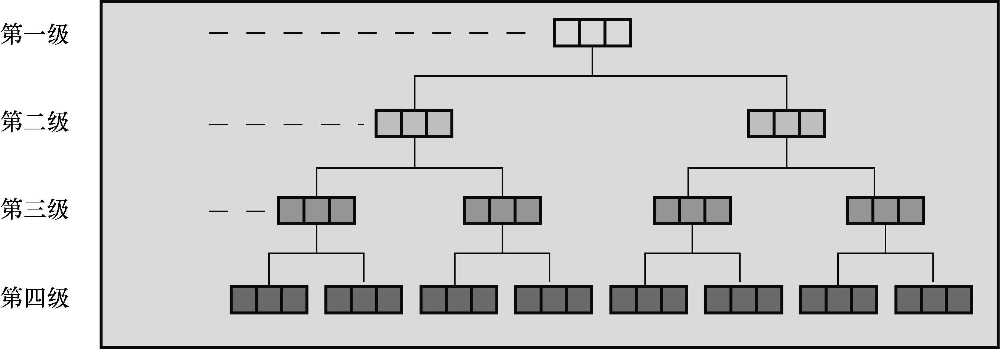

### 14.9　链式结构

在结束讨论结构之前，我们想简要介绍一下结构的多种用途之一：创建新的数据形式。计算机用户已经开发出的一些数据形式比我们提到过的数组和简单结构更有效地解决特定的问题。这些形式包括队列、二叉树、堆、哈希表和图表。许多这样的形式都由链式结构（linked structure）组成。通常，每个结构都包含一两个数据项和一两个指向其他同类型结构的指针。这些指针把一个结构和另一个结构链接起来，并提供一种路径能遍历整个彼此链接的结构。例如，图14.3演示了一个二叉树结构，每个单独的结构（或节点）都和它下面的两个结构（或节点）相连。

图14.3中显示的分级或树状的结构是否比数组高效？考虑一个有10级节点的树的情况。它有210−1（或1023）个节点，可以存储1023个单词。如果这些单词以某种规则排列，那么可以从最顶层开始，逐级向下移动查找单词，最多只需移动9次便可找到任意单词。如果把这些单词都放在一个数组中，最多要查找1023个元素才能找出所需的单词。

<b class="my_markdown">图14.3　一个二叉树结构</b>

如果你对这些高级概念感兴趣，可以阅读一些关于数据结构的书籍。使用C结构，可以创建和使用那些书中介绍的各种数据形式。另外，第17章中也介绍了一些高级数据形式。

本章对结构的概念介绍至此为止，第17章中会给出链式结构的例子。下面，我们介绍C语言中的联合、枚举和 `typedef` 。

