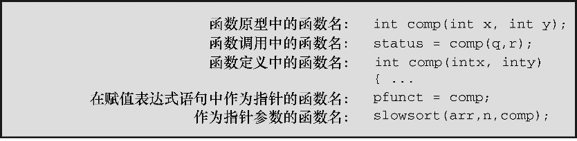

### 14.14　函数和指针

通过上一节的学习可知，可以声明一个指向函数的指针。这个复杂的玩意儿到底有何用处？通常，函数指针常用作另一个函数的参数，告诉该函数要使用哪一个函数。例如，排序数组涉及比较两个元素，以确定先后。如果元素是数字，可以使用>运算符；如果元素是字符串或结构，就要调用函数进行比较。C库中的 `qsort()` 函数可以处理任意类型的数组，但是要告诉 `qsort()` 使用哪个函数来比较元素。为此， `qsort()` 函数的参数列表中，有一个参数接受指向函数的指针。然后， `qsort()` 函数使用该函数提供的方案进行排序，无论这个数组中的元素是整数、字符串还是结构。

我们来进一步研究函数指针。首先，什么是函数指针？假设有一个指向 `int` 类型变量的指针，该指针存储着这个 `int` 类型变量存储在内存位置的地址。同样，函数也有地址，因为函数的机器语言实现由载入内存的代码组成。指向函数的指针中存储着函数代码的起始处的地址。

其次，声明一个数据指针时，必须声明指针所指向的数据类型。声明一个函数指针时，必须声明指针指向的函数类型。为了指明函数类型，要指明函数签名，即函数的返回类型和形参类型。例如，考虑下面的函数原型：

```c
void ToUpper(char *);    // 把字符串中的字符转换成大写字符
```

`ToUpper()` 函数的类型是“带 `char *`  类型参数、返回类型是 `void` 的函数”。下面声明了一个指针 `pf` 指向该函数类型：

```c
void (*pf)(char *);    // pf 是一个指向函数的指针
```

从该声明可以看出，第1对圆括号把*和 `pf` 括起来，表明 `pf` 是一个指向函数的指针。因此， `(` * `pf)` 是一个参数列表为 `(char`  * `)` 、返回类型为 `void` 的函数。注意，把函数名 `ToUpper` 替换为表达式 `(` * `pf)` 是创建指向函数指针最简单的方式。所以，如果想声明一个指向某类型函数的指针，可以写出该函数的原型后把函数名替换成 `(` * `pf)` 形式的表达式，创建函数指针声明。前面提到过，由于运算符优先级的规则，在声明函数指针时必须把*和指针名括起来。如果省略第1个圆括号会导致完全不同的情况：

```c
void *pf(char *); // pf 是一个返回字符指针的函数
```

> **提示**
> 要声明一个指向特定类型函数的指针，可以先声明一个该类型的函数，然后把函数名替换成 `(` * `pf)` 形式的表达式。然后， `pf` 就成为指向该类型函数的指针。

声明了函数指针后，可以把类型匹配的函数地址赋给它。在这种上下文中，函数名可以用于表示函数的地址：

```c
void ToUpper(char *);
void ToLower(char *);
int round(double);
void (*pf)(char *);
pf = ToUpper;      // 有效，ToUpper是该类型函数的地址
pf = ToLower;      //有效，ToLower是该类型函数的地址
pf = round;        // 无效，round与指针类型不匹配
pf = ToLower();    // 无效，ToLower()不是地址
```

最后一条语句是无效的，不仅因为 `ToLower()` 不是地址，而且 `ToLower()` 的返回类型是 `void` ，它没有返回值，不能在赋值语句中进行赋值。注意，指针 `pf` 可以指向其他带 `char`  *类型参数、返回类型是 `void` 的函数，不能指向其他类型的函数。

既然可以用数据指针访问数据，也可以用函数指针访问函数。奇怪的是，有两种逻辑上不一致的语法可以这样做，下面解释：

```c
void ToUpper(char *);
void ToLower(char *);
void (*pf)(char *);
char mis[] = "Nina Metier";
pf = ToUpper;
(*pf)(mis);    // 把ToUpper 作用于mis（语法1）
pf = ToLower;
pf(mis);       // 把ToLower 作用于mis（语法2）
```

这两种方法看上去都合情合理。先分析第1种方法：由于 `pf` 指向 `ToUpper` 函数，那么* `pf` 就相当于 `ToUpper` 函数，所以表达式 `(` * `pf)(mis)` 和 `ToUpper(mis)` 相同。从 `ToUpper` 函数和 `pf` 的声明就能看出， `ToUpper` 和 `(` * `pf)` 是等价的。第2种方法：由于函数名是指针，那么指针和函数名可以互换使用，所以 `pf(mis)` 和 `ToUpper(mis)` 相同。从 `pf` 的赋值表达式语句就能看出 `ToUpper` 和 `pf` 是等价的。由于历史的原因，贝尔实验室的C和UNIX的开发者采用第1种形式，而伯克利的UNIX推广者却采用第2种形式。K&R C不允许第2种形式。但是，为了与现有代码兼容，ANSI C认为这两种形式（本例中是 `(` * `pf)(mis)` 和 `pf(mis)` ）等价。后续的标准也延续了这种矛盾的和谐。

作为函数的参数是数据指针最常见的用法之一，函数指针亦如此。例如，考虑下面的函数原型：

```c
void show(void (* fp)(char *), char * str);
```

这看上去让人头晕。它声明了两个形参： `fp` 和 `str` 。 `fp` 形参是一个函数指针， `str` 是一个数据指针。更具体地说， `fp` 指向的函数接受 `char`  * 类型的参数，其返回类型为 `void` ； `str` 指向一个 `char` 类型的值。因此，假设有上面的声明，可以这样调用函数：

```c
show(ToLower, mis);   /* show()使用ToLower()函数：fp = ToLower */
show(pf, mis);        /* show()使用pf指向的函数： fp = pf */
```

`show()` 如何使用传入的函数指针？是用 `fp()` 语法还是 `(` * `fp)()` 语法调用函数：

```c
void show(void (* fp)(char *), char * str)
{
      (*fp)(str);    /* 把所选函数作用于str */
     puts(str);      /* 显示结果 */
}
```

例如，这里的 `show()` 首先用 `fp` 指向的函数转换 `str` ，然后显示转换后的字符串。

顺带一提，把带返回值的函数作为参数传递给另一个函数有两种不同的方法。例如，考虑下面的语句：

```c
function1(sqrt);        /* 传递sqrt()函数的地址 */
function2(sqrt(4.0));   /* 传递sqrt()函数的返回值 */
```

第1条语句传递的是 `sqrt()` 函数的地址，假设 `function1()` 在其代码中会使用该函数。第2条语句先调用 `sqrt()` 函数，然后求值，并把返回值（该例中是 `2.0` ）传递给 `function2()` 。

程序清单14.16中的程序通过 `show()` 函数来演示这些要点，该函数以各种转换函数作为参数。该程序也演示了一些处理菜单的有用技巧。

程序清单14.16　 `func_ptr.c` 程序

```c
// func_ptr.c -- 使用函数指针
#include <stdio.h>
#include <string.h>
#include <ctype.h>
#define LEN 81
char * s_gets(char * st, int n);
char showmenu(void);
void eatline(void);        // 读取至行末尾
void show(void(*fp)(char *), char * str);
void ToUpper(char *);      // 把字符串转换为大写
void ToLower(char *);      // 把字符串转换为小写
void Transpose(char *);    // 大小写转置
void Dummy(char *);        // 不更改字符串
int main(void)
{
     char line[LEN];
     char copy[LEN];
     char choice;
     void(*pfun)(char *); // 声明一个函数指针，被指向的函数接受char *类型的参数，无返回值
     puts("Enter a string (empty line to quit):");
     while (s_gets(line, LEN) != NULL && line[0] != '\0')
     {
          while ((choice = showmenu()) != 'n')
          {
               switch (choice)  // switch语句设置指针
               {
               case 'u': pfun = ToUpper;   break;
               case 'l': pfun = ToLower;   break;
               case 't': pfun = Transpose; break;
               case 'o': pfun = Dummy;     break;
               }
               strcpy(copy, line);    // 为show()函数拷贝一份
               show(pfun, copy);      // 根据用户的选择，使用选定的函数
          }
          puts("Enter a string (empty line to quit):");
     }
     puts("Bye!");
     return 0;
}
char showmenu(void)
{
     char ans;
     puts("Enter menu choice:");
     puts("u) uppercase       l) lowercase");
     puts("t) transposed case o) original case");
     puts("n) next string");
     ans = getchar();      // 获取用户的输入
     ans = tolower(ans);   // 转换为小写
     eatline();            // 清理输入行
     while (strchr("ulton", ans) == NULL)
     {
          puts("Please enter a u, l, t, o, or n:");
          ans = tolower(getchar());
          eatline();
     }
     return ans;
}
void eatline(void)
{
     while (getchar() != '\n')
          continue;
}
void ToUpper(char * str)
{
     while (*str)
     {
          *str = toupper(*str);
          str++;
     }
}
void ToLower(char * str)
{
     while (*str)
     {
          *str = tolower(*str);
          str++;
     }
}
void Transpose(char * str)
{
     while (*str)
     {
          if (islower(*str))
               *str = toupper(*str);
          else if (isupper(*str))
               *str = tolower(*str);
          str++;
     }
}
void Dummy(char * str)
{
     // 不改变字符串
}
void show(void(*fp)(char *), char * str)
{
     (*fp)(str);   // 把用户选定的函数作用于str
     puts(str);    // 显示结果
}
char * s_gets(char * st, int n)
{
     char * ret_val;
     char * find;
     ret_val = fgets(st, n, stdin);
     if (ret_val)
     {
          find = strchr(st, '\n');    // 查找换行符
          if (find)                   // 如果地址不是NULL，
               *find = '\0';          // 在此处放置一个空字符
          else
               while (getchar() != '\n')
                    continue;         // 清理输入行中剩余的字符
     }
     return ret_val;
}
```

下面是该程序的输出示例：

```c
Enter a string (empty line to quit):
Does C make you feel loopy?
Enter menu choice:
u) uppercase l) lowercase
t) transposed case o) original case
n) next string
t
dOES c MAKE YOU FEEL LOOPY?
Enter menu choice:
u) uppercase l) lowercase
t) transposed case o) original case
n) next string
l
does c make you feel loopy?
Enter menu choice:
u) uppercase l) lowercase
t) transposed case o) original case
n) next string
n
Enter a string (empty line to quit):
Bye!

```

注意， `ToUpper()` 、 `ToLower()` 、 `Transpose()` 和 `Dummy()` 函数的类型都相同，所以这4个函数都可以赋给 `pfun` 指针。该程序把 `pfun` 作为 `show()` 的参数，但是也可以直接把这4个函数中的任一个函数名作为参数，如 `show(Transpose, copy)` 。

这种情况下，可以使用 `typedef` 。例如，该程序中可以这样写：

```c
typedef void (*V_FP_CHARP)(char *);
void show (V_FP_CHARP fp, char *);
V_FP_CHARP pfun;
```

如果还想更复杂一些，可以声明并初始化一个函数指针的数组：

```c
V_FP_CHARP arpf[4] = {ToUpper, ToLower, Transpose, Dummy};
```

然后把 `showmenu()` 函数的返回类型改为 `int` ，如果用户输入 `u` ，则返回 `0` ；如果用户输入 `l` ，则返回 `2` ；如果用户输入 `t` ，则返回 `2` ，以此类推。可以把程序中的 `switch` 语句替换成下面的 `while` 循环：

```c
index = showmenu();
while (index >= 0 && index <= 3)
{
     strcpy(copy, line);        /* 为show()拷贝一份 */
     show(arpf[index], copy);   /* 使用选定的函数 */
     index = showmenu();
}
```

虽然没有函数数组，但是可以有函数指针数组。

以上介绍了使用函数名的4种方法：定义函数、声明函数、调用函数和作为指针。图14.4进行了总结。


<center class="my_markdown"><b class="my_markdown">图14.4　函数名的用法</b></center>

至于如何处理菜单， `showmenu()` 函数给出了几种技巧。首先，下面的代码：

```c
ans = getchar();       // 获取用户输入
ans = tolower(ans);    // 转换成小写
```

和

```c
ans = tolower(getchar());
```

演示了转换用户输入的两种方法。这两种方法都可以把用户输入的字符转换为一种大小写形式，这样就不用检测用户输入的是 `'u'` 还是 `'U'` ，等等。

`eatline()` 函数丢弃输入行中的剩余字符，在处理这两种情况时很有用。第一，用户为了输入一个选择，输入一个字符，然后按下Enter键，将产生一个换行符。如果不处理这个换行符，它将成为下一次读取的第1个字符。第二，假设用户输入的是整个单词 `uppercase` ，而不是一个字母 `u` 。如果没有 `eatline()` 函数，程序会把 `uppercase` 中的字符作为用户的响应依次读取。有了 `eatline()` ，程序会读取 `u` 字符并丢弃输入行中剩余的字符。

其次， `showmenu()` 函数的设计意图是，只给程序返回正确的选项。为完成这项任务，程序使用了 `string.h` 头文件中的标准库函数 `strchr()` ：

```c
while (strchr("ulton", ans) == NULL)
```

该函数在字符串 `"ulton"` 中查找字符 `ans` 首次出现的位置，并返回一个指向该字符的指针。如果没有找到该字符，则返回空指针。因此，上面的 `while` 循环头可以用下面的 `while` 循环头代替，但是上面的用起来更方便：

```c
while (ans != 'u' && ans != 'l' && ans != 't' && ans != 'o' && ans != 'n')
```

待检查的项越多，使用 `strchr()` 就越方便。

