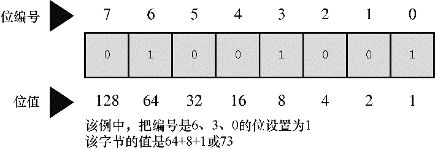

#### 15.1.1　二进制整数

通常，1字节包含8位。C语言用字节（byte）表示存储系统字符集所需的大小，所以C字节可能是8位、9位、16位或其他值。不过，描述存储器芯片和数据传输率中所用的字节指的是8位字节。为了简化起见，本章假设1字节是8位（计算机界通常用八位组(octet)这个术语特指8位字节）。可以从左往右给这8位分别编号为7～0。在1字节中，编号是7的位被称为高阶位（high-order bit），编号是0的位被称为低阶位（low-order bit）。每1位的编号对应2的相应指数。因此，可以根据图15.1所示的例子理解字节。


<center class="my_markdown"><b class="my_markdown">图15.1　位编号和位值</b></center>

这里，128是2的7次幂，以此类推。该字节能表示的最大数字是把所有位都设置为1：11111111。这个二进制数的值是：

```c
128 + 64 + 32 + 16 + 8 + 4 + 2 + 1 = 255
```

而该字节最小的二进制数是00000000，其值为0。因此，1字节可存储0～255范围内的数字，总共256个值。或者，通过不同的方式解释位组合（bit pattern），程序可以用1字节存储-128～+127范围内的整数，总共还是256个值。例如，通常 `unsigned char` 用1字节表示的范围是0～255，而 `signed char` 用1字节表示的范围是-128～+27。

