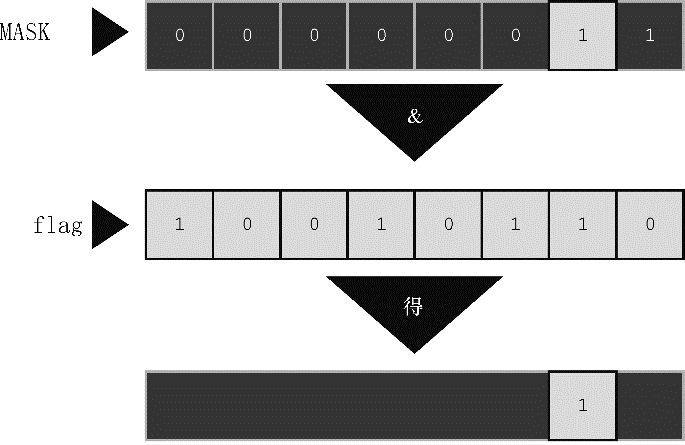

#### 15.3.2　用法：掩码

按位与运算符常用于掩码（mask）。所谓掩码指的是一些设置为开（ `1` ）或关（ `0` ）的位组合。要明白称其为掩码的原因，先来看通过 `&` 把一个量与掩码结合后发生什么情况。例如，假设定义符号常量 `MASK` 为 `2` （即，二进制形式为 `00000010` ），只有 `1` 号位是 `1` ，其他位都是 `0` 。下面的语句：

```c
flags = flags & MASK;
```

把 `flags` 中除 `1` 号位以外的所有位都设置为 `0` ，因为使用按位与运算符（ `&` ）任何位与 `0` 组合都得 `0` 。 `1` 号位的值不变（如果1号位是 `1` ，那么 `1&1` 得 `1` ；如果1号位是 `0` ，那么 `0&1` 也得 `0` ）。这个过程叫作“使用掩码”，因为掩码中的0隐藏了 `flags` 中相应的位。

可以这样类比：把掩码中的0看作不透明，1看作透明。表达式 `flags & MASK` 相当于用掩码覆盖在 `flags` 的位组合上，只有 `MASK` 为1的位才可见（见图15.2）。


<center class="my_markdown"><b class="my_markdown">图15.2　掩码示例</b></center>

用 `&=` 运算符可以简化前面的代码，如下所示：

```c
flags &= MASK;
```

下面这条语句是按位与的一种常见用法：

```c
ch &= 0xff; /* 或者 ch &= 0377; */
```

前面介绍过 `oxff` 的二进制形式是11111111，八进制形式是 `0377` 。这个掩码保持 `ch` 中最后8位不变，其他位都设置为0。无论 `ch` 原来是8位、16位或是其他更多位，最终的值都被修改为1个8位字节。在该例中，掩码的宽度为8位。

