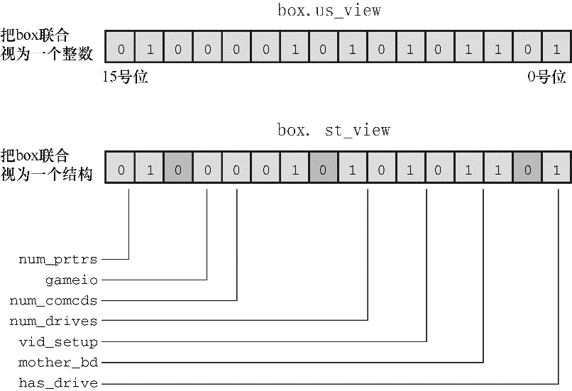

#### 15.4.2　位字段和按位运算符

在同类型的编程问题中，位字段和按位运算符是两种可替换的方法，用哪种方法都可以。例如，前面的例子中，使用和 `unsigned int` 类型大小相同的结构存储图形框的信息。也可使用 `unsigned int` 变量存储相同的信息。如果不想用结构成员表示法来访问不同的部分，也可以使用按位运算符来操作。一般而言，这种方法比较麻烦。接下来，我们来研究这两种方法（程序中使用了这两种方法，仅为了解释它们的区别，我们并不鼓励这样做）。

可以通过一个联合把结构方法和位方法放在一起。假定声明了 `struct box_props` 类型，然后这样声明联合：

```c
union Views /* 把数据看作结构或unsigned short类型的变量 */
{
     struct box_props st_view;
     unsigned short us_view;
};
```

在某些系统中， `unsigned int` 和 `box_props` 类型的结构都占用16位内存。但是，在其他系统中（例如我们使用的系统）， `unsigned int` 和 `box_props` 都是32位。无论哪种情况，通过联合，都可以使用 `st_view` 成员把一块内存看作是一个结构，或者使用 `us_view` 成员把相同的内存块看作是一个 `unsigned short` 。结构的哪一个位字段与 `unsigned short` 中的哪一位对应？这取决于实现和硬件。下面的程序示例假设从字节的低阶位端到高阶位端载入结构。也就是说，结构中的第1个位字段对应计算机字的0号位（为简化起见，图15.3以16位单元演示了这种情况）。


<center class="my_markdown"><b class="my_markdown">图15.3　作为整数和结构的联合</b></center>

程序清单15.4使用 `Views` 联合来比较位字段和按位运算符这两种方法。在该程序中， `box` 是 `Views` 联合，所以 `box.st_view` 是一个使用位字段的 `box_props` 类型的结构， `box.us_view` 把相同的数据看作是一个 `unsigned short` 类型的变量。联合只允许初始化第1个成员，所以初始化值必须与结构相匹配。该程序分别通过两个函数显示 `box` 的属性，一个函数接受一个结构，一个函数接受一个 `unsigned short` 类型的值。这两种方法都能访问数据，但是所用的技术不同。该程序还使用了本章前面定义的 `itobs()` 函数，以二进制字符串形式显示数据，以便读者查看每个位的开闭情况。

程序清单15.4　 `dualview.c` 程序

```c
/* dualview.c -- 位字段和按位运算符 */
#include <stdio.h>
#include <stdbool.h>
#include <limits.h>
/* 位字段符号常量 */
/* 边框线样式     */
#define SOLID     0
#define DOTTED    1
#define DASHED    2
/* 三原色 */
#define BLUE      4
#define GREEN     2
#define RED       1
/* 混合颜色 */
#define BLACK     0
#define YELLOW    (RED | GREEN)
#define MAGENTA   (RED | BLUE)
#define CYAN      (GREEN | BLUE)
#define WHITE     (RED | GREEN | BLUE)
/* 按位方法中用到的符号常量 */
#define OPAQUE        0x1
#define FILL_BLUE     0x8
#define FILL_GREEN    0x4
#define FILL_RED      0x2
#define FILL_MASK     0xE
#define BORDER        0x100
#define BORDER_BLUE   0x800
#define BORDER_GREEN  0x400
#define BORDER_RED    0x200
#define BORDER_MASK   0xE00
#define B_SOLID       0
#define B_DOTTED      0x1000
#define B_DASHED      0x2000
#define STYLE_MASK    0x3000
const char * colors[8] = { "black", "red", "green", "yellow", "blue", "magenta",
"cyan", "white" };
struct box_props {
     bool opaque                  : 1;
     unsigned int fill_color      : 3;
     unsigned int                 : 4;
     bool show_border             : 1;
     unsigned int border_color    : 3;
     unsigned int border_style    : 2;
     unsigned int                 : 2;
};
union Views     /* 把数据看作结构或unsigned short类型的变量 */
{
     struct box_props st_view;
     unsigned short us_view;
};
void show_settings(const struct box_props * pb);
void show_settings1(unsigned short);
char * itobs(int n, char * ps);
int main(void)
{
     /* 创建Views联合，并初始化initialize struct box view */
     union Views box = { { true, YELLOW, true, GREEN, DASHED } };
     char bin_str[8 * sizeof(unsigned int) + 1];
     printf("Original box settings:\n");
     show_settings(&box.st_view);
     printf("\nBox settings using unsigned int view:\n");
     show_settings1(box.us_view);
     printf("bits are %s\n",
          itobs(box.us_view, bin_str));
     box.us_view &= ～FILL_MASK;                 /* 把表示填充色的位清0 */
     box.us_view |= (FILL_BLUE | FILL_GREEN);    /* 重置填充色 */
     box.us_view ^= OPAQUE;                      /* 切换是否透明的位 */
     box.us_view |= BORDER_RED;                  /* 错误的方法 */
     box.us_view &= ～STYLE_MASK;                /* 把样式的位清0 */
     box.us_view |= B_DOTTED;                    /* 把样式设置为点 */
     printf("\nModified box settings:\n");
     show_settings(&box.st_view);
     printf("\nBox settings using unsigned int view:\n");
     show_settings1(box.us_view);
     printf("bits are %s\n",
          itobs(box.us_view, bin_str));
     return 0;
}
void show_settings(const struct box_props * pb)
{
     printf("Box is %s.\n",
          pb->opaque == true ? "opaque" : "transparent");
     printf("The fill color is %s.\n", colors[pb->fill_color]);
     printf("Border %s.\n",
          pb->show_border == true ? "shown" : "not shown");
     printf("The border color is %s.\n", colors[pb->border_color]);
     printf("The border style is ");
     switch (pb->border_style)
     {
     case SOLID:  printf("solid.\n"); break;
     case DOTTED: printf("dotted.\n"); break;
     case DASHED: printf("dashed.\n"); break;
     default:     printf("unknown type.\n");
     }
}
void show_settings1(unsigned short us)
{
     printf("box is %s.\n",
          (us & OPAQUE) == OPAQUE ? "opaque" : "transparent");
     printf("The fill color is %s.\n",
          colors[(us >> 1) & 07]);
     printf("Border %s.\n",
          (us & BORDER) == BORDER ? "shown" : "not shown");
     printf("The border style is ");
     switch (us & STYLE_MASK)
     {
     case B_SOLID    : printf("solid.\n"); break;
     case B_DOTTED   : printf("dotted.\n"); break;
     case B_DASHED   : printf("dashed.\n"); break;
     default         : printf("unknown type.\n");
     }
     printf("The border color is %s.\n",
          colors[(us >> 9) & 07]);
}
char * itobs(int n, char * ps)
{
     int i;
     const static int size = CHAR_BIT * sizeof(int);
     for (i = size - 1; i >= 0; i--, n >>= 1)
          ps[i] = (01 & n) + '0';
     ps[size] = '\0';
     return ps;
}
```

下面是该程序的输出：

```c
Original box settings:
Box is opaque.
The fill color is yellow.
Border shown.
The border color is green.
The border style is dashed.
Box settings using unsigned int view:
box is opaque.
The fill color is yellow.
Border shown.
The border style is dashed.
The border color is green.
bits are 00000000000000000010010100000111
Modified box settings:
Box is transparent.
The fill color is cyan.
Border shown.
The border color is yellow.
The border style is dotted.
Box settings using unsigned int view:
box is transparent.
The fill color is cyan.
Border not shown.
The border style is dotted.
The border color is yellow.
bits are 00000000000000000001011100001100
```

这里要讨论几个要点。位字段视图和按位视图的区别是，按位视图需要位置信息。例如，程序中使用 `BLUE` 表示蓝色，该符号常量的数值为 `4` 。但是，由于结构排列数据的方式，实际存储蓝色设置的是3号位（位的编号从0开始，参见图15.1），而且存储边框为蓝色的设置是11号位。因此，该程序定义了一些新的符号常量：

```c
#define FILL_BLUE      0x8
#define BORDER_BLUE    0x800
```

这里， `0x8` 是3号位为 `1` 时的值， `0x800` 是11号位为 `1` 时的值。可以使用第 `1` 个符号常量设置填充色的蓝色位，用第2个符号常量设置边框颜色的蓝色位。用十六进制记数法更容易看出要设置二进制的哪一位，由于十六进制的每一位代表二进制的4位，那么 `0x8` 的位组合是1000，而 `0x800` 的位组合是100000000000， `0x800` 的位组合比 `0x8` 后面多 `8` 个 `0` 。但是以等价的十进制来看就没那么明显， `0x8` 是8， `0x800` 是2048。

如果值是 `2` 的幂，那么可以使用左移运算符来表示值。例如，可以用下面的 `#define` 分别替换上面的 `#define` ：

```c
#define FILL_BLUE      1<<3
#define BORDER_BLUE    1<<11
```

这里， `<<` 的右侧是 `2` 的指数，也就是说， `0x8` 是 `2<sup class="my_markdown">3</sup>` ， `0x800` 是 `2<sup class="my_markdown">11</sup>` 。同样，表达式 `1<<n` 指的是第 `n` 位为 `1` 的整数。 `1<<11` 是常量表达式，在编译时求值。

可以使用枚举代替 `#defined` 创建符号常量。例如，可以这样做：

```c
enum { OPAQUE = 0x1, FILL_BLUE = 0x8, FILL_GREEN = 0x4, FILL_RED = 0x2,
        FILL_MASK = 0xE, BORDER = 0x100, BORDER_BLUE = 0x800,
        BORDER_GREEN = 0x400, BORDER_RED = 0x200, BORDER_MASK = 0xE00,
        B_DOTTED = 0x1000, B_DASHED = 0x2000, STYLE_MASK = 0x3000};
```

如果不想创建枚举变量，就不用在声明中使用标记。

注意，按位运算符改变设置更加复杂。例如，要设置填充色为青色。只打开蓝色位和绿色位是不够的：

```c
box.us_view |= (FILL_BLUE | FILL_GREEN); /* 重置填充色 */
```

问题是该颜色还依赖于红色位的设置。如果已经设置了该位（比如对于黄色），这行代码保留了红色位的设置，而且还设置了蓝色位和绿色位，结果是产生白色。解决这个问题最简单的方法是在设置新值前关闭所有的颜色位。因此，程序中使用了下面两行代码：

```c
box.us_view &= ～FILL_MASK;                 /* 把表示填充色的位清0 */
box.us_view |= (FILL_BLUE | FILL_GREEN);    /* 重置填充色 */
```

如果不先关闭所有的相关位，程序中演示了这种情况：

```c
box.us_view |= BORDER_RED;        /* 错误的方法 */
```

因为 `BORDER_GREEN` 位已经设置过了，所以结果颜色是 `BORDER_GREEN | BORDER_RED` ，被解释为黄色。

这种情况下，位字段版本更简单：

```c
box.st_view.fill_color = CYAN;    /*等价的位字段方法 */
```

这种方法不用先清空所有的位。而且，使用位字段成员时，可以为边框和框内填充色使用相同的颜色值。但是用按位运算符的方法则要使用不同的值（这些值反映实际位的位置）。

其次，比较下面两个打印语句：

```c
printf("The border color is %s.\n", colors[pb->border_color]);
printf("The border color is %s.\n", colors[(us >> 9) & 07]);
```

第 `1` 条语句中，表达式 `pb->border_color` 的值在 `0` ～ `7` 的范围内，所以该表达式可用作 `colors` 数组的索引。用按位运算符获得相同的信息更加复杂。一种方法是使用 `us>>9` 把边框颜色右移至最右端（ `0` 号位～ `2` 号位），然后把该值与掩码 `07` 组合，关闭除了最右端 `3` 位以外所有的位。这样结果也在 `0` ～ `7` 的范围内，可作为 `colors` 数组的索引。

> **警告**
> 位字段和位的位置之间的相互对应因实现而异。例如，在早期的Macintosh PowerPC上运行程序清单15.4，输出如下：

```c
Original box settings:
Box is opaque.
The fill color is yellow.
Border shown.
The border color is green.
The border style is dashed.
Box settings using unsigned int view:
box is transparent.
The fill color is black.
Border not shown.
The border style is solid.
The border color is black.
bits are 10110000101010000000000000000000
Modified box settings:
Box is opaque.
The fill color is yellow.
Border shown.
The border color is green.
The border style is dashed.
Box settings using unsigned int view:
box is opaque.
The fill color is cyan.
Border shown.
The border style is dotted.
The border color is red.
bits are 10110000101010000001001000001101
```

> 该输出的二进制位与程序示例15.4不同，Macintosh PowerPC把结构载入内存的方式不同。特别是，它把第1位字段载入最高阶位，而不是最低阶位。所以结构表示法存储在前16位（与PC中的顺序不同），而unsigned int表示法则存储在后16位。因此，对于Macintosh，程序清单15.4中关于位的位置的假设是错误的，使用按位运算符改变透明设置和填充色设置时，也弄错了位。

