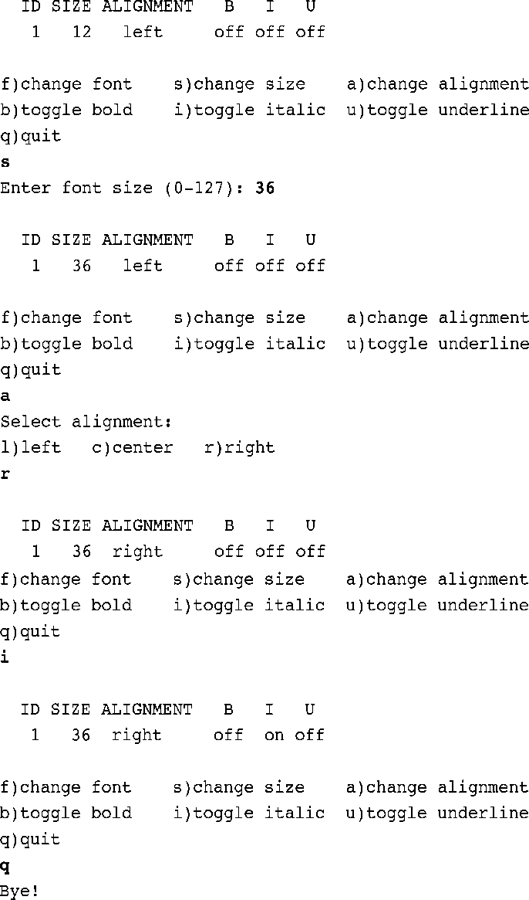

### 15.9　编程练习

1．编写一个函数，把二进制字符串转换为一个数值。例如，有下面的语句：

```c
    char * pbin = "01001001";
```

那么把 `pbin` 作为参数传递给该函数后，它应该返回一个 `int` 类型的值73。

2．编写一个程序，通过命令行参数读取两个二进制字符串，对这两个二进制数使用～运算符、 `&` 运算符、 `|` 运算符和 `^` 运算符，并以二进制字符串形式打印结果（如果无法使用命令行环境，可以通过交互式让程序读取字符串）。

3．编写一个函数，接受一个 `int` 类型的参数，并返回该参数中打开位的数量。在一个程序中测试该函数。

4．编写一个程序，接受两个 `int` 类型的参数：一个是值；一个是位的位置。如果指定位的位置为 `1` ，该函数返回 `1` ；否则返回 `0` 。在一个程序中测试该函数。

5．编写一个函数，把一个 `unsigned int` 类型值中的所有位向左旋转指定数量的位。例如， `rotate_l(x, 4)` 把 `x` 中所有位向左移动4个位置，而且从最左端移出的位会重新出现在右端。也就是说，把高阶位移出的位放入低阶位。在一个程序中测试该函数。

6．设计一个位字段结构以存储下面的信息。

字体 `ID` ： `0` ～ `255` 之间的一个数；

字体大小： `0` ～ `127` 之间的一个数；

对齐： `0` ～ `2` 之间的一个数，表示左对齐、居中、右对齐；

加粗：开（ `1` ）或闭（ `0` ）；

斜体：开（ `1` ）或闭（ `0` ）；

在一个程序中使用该结构来打印字体参数，并使用循环菜单来让用户改变参数。例如，该程序的一个运行示例如下：



该程序要使用按位与运算符（ `&` ）和合适的掩码来把字体ID和字体大小信息转换到指定的范围内。

7．编写一个与编程练习6功能相同的程序，使用 `unsigned long` 类型的变量存储字体信息，并且使用按位运算符而不是位成员来管理这些信息。


