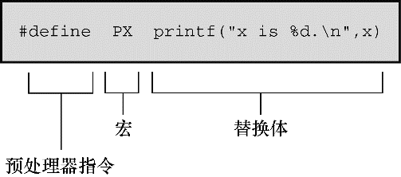

### 16.2　明示常量： `#define` 

`#define` 预处理器指令和其他预处理器指令一样，以 `#` 号作为一行的开始。ANSI和后来的标准都允许 `#` 号前面有空格或制表符，而且还允许在 `#` 和指令的其余部分之间有空格。但是旧版本的C要求指令从一行最左边开始，而且 `#` 和指令其余部分之间不能有空格。指令可以出现在源文件的任何地方，其定义从指令出现的地方到该文件末尾有效。我们大量使用 `#define` 指令来定义明示常量（manifest constant）（也叫作符号常量），但是该指令还有许多其他用途。程序清单16.1演示了 `#define` 指令的一些用法和属性。

程序清单16.1　 `preproc.c` 程序

```c
/* preproc.c -- 简单的预处理示例 */
#include <stdio.h>
#define TWO 2　　　　/* 可以使用注释 */
#define OW "Consistency is the last refuge of the unimagina\
tive. - Oscar Wilde" /* 反斜杠把该定义延续到下一行 */
#define FOUR　TWO*TWO
#define PX printf("X is %d.\n", x)
#define FMT　"X is %d.\n"
int main(void)
{
　　 int x = TWO;
　　 PX;
　　 x = FOUR;
　　 printf(FMT, x);
　　 printf("%s\n", OW);
　　 printf("TWO: OW\n");
　　 return 0;
}
```

预处理器指令从 `#` 开始运行，到后面的第1个换行符为止。也就是说，指令的长度仅限于一行。然而，前面提到过，在预处理开始前，编译器会把多行物理行处理为一行逻辑行。

每行 `#define` （逻辑行）都由3部分组成。第1部分是 `#define` 指令本身。第2部分是选定的缩写，也称为宏。有些宏代表值（如本例），这些宏被称为类对象宏（object-like macro）。C语言还有类函数宏（function-like macro），稍后讨论。宏的名称中不允许有空格，而且必须遵循C变量的命名规则：只能使用字符、数字和下划线（ `_` ）字符，而且首字符不能是数字。第3部分（指令行的其余部分）称为替换列表或替换体（见图16.1）。一旦预处理器在程序中找到宏的示实例后，就会用替换体代替该宏（也有例外，稍后解释）。从宏变成最终替换文本的过程称为宏展开（macro expansion）。注意，可以在 `#define` 行使用标准C注释。如前所述，每条注释都会被一个空格代替。


<center class="my_markdown"><b class="my_markdown">图16.1　类对象宏定义的组成</b></center>

运行该程序示例后，输出如下 `:`

```c
X is 2.
X is 4.
Consistency is the last refuge of the unimaginative. - Oscar Wilde
TWO: OW
```

下面分析具体的过程。下面的语句：

```c
int x = TWO;
```

变成了：

```c
int x = 2;
```

`2` 代替了 `TWO` 。而语句：

```c
PX;
```

变成了：

```c
printf("X is %d.\n", x);
```

这里同样进行了替换。这是一个新用法，到目前为止我们只是用宏来表示明示常量。从该例中可以看出，宏可以表示任何字符串，甚至可以表示整个C表达式。但是要注意，虽然 `PX` 是一个字符串常量，它只打印一个名为 `x` 的变量。

下一行也是一个新用法。读者可能认为 `FOUR` 被替换成 `4` ，但是实际的过程是：

```c
x = FOUR;
```

变成了：

```c
x = TWO*TWO;
```

即是：

```c
x = 2*2;
```

宏展开到此处为止。由于编译器在编译期对所有的常量表达式（只包含常量的表达式）求值，所以预处理器不会进行实际的乘法运算，这一过程在编译时进行。预处理器不做计算，不对表达式求值，它只进行替换。

注意，宏定义还可以包含其他宏（一些编译器不支持这种嵌套功能）。

程序中的下一行：

```c
printf (FMT, x);
```

变成了：

```c
printf("X is %d.\n",x);
```

相应的字符串替换了 `FMT` 。如果要多次使用某个冗长的字符串，这种方法比较方便。另外，也可以用下面的方法：

```c
const char * fmt = "X is %d.\n";
```

然后可以把 `fmt` 作为 `printf()` 的格式字符串。

下一行中，用相应的字符串替换 `OW` 。双引号使替换的字符串成为字符串常量。编译器把该字符串存储在以空字符结尾的数组中。因此，下面的指令定义了一个字符常量：

```c
#define HAL 'Z'
```

而下面的指令则定义了一个字符串（ `Z\0` ）：

```c
#define HAP "Z"
```

在程序示例16.1中，我们在一行的结尾加一个反斜杠字符使该行扩展至下一行：

```c
#define OW "Consistency is the last refuge of the unimagina\
tive. - Oscar Wilde"
```

注意，第2行要与第1行左对齐。如果这样做：

```c
#define OW "Consistency is the last refuge of the unimagina\
　　 tive. - Oscar Wilde"
```

那么输出的内容是：

```c
Consistency is the last refuge of the unimagina tive. - Oscar Wilde
```

第2行开始到 `tive` 之间的空格也算是字符串的一部分。

一般而言，预处理器发现程序中的宏后，会用宏等价的替换文本进行替换。如果替换的字符串中还包含宏，则继续替换这些宏。唯一例外的是双引号中的宏。因此，下面的语句：

```c
printf("TWO: OW");
```

打印的是 `TWO: OW` ，而不是打印：

```c
2: Consistency is the last refuge of the unimaginative. - Oscar Wilde
```

要打印这行，应该这样写：

```c
printf("%d: %s\n", TWO, OW);
```

这行代码中，宏不在双引号内。

那么，何时使用字符常量？对于绝大部分数字常量，应该使用字符常量。如果在算式中用字符常量代替数字，常量名能更清楚地表达该数字的含义。如果是表示数组大小的数字，用符号常量后更容易改变数组的大小和循环次数。如果数字是系统代码（如， `EOF` ），用符号常量表示的代码更容易移植（只需改变 `EOF` 的定义）。助记、易更改、可移植，这些都是符号常量很有价值的特性。

C语言现在也支持 `const` 关键字，提供了更灵活的方法。用 `const` 可以创建在程序运行过程中不能改变的变量，可具有文件作用域或块作用域。另一方面，宏常量可用于指定标准数组的大小和 `const` 变量的初始值。

```c
#define LIMIT 20
const int LIM = 50;
static int data1[LIMIT];　 　// 有效
static int data2[LIM];　　 　// 无效
const int LIM2 = 2 * LIMIT 　// 有效
const int LIM3 = 2 * LIM;　　// 无效
```

这里解释一下上面代码中的“无效”注释。在C中，非自动数组的大小应该是整型常量表达式，这意味着表示数组大小的必须是整型常量的组合（如 `5` ）、枚举常量和 `sizeof` 表达式，不包括 `const` 声明的值（这也是C++和C的区别之一，在C++中可以把 `const` 值作为常量表达式的一部分）。但是，有的实现可能接受其他形式的常量表达式。例如，GCC 4.7.3不允许 `data2` 的声明，但是Clang 4.6允许。

