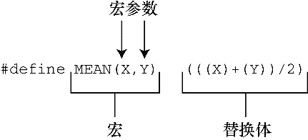

### 16.3　在 `#define` 中使用参数

在 `#define` 中使用参数可以创建外形和作用与函数类似的类函数宏。带有参数的宏看上去很像函数，因为这样的宏也使用圆括号。类函数宏定义的圆括号中可以有一个或多个参数，随后这些参数出现在替换体中，如图16.2所示。


<center class="my_markdown"><b class="my_markdown">图16.2　函数宏定义的组成</b></center>

下面是一个类函数宏的示例：

```c
#define SQUARE(X) X*X
```

在程序中可以这样用：

```c
z = SQUARE(2);
```

这看上去像函数调用，但是它的行为和函数调用完全不同。程序清单16.2演示了类函数宏和另一个宏的用法。该示例中有一些陷阱，请读者仔细阅读序。

程序清单16.2　 `mac_arg.c` 程序

```c
/* mac_arg.c -- 带参数的宏 */
#include <stdio.h>
#define SQUARE(X) X*X
#define PR(X)　 printf("The result is %d.\n", X)
int main(void)
{
　　 int x = 5;
　　 int z;
　　 printf("x = %d\n", x);
　　 z = SQUARE(x);
　　 printf("Evaluating SQUARE(x): ");
　　 PR(z);
　　 z = SQUARE(2);
　　 printf("Evaluating SQUARE(2): ");
　　 PR(z);
　　 printf("Evaluating SQUARE(x+2): ");
　　 PR(SQUARE(x + 2));
　　 printf("Evaluating 100/SQUARE(2): ");
　　 PR(100 / SQUARE(2));
　　 printf("x is %d.\n", x);
　　 printf("Evaluating SQUARE(++x): ");
　　 PR(SQUARE(++x));
　　 printf("After incrementing, x is %x.\n", x);
　　 return 0;
}
```

`SQUARE` 宏的定义如下：

```c
#define SQUARE(X) X*X
```

这里， `SQUARE` 是宏标识符， `SQUARE(X)` 中的 `X` 是宏参数， `X` * `X` 是替换列表。程序清单16.2中出现 `SQUARE(X)` 的地方都会被 `X` * `X` 替换。这与前面的示例不同，使用该宏时，既可以用 `X` ，也可以用其他符号。宏定义中的 `X` 由宏调用中的符号代替。因此， `SQUARE(2)` 替换为 `2` * `2` ， `X` 实际上起到参数的作用。

然而，稍后你将看到，宏参数与函数参数不完全相同。下面是程序的输出。注意有些内容可能与我们的预期不符。实际上，你的编译器输出甚至与下面的结果完全不同。

```c
x = 5
Evaluating SQUARE(x): The result is 25.
Evaluating SQUARE(2): The result is 4.
Evaluating SQUARE(x+2): The result is 17.
Evaluating 100/SQUARE(2): The result is 100.
x is 5.
Evaluating SQUARE(++x): The result is 42.
After incrementing, x is 7.
```

前两行与预期相符，但是接下来的结果有点奇怪。程序中设置 `x` 的值为 `5` ，你可能认为 `SQUARE(x+2)` 应该是 `7` * `7` ，即 `49` 。但是，输出的结果是 `17` ，这不是一个平方值！导致这样结果的原因是，我们前面提到过，预处理器不做计算、不求值，只替换字符序列。预处理器把出现 `x` 的地方都替换成 `x+2` 。因此， `x` * `x` 变成了 `x+2` * `x+2` 。如果 `x` 为 `5` ，那么该表达式的值为：

```c
5+2*5+2 = 5 + 10 + 2 = 17
```

该例演示了函数调用和宏调用的重要区别。函数调用在程序运行时把参数的值传递给函数。宏调用在编译之前把参数记号传递给程序。这两个不同的过程发生在不同时期。是否可以修改宏定义让 `SQUARE(x+2)` 得 `36` ？当然可以，要多加几个圆括号：

```c
#define SQUARE(x) (x)*(x)
```

现在 `SQUARE(x+2)` 变成了 `(x+2)` * `(x+2)` ，在替换字符串中使用圆括号就得到符合预期的乘法运算。

但是，这并未解决所有的问题。下面的输出行：

```c
100/SQUARE(2)
```

将变成：

```c
100/2*2
```

根据优先级规则，从左往右对表达式求值： `(100/2)` * `2` ，即 `50` * `2` ，得 `100` 。把 `SQUARE(x)` 定义为下面的形式可以解决这种混乱：

```c
#define SQUARE(x) (x*x)
```

这样修改定义后得 `100/(2` * `2)` ，即 `100/4` ，得 `25` 。

要处理前面的两种情况，要这样定义：

```c
#define SQUARE(x) ((x)*(x))
```

因此，必要时要使用足够多的圆括号来确保运算和结合的正确顺序。

尽管如此，这样做还是无法避免程序中最后一种情况的问题。 `SQUARE(++x)` 变成了 `++x` * `++x` ，递增了两次 `x` ，一次在乘法运算之前，一次在乘法运算之后：

```c
++x*++x = 6*7 = 42
```

由于标准并未对这类运算规定顺序，所以有些编译器得 `7` * `6` 。而有些编译器可能在乘法运算之前已经递增了 `x` ，所以 `7` * `7` 得 `49` 。在C标准中，对该表达式求值的这种情况称为未定义行为。无论哪种情况， `x` 的开始值都是 `5` ，虽然从代码上看只递增了一次，但是 `x` 的最终值是 `7` 。

解决这个问题最简单的方法是，避免用 `++x` 作为宏参数。一般而言，不要在宏中使用递增或递减运算符。但是， `++x` 可作为函数参数，因为编译器会对 `++x` 求值得 `5` 后，再把 `5` 传递给函数。

