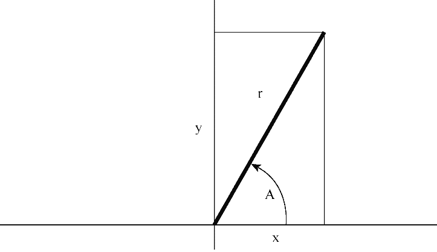

### 16.18　编程练习

1．开发一个包含你需要的预处理器定义的头文件。

2．两数的调和平均数这样计算：先得到两数的倒数，然后计算两个倒数的平均值，最后取计算结果的倒数。使用 `#define` 指令定义一个宏“函数”，执行该运算。编写一个简单的程序测试该宏。

3．极坐标用向量的模（即向量的长度）和向量相对 `x` 轴逆时针旋转的角度来描述该向量。直角坐标用向量的 `x` 轴和 `y` 轴的坐标来描述该向量（见图16.3）。编写一个程序，读取向量的模和角度（单位：度），然后显示 `x` 轴和 `y` 轴的坐标。相关方程如下：

```c
　　 x = r*cos A y = r*sin A
```

需要一个函数来完成转换，该函数接受一个包含极坐标的结构，并返回一个包含直角坐标的结构（或返回指向该结构的指针）。


<center class="my_markdown"><b class="my_markdown">图16.3　直角坐标和极坐标</b></center>

4．ANSI库这样描述 `clock()` 函数的特性：

```c
#include <time.h>
clock_t clock (void);
```

这里， `clock_t` 是定义在 `time.h` 中的类型。该函数返回处理器时间，其单位取决于实现（如果处理器时间不可用或无法表示，该函数将返回 `-1` ）。然而， `CLOCKS_PER_SEC` （也定义在 `time.h` 中）是每秒处理器时间单位的数量。因此，两个 `clock()` 返回值的差值除以 `CLOCKS_PER_SEC` 得到两次调用之间经过的秒数。在进行除法运算之前，把值的类型强制转换成 `double` 类型，可以将时间精确到小数点以后。编写一个函数，接受一个 `double` 类型的参数表示时间延迟数，然后在这段时间运行一个循环。编写一个简单的程序测试该函数。

5．编写一个函数接受这些参数：内含 `int` 类型元素的数组名、数组的大小和一个代表选取次数的值。该函数从数组中随机选择指定数量的元素，并打印它们。每个元素只能选择一次（模拟抽奖数字或挑选陪审团成员）。另外，如果你的实现有 `time()` （第12章讨论过）或类似的函数，可在 `srand()` 中使用这个函数的输出来初始化随机数生成器 `rand()` 。编写一个简单的程序测试该函数。

6．修改程序清单16.17，使用 `struct names` 元素（在程序清单16.17后面的讨论中定义过），而不是 `double` 类型的数组。使用较少的元素，并用选定的名字显式初始化数组。

7．下面是使用变参函数的一个程序段：

```c
#include <stdio.h>
#include <stdlib.h>
#include <stdarg.h>
void show_array(const double ar[], int n);
double * new_d_array(int n, ...);
int main()
{
　　 double * p1;
　　 double * p2;
　　 p1 = new_d_array(5, 1.2, 2.3, 3.4, 4.5, 5.6);
　　 p2 = new_d_array(4, 100.0, 20.00, 8.08, -1890.0);
　　 show_array(p1, 5);
　　 show_array(p2, 4);
　　 free(p1);
　　 free(p2);
　　 return 0;
}
```

`new_d_array()` 函数接受一个 `int` 类型的参数和 `double` 类型的参数。该函数返回一个指针，指向由 `malloc()` 分配的内存块。 `int` 类型的参数指定了动态数组中的元素个数， `double` 类型的值用于初始化元素（第 `1` 个值赋给第 `1` 个元素，以此类推）。编写 `show_array()` 和 `new_d_array()` 函数的代码，完成这个程序。


