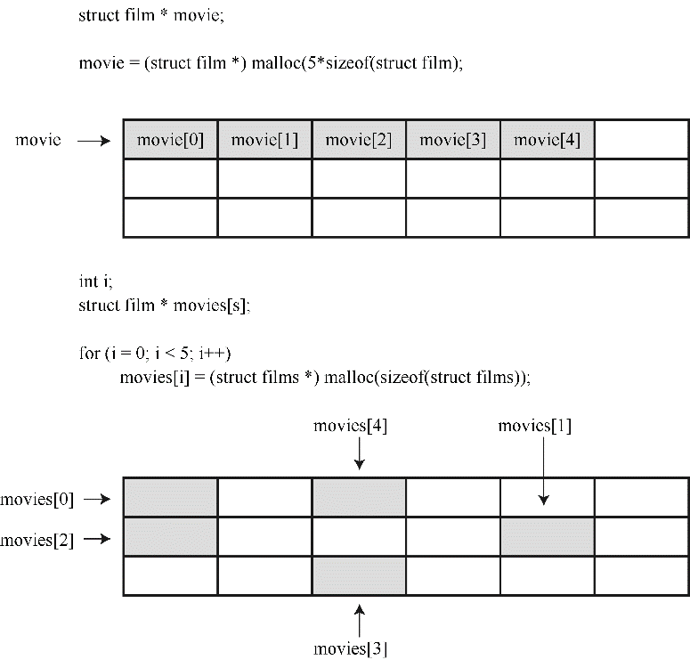
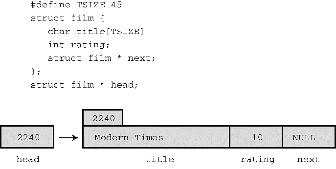
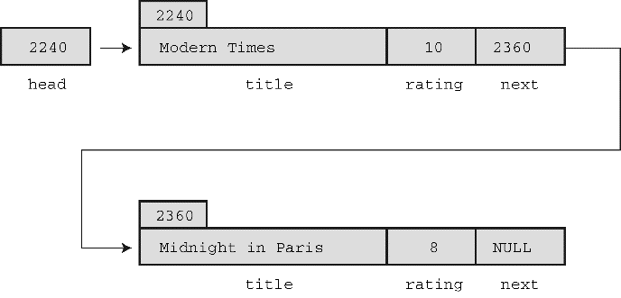
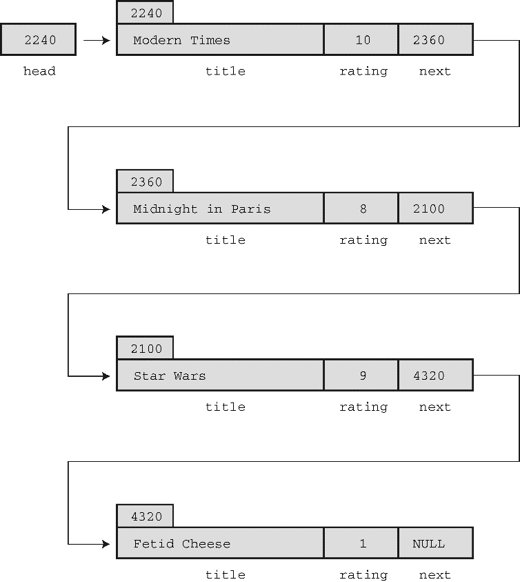

### 17.2　从数组到链表

理想的情况是，用户可以不确定地添加数据（或者不断添加数据直到用完内存量），而不是先指定要输入多少项，也不用让程序分配多余的空间。这可以通过在输入每一项后调用 `malloc()` 分配正好能存储该项的空间。如果用户输入3部影片，程序就调用 `malloc()` 3次；如果用户输入300部影片，程序就调用 `malloc()` 300次。

不过，我们又制造了另一个麻烦。比较一下，一种方法是调用 `malloc()` 一次，为300个 `film` 结构请求分配足够的空间；另一种方法是调用 `malloc()` 300次，分别为每个 `file` 结构请求分配足够的空间。前者分配的是连续的内存块，只需要一个单独的指向 `struct` 变量（ `film` ）的指针，该指针指向已分配块中的第1个结构。简单的数组表示法让指针访问块中的每个结构，如前面代码段所示。第2种方法的问题是，无法保证每次调用 `malloc()` 都能分配到连续的内存块。这意味着结构不一定被连续存储（见图17.1）。因此，与第1种方法存储一个指向300个结构块的指针相比，你需要存储300个指针，每个指针指向一个单独存储的结构。


<center class="my_markdown"><b class="my_markdown">图17.1　一块内存中分配结构和单独分配结构</b></center>

一种解决方法是创建一个大型的指针数组，并在分配新结构时逐个给这些指针赋值，但是我们不打算使用这种方法：

```c
#define TSIZE 45    /*存储片名的数组大小*/
#define FMAX 500    /*影片的最大数量*/
struct film {
     char title[TSIZE];
     int rating;
};
...
struct film * movies[FMAX]; /* 结构指针数组 */
int i;
...
movies[i] = (struct film *) malloc (sizeof (struct film));
```

如果用不完500个指针，这种方法节约了大量的内存，因为内含500个指针的数组比内含500个结构的数组所占的内存少得多。尽管如此，如果用不到500个指针，还是浪费了不少空间。而且，这样还是有500个结构的限制。

还有一种更好的方法。每次使用 `malloc()` 为新结构分配空间时，也为新指针分配空间。但是，还得需要另一个指针来跟踪新分配的指针，用于跟踪新指针的指针本身，也需要一个指针来跟踪，以此类推。要重新定义结构才能解决这个潜在的问题，即每个结构中包含指向 `next` 结构的指针。然后，当创建新结构时，可以把该结构的地址存储在上一个结构中。简而言之，可以这样定义 `film` 结构：

```c
#define TSIZE 45    /* 存储片名的数组大小*/
struct film {
     char title[TSIZE];
     int rating;
     struct film * next;
};
```

虽然结构不能含有与本身类型相同的结构，但是可以含有指向同类型结构的指针。这种定义是定义链表（linked list）的基础，链表中的每一项都包含着在何处能找到下一项的信息。

在学习链表的代码之前，我们先从概念上理解一个链表。假设用户输入的片名是 `Modern Times` ，等级为 `10` 。程序将为 `film` 类型的结构分配空间，把字符串 `Modern Times` 拷贝到结构中的 `title` 成员中，然后设置 `rating` 成员为 `10` 。为了表明该结构后面没有其他结构，程序要把 `next` 成员指针设置为 `NULL` （ `NULL` 是一个定义在 `stdio.h` 头文件中的符号常量，表示空指针）。当然，还需要一个单独的指针存储第 `1` 个结构的地址，该指针被称为头指针（head pointer）。头指针指向链表中的第1项。图17.2演示了这种结构（为节约图片空间，压缩了 `title` 成员中的空白）。


<center class="my_markdown"><b class="my_markdown">图17.2　链表中的第1个项</b></center>

现在，假设用户输入第2部电影及其评级，如 `Midnight in Paris` 和 `8` 。程序为第2个 `film` 类型结构分配空间，把新结构的地址存储在第1个结构的 `next` 成员中（擦写了之前存储在该成员中的 `NULL` ），这样链表中第1个结构中的 `next` 指针指向第2个结构。然后程序把 `Midnight in Paris` 和 `8` 拷贝到新结构中，并把第2个结构中的 `next` 成员设置为 `NULL` ，表明该结构是链表中的最后一个结构。图17.3演示了这两个项。


<center class="my_markdown"><b class="my_markdown">图17.3　链表中的两个项</b></center>

每加入一部新电影，就以相同的方式来处理。新结构的地址将存储在上一个结构中，新信息存储在新结构中，而且新结构中的 `next` 成员设置为 `NULL` 。从而建立起如图17.4所示的链表。


<center class="my_markdown"><b class="my_markdown">图17.4　链表中的多个项</b></center>

假设要显示这个链表，每显示一项，就可以根据该项中已存储的地址来定位下一个待显示的项。然而，这种方案能正常运行，还需要一个指针存储链表中第1项的地址，因为链表中没有其他项存储该项的地址。此时，头指针就派上了用场。

