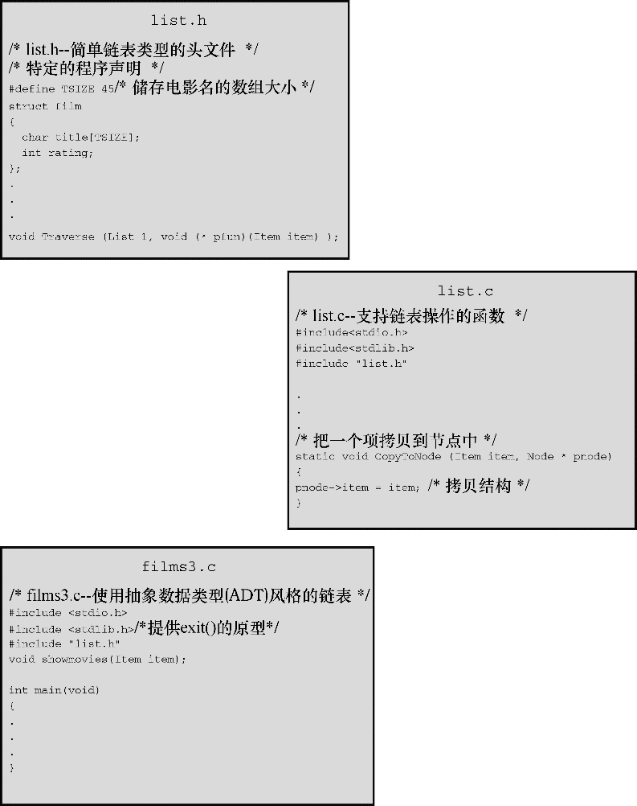

#### 17.3.4　实现接口

当然，我们还是必须实现 `List` 接口。C方法是把函数定义统一放在 `list.c` 文件中。然后，整个程序由 `list.h` （定义数据结构和提供用户接口的原型）、 `list.c` （提供函数代码实现接口）和 `films3.c` （把链表接口应用于特定编程问题的源代码文件）组成。程序清单17.5演示了 `list.c` 的一种实现。要运行该程序，必须把 `films3.c` 和 `list.c` 一起编译和链接（可以复习一下第9章关于编译多文件程序的内容）。 `list.h` 、 `list.c` 和 `films3.c` 组成了整个程序（见图17.5）。

程序清单17.5　 `list.c` 实现文件

```c
/* list.c -- 支持链表操作的函数 */
#include <stdio.h>
#include <stdlib.h>
#include "list.h"
/* 局部函数原型 */
static void CopyToNode(Item item, Node * pnode);
/* 接口函数   */
/* 把链表设置为空 */
void InitializeList(List * plist)
{
     plist = NULL;
}
/* 如果链表为空，返回true */
bool ListIsEmpty(const List * plist)
{
     if (*plist == NULL)
          return true;
     else
          return false;
}
/* 如果链表已满，返回true */
bool ListIsFull(const List * plist)
{
     Node * pt;
     bool full;
     pt = (Node *)malloc(sizeof(Node));
     if (pt == NULL)
          full = true;
     else
          full = false;
     free(pt);
     return full;
}
/* 返回节点的数量 */
unsigned int ListItemCount(const List * plist)
{
     unsigned int count = 0;
     Node * pnode = *plist;    /* 设置链表的开始 */
     while (pnode != NULL)
     {
          ++count;
          pnode = pnode->next;  /* 设置下一个节点 */
     }
     return count;
}
/* 创建存储项的节点，并将其添加至由plist指向的链表末尾（较慢的实现） */
bool AddItem(Item item, List * plist)
{
     Node * pnew;
     Node * scan = *plist;
     pnew = (Node *) malloc(sizeof(Node));
     if (pnew == NULL)
          return false;          /* 失败时退出函数 */
     CopyToNode(item, pnew);
     pnew->next = NULL;
     if (scan == NULL)           /* 空链表，所以把 */
          *plist = pnew;         /* pnew放在链表的开头 */
     else
     {
          while (scan->next != NULL)
               scan = scan->next; /* 找到链表的末尾 */
          scan->next = pnew;      /* 把pnew添加到链表的末尾 */
     }
     return true;
}
/* 访问每个节点并执行pfun指向的函数 */
void Traverse(const List * plist, void(*pfun)(Item item))
{
     Node * pnode = *plist;     /* 设置链表的开始 */
     while (pnode != NULL)
     {
          (*pfun)(pnode->item); /* 把函数应用于链表中的项 */
          pnode = pnode->next;  /* 前进到下一项   */
     }
}
/* 释放由malloc()分配的内存 */
/* 设置链表指针为NULL       */
void EmptyTheList(List * plist)
{
     Node * psave;
     while (*plist != NULL)
     {
          psave = (*plist)->next;     /* 保存下一个节点的地址    */
          free(*plist);               /* 释放当前节点           */
          *plist = psave;             /* 前进至下一个节点        */
     }
}
/* 局部函数定义 */
/* 把一个项拷贝到节点中 */
static void CopyToNode(Item item, Node * pnode)
{
     pnode->item = item;  /* 拷贝结构 */
}
```


<center class="my_markdown"><b class="my_markdown">图17.5　电影程序的3个部分</b></center>

#### 1．程序的一些注释

`list.c` 文件有几个需要注意的地方。首先，该文件演示了什么情况下使用内部链接函数。如第 `12` 章所述，具有内部链接的函数只能在其声明所在的文件夹可见。在实现接口时，有时编写一个辅助函数（不作为正式接口的一部分）很方便。例如，使用 `CopyToNode()` 函数把一个 `Item` 类型的值拷贝到 `Item` 类型的变量中。由于该函数是实现的一部分，但不是接口的一部分，所以我们使用 `static` 存储类别说明符把它隐藏在 `list.c` 文件中。接下来，讨论其他函数。

`InitializeList()` 函数将链表初始化为空。在我们的实现中，这意味着把 `List` 类型的变量设置为 `NULL` 。前面提到过，这要求把指向 `List` 类型变量的指针传递给该函数。

`ListIsEmpty()` 函数很简单，但是它的前提条件是，当链表为空时，链表变量被设置为 `NULL` 。因此，在首次调用 `ListIsEmpty()` 函数之前初始化链表非常重要。另外，如果要扩展接口添加删除项的功能，那么当最后一个项被删除时，应该确保该删除函数重置链表为空。对链表而言，链表的大小取决于可用内存量。 `ListIsFull()` 函数尝试为新项分配空间。如果分配失败，说明链表已满；如果分配成功，则必须释放刚才分配的内存供真正的项所用。

`ListItemCount()` 函数使用常用的链表算法遍历链表，同时统计链表中的项：

```c
unsigned int ListItemCount(const List * plist)
{
     unsigned int count = 0;
     Node * pnode = *plist;    /* 设置链表的开始 */
     while (pnode != NULL)
     {
          ++count;
          pnode = pnode->next;  /* 设置下一个节点 */
     }
     return count;
}
```

`AddItem()` 函数是这些函数中最复杂的：

```c
bool AddItem(Item item, List * plist)
{
     Node * pnew;
     Node * scan = *plist;
     pnew = (Node *) malloc(sizeof(Node));
     if (pnew == NULL)
          return false;               /* 失败时退出函数 */
     CopyToNode(item, pnew);
     pnew->next = NULL;
     if (scan == NULL)                /* 空链表，所以把 */
          *plist = pnew;              /* pnew放在链表的开头 */
     else
     {
          while (scan->next != NULL)
               scan = scan->next;    /* 找到链表的末尾 */
          scan->next = pnew;         /* 把pnew添加到链表的末尾 */
     }
     return true;
}
```

`AddItem()` 函数首先为新节点分配空间。如果分配成功，该函数使用 `CopyToNode()` 把项拷贝到新节点中。然后把该节点的 `next` 成员设置为 `NULL` 。这表明该节点是链表中的最后一个节点。最后，完成创建节点并为其成员赋正确的值之后，该函数把该节点添加到链表的末尾。如果该项是添加到链表的第1个项，需要把头指针设置为指向第1项（记住，头指针的地址是传递给 `AddItem()` 函数的第2个参数，所以* `plist` 就是头指针的值）。否则，代码继续在链表中前进，直到发现被设置为 `NULL` 的 `next` 成员。此时，该节点就是当前的最后一个节点，所以，函数重置它的 `next` 成员指向新节点。

要养成良好的编程习惯，给链表添加项之前应调用 `ListIsFull()` 函数。但是，用户可能并未这样做，所以在 `AddItem()` 函数内部检查 `malloc()` 是否分配成功。而且，用户还可能在调用 `ListIsFull()` 和调用 `AddItem()` 函数之间做其他事情分配了内存，所以最好还是检查 `malloc()` 是否分配成功。

`Traverse()` 函数与 `ListItemCount()` 函数类似，不过它还把一个指针函数作用于链表中的每一项。

```c
void Traverse (const List * plist, void (* pfun)(Item item) )
{
     Node * pnode = *plist;       /* 设置链表的开始 */
     while (pnode != NULL)
     {
           (*pfun)(pnode->item);  /* 把函数应用于该项*/
          pnode = pnode->next;    /* 前进至下一个项 */
     }
}
```

`pnode->item` 代表存储在节点中的数据， `pnode->next` 标识链表中的下一个节点。如下函数调用：

```c
Traverse(movies, showmovies);
```

把 `showmovies()` 函数应用于链表中的每一项。

最后， `EmptyTheList()` 函数释放了之前 `malloc()` 分配的内存：

```c
void EmptyTheList(List * plist)
{
     Node * psave;
     while (*plist != NULL)
     {
          psave = (*plist)->next;     /* 保存下一个节点的地址    */
          free(*plist);              /* 释放当前节点            */
          *plist = psave;            /* 前进至下一个节点        */
     }
}
```

该函数的实现通过把 `List` 类型的变量设置为 `NULL` 来表明一个空链表。因此，要把 `List` 类型变量的地址传递给该函数，以便函数重置。由于 `List` 已经是一个指针，所以 `plist` 是一个指向指针的指针。因此，在上面的代码中，* `plist` 是指向 `Node` 的指针。当到达链表末尾时，* `plist` 为 `NULL` ，表明原始的实际参数现在被设置为 `NULL` 。

代码中要保存下一节点的地址，因为原则上调用了 `free()` 会使当前节点（即* `plist` 指向的节点）的内容不可用。

> **提示　 `const` 的限制**
> 多个处理链表的函数都把 `const List`  *  `plist` 作为形参，表明这些函数不会更改链表。这里， `const` 确实提供了一些保护。它防止了* `plist` （即 `plist` 所指向的量）被修改。在该程序中， `plist` 指向 `movies` ，所以 `const` 防止了这些函数修改 `movies` 。因此，在 `ListItemCount()` 中，不允许有类似下面的代码：

```c
*plist = (*plist)->next; // 如果*plist是const，不允许这样做
```

> 因为改变* `plist` 就改变了 `movies` ，将导致程序无法跟踪数据。然而，* `plist` 和 `movies` 都被看作是 `const` 并不意味着* `plist` 或 `movies` 指向的数据是 `const` 。例如，可以编写下面的代码：

```c
(*plist)->item.rating = 3; // 即使*plist是const，也可以这样做
```

> 因为上面的代码并未改变* `plist` ，它改变的是* `plist` 指向的数据。由此可见，不要指望 `const` 能捕获到意外修改数据的程序错误。

#### 2．考虑你要做的

现在花点时间来评估ADT方法做了什么。首先，比较程序清单17.2和程序清单17.4。这两个程序都使用相同的内存分配方法（动态分配链接的结构）解决电影链表的问题，但是程序清单17.2暴露了所有的编程细节，把 `malloc()` 和 `prev->next` 这样的代码都公之于众。而程序清单17.4隐藏了这些细节，并用与任务直接相关的方式表达程序。也就是说，该程序讨论的是创建链表和向链表中添加项，而不是调用内存函数或重置指针。简而言之，程序清单17.4是根据待解决的问题来表达程序，而不是根据解决问题所需的具体工具来表达程序。 `ADT` 版本可读性更高，而且针对的是最终的用户所关心的问题。

其次， `list.h` 和 `list.c` 文件一起组成了可复用的资源。如果需要另一个简单的链表，也可以使用这些文件。假设你需要存储亲戚的一些信息：姓名、关系、地址和电话号码，那么先要在 `list.h` 文件中重新定义 `Item` 类型：

```c
typedef struct itemtag
{
     char fname[14];
     char lname [24];
     char relationship[36];
     char address [60];
     char phonenum[20];
} Item;
```

然后……只需要做这些就行了。因为所有处理简单链表的函数都与 `Item` 类型有关。根据不同的情况，有时还要重新定义 `CopyToNode()` 函数。例如，当项是一个数组时，就不能通过赋值来拷贝。

另一个要点是，用户接口是根据抽象链表操作定义的，不是根据某些特定的数据表示和算法来定义。这样，不用重写最后的程序就能随意修改实现。例如，当前使用的 `AddItem()` 函数效率不高，因为它总是从链表第1个项开始，然后搜索至链表末尾。可以通过保存链表结尾处的地址来解决这个问题。例如，可以这样重新定义 `List` 类型：

```c
typedef struct list
{
     Node * head;   /* 指向链表的开头 */
     Node * end;    /* 指向链表的末尾 */
} List;
```

当然，还要根据新的定义重写处理链表的函数，但是不用修改程序清单17.4中的内容。对大型编程项目而言，这种把实现和最终接口隔离的做法相当有用。这称为数据隐藏，因为对终端用户隐藏了数据表示的细节。

注意，这种特殊的ADT甚至不要求以链表的方式实现简单列表。下面是另一种方法：

```c
#define MAXSIZE 100
typedef struct list
{
     Item entries[MAXSIZE];    /* 项数组 */
     int items;                /* 其中的项数 */
} List;
```

这样做也需要重写 `list.c` 文件，但是使用 `list` 的程序不用修改。

最后，考虑这种方法给程序开发过程带来了哪些好处。如果程序运行出现问题，可以把问题定位到具体的函数上。如果想用更好的方法来完成某个任务（如，添加项），只需重写相应的函数即可。如果需要新功能，可以添加一个新的函数。如果觉得数组或双向链表更好，可以重写实现的代码，不用修改使用实现的程序。

