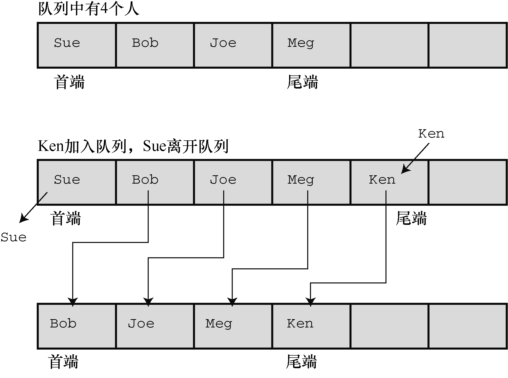
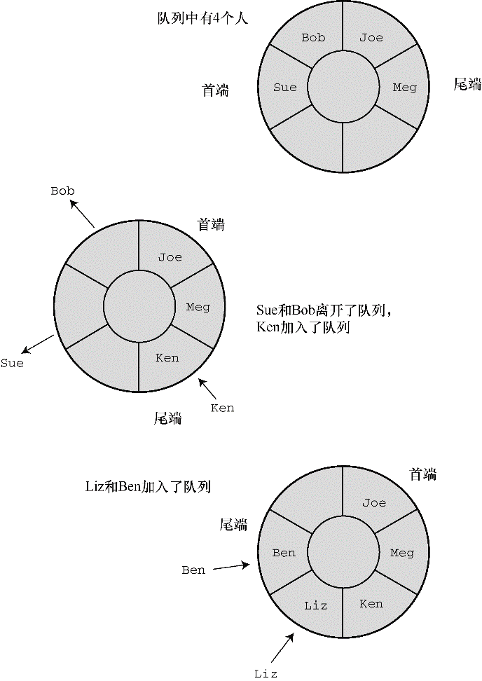

#### 17.4.3　实现接口数据表示

第一步是确定在队列中使用何种C数据形式。有可能是数组。数组的优点是方便使用，而且向数组的末尾添加项很简单。问题是如何从队列的开头删除项。类比于排队买票的队列，从队列的开头删除一个项包括拷贝数组首元素的值和把数组剩余各项依次向前移动一个位置。编程实现这个过程很简单，但是会浪费大量的计算机时间（见图17.6）。


<center class="my_markdown"><b class="my_markdown">图17.6　用数组实现队列</b></center>

第二种解决数组队列删除问题的方法是改变队列首端的位置，其余元素不动（见图17.7）。


<center class="my_markdown"><b class="my_markdown">图17.7　重新定义首元素</b></center>

解决这种问题的一个好方法是，使队列成为环形。这意味着把数组的首尾相连，即数组的首元素紧跟在最后一个元素后面。这样，当到达数组末尾时，如果首元素空出，就可以把新添加的项存储到这些空出的元素中（见图17.8）。可以想象在一张条形的纸上画出数组，然后把数组的首尾粘起来形成一个环。当然，要做一些标记，以免尾端超过首端。


<center class="my_markdown"><b class="my_markdown">图17.8　环形队列</b></center>

另一种方法是使用链表。使用链表的好处是删除首项时不必移动其余元素，只需重置头指针指向新的首元素即可。由于我们已经讨论过链表，所以采用这个方案。我们用一个整数队列开始测试：

```c
typedef int Item;
```

链表由节点组成，所以，下一步是定义节点：

```c
typedef struct node
{
     Item item;
     struct node * next;
} Node;
```

对队列而言，要保存首尾项，这可以使用指针来完成。另外，可以用一个计数器来记录队列中的项数。因此，该结构应由两个指针成员和一个 `int` 类型的成员构成：

```c
typedef struct queue
{
     Node * front;   /* 指向队列首项的指针 */
     Node * rear;    /*指向队列尾项的指针*/
     int items;      /* 队列中的项数*/
} Queue;
```

注意， `Queue` 是一个内含3个成员的结构，所以用指向队列的指针作为参数比直接用队列作为参数节约了时间和空间。

接下来，考虑队列的大小。对链表而言，其大小受限于可用的内存量，因此链表不要太大。例如，可能使用一个队列模拟飞机等待在机场着陆。如果等待的飞机数量太多，新到的飞机就应该改到其他机场降落。我们把队列的最大长度设置为10。程序清单17.6包含了队列接口的原型和定义。 `Item` 类型留给用户定义。使用该接口时，可以根据特定的程序插入合适的定义。

程序清单17.6　 `queue.h` 接口头文件

```c
/* queue.h -- Queue的接口 */
#ifndef _QUEUE_H_
#define _QUEUE_H_
#include <stdbool.h>
// 在这里插入Item类型的定义，例如
typedef int Item;        // 用于use_q.c
// 或者 typedef struct item {int gumption; int charisma;} Item;
#define MAXQUEUE 10
typedef struct node
{
     Item item;
     struct node * next;
} Node;
typedef struct queue
{
     Node * front;  /* 指向队列首项的指针    */
     Node * rear;   /* 指向队列尾项的指针    */
     int items;     /* 队列中的项数          */
} Queue;
/* 操作：        初始化队列                                       */
/* 前提条件：    pq 指向一个队列                                  */
/* 后置条件：    队列被初始化为空                                 */
void InitializeQueue(Queue * pq);
/* 操作：        检查队列是否已满                                 */
/* 前提条件：    pq 指向之前被初始化的队列                         */
/* 后置条件：    如果队列已满则返回true，否则返回false             */
bool QueueIsFull(const Queue * pq);
/* 操作：        检查队列是否为空                                 */
/* 前提条件：    pq 指向之前被初始化的队列                         */
/* 后置条件：    如果队列为空则返回true，否则返回false             */
bool QueueIsEmpty(const Queue *pq);
/* 操作：        确定队列中的项数                                 */
/* 前提条件：    pq 指向之前被初始化的队列                         */
/* 后置条件：    返回队列中的项数                                 */
int QueueItemCount(const Queue * pq);
/* 操作：        在队列末尾添加项                                 */
/* 前提条件：    pq 指向之前被初始化的队列                         */
/*              item是要被添加在队列末尾的项                      */
/* 后置条件：    如果队列不为空，item将被添加在队列的末尾，         */
/*              该函数返回true；否则，队列不改变，该函数返回false  */
bool EnQueue(Item item, Queue * pq);
/* 操作：        从队列的开头删除项                              */
/* 前提条件：    pq 指向之前被初始化的队列                        */
/* 后置条件：    如果队列不为空，队列首端的item将被拷贝到*pitem中  */
/*              并被删除，且函数返回true；                      */
/*              如果该操作使得队列为空，则重置队列为空            */
/*              如果队列在操作前为空，该函数返回false            */
bool DeQueue(Item *pitem, Queue * pq);
/* 操作：        清空队列                                      */
/* 前提条件：    pq 指向之前被初始化的队列                      */
/* 后置条件：    队列被清空                                    */
void EmptyTheQueue(Queue * pq);
#endif
```

#### 1．实现接口函数

接下来，我们编写接口代码。首先，初始化队列为空，这里“空”的意思是把指向队列首项和尾项的指针设置为NULL，并把项数（items成员）设置为0：

```c
void InitializeQueue(Queue * pq)
{
     pq->front = pq->rear = NULL;
     pq->items = 0;
}
```

这样，通过检查 `items` 的值可以很方便地了解到队列是否已满、是否为空和确定队列的项数：

```c
bool QueueIsFull(const Queue * pq)
{
     return pq->items == MAXQUEUE;
}
bool QueueIsEmpty(const Queue * pq)
{
     return pq->items == 0;
}
int QueueItemCount(const Queue * pq)
{
     return pq->items;
}
```

把项添加到队列中，包括以下几个步骤：

（1）创建一个新节点；

（2）把项拷贝到节点中；

（3）设置节点的 `next` 指针为 `NULL` ，表明该节点是最后一个节点；

（4）设置当前尾节点的next指针指向新节点，把新节点链接到队列中；

（5）把rear指针指向新节点，以便找到最后的节点；

（6）项数加1。

函数还要处理两种特殊情况。第一种情况，如果队列为空，应该把 `front` 指针设置为指向新节点。因为如果队列中只有一个节点，那么这个节点既是首节点也是尾节点。第二种情况是，如果函数不能为节点分配所需内存，则必须执行一些动作。因为大多数情况下我们都使用小型队列，这种情况很少发生，所以，如果程序运行的内存不足，我们只是通过函数终止程序。 `EnQueue()` 的代码如下：

```c
bool EnQueue(Item item, Queue * pq)
{
     Node * pnew;
     if (QueueIsFull(pq))
          return false;
     pnew = (Node *)malloc(sizeof(Node));
     if (pnew == NULL)
     {
          fprintf(stderr,"Unable to allocate memory!\n");
          exit(1);
     }
     CopyToNode(item, pnew);
     pnew->next = NULL;
     if (QueueIsEmpty(pq))
          pq->front = pnew;        /* 项位于队列首端         */
     else
          pq->rear->next = pnew;  /* 链接到队列尾端        */
     pq->rear = pnew;             /* 记录队列尾端的位置    */
     pq->items++;                 /* 队列项数加1          */
     return true;
}
```

`CopyToNode()` 函数是静态函数，用于把项拷贝到节点中：

```c
static void CopyToNode(Item item, Node * pn)
{
     pn->item = item;
}
```

从队列的首端删除项，涉及以下几个步骤：

（1）把项拷贝到给定的变量中；

（2）释放空出的节点使用的内存空间；

（3）重置首指针指向队列中的下一个项；

（4）如果删除最后一项，把首指针和尾指针都重置为 `NULL` ；

（5）项数减 `1` 。

下面的代码完成了这些步骤：

```c
bool DeQueue(Item * pitem, Queue * pq)
{
     Node * pt;
     if (QueueIsEmpty(pq))
          return false;
     CopyToItem(pq->front, pitem);
     pt = pq->front;
     pq->front = pq->front->next;
     free(pt);
     pq->items--;
     if (pq->items == 0)
          pq->rear = NULL;
     return true;
}
```

关于指针要注意两点。第一，删除最后一项时，代码中并未显式设置 `front` 指针为 `NULL` ，因为已经设置 `front` 指针指向被删除节点的 `next` 指针。如果该节点是最后一个节点，那么它的 `next` 指针就为 `NULL` 。第二，代码使用临时指针（ `pt` ）存储待删除节点的位置。因为指向首节点的正式指针（ `pt->front` ）被重置为指向下一个节点，所以如果没有临时指针，程序就不知道该释放哪块内存。

我们使用 `DeQueue()` 函数清空队列。循环调用 `DeQueue()` 函数直到队列为空：

```c
void EmptyTheQueue(Queue * pq)
{
     Item dummy;
     while (!QueueIsEmpty(pq))
          DeQueue(&dummy, pq);
}
```

> **注意　保持纯正的ADT**
> 定义ADT接口后，应该只使用接口函数处理数据类型。例如， `DeQueue()` 依赖 `EnQueue()` 函数来正确设置指针和把 `rear` 节点的 `next` 指针设置为 `NULL` 。如果在一个使用ADT的程序中，决定直接操控队列的某些部分，有可能破坏接口包中函数之间的协作关系。

程序清单17.7演示了该接口中的所有函数，包括 `EnQueue()` 函数中用到的 `CopyToNode()` 函数。

程序清单17.7　 `queue.c` 实现文件

```c
/* queue.c -- Queue类型的实现 */
#include <stdio.h>
#include <stdlib.h>
#include "queue.h"
/* 局部函数 */
static void CopyToNode(Item item, Node * pn);
static void CopyToItem(Node * pn, Item * pi);
void InitializeQueue(Queue * pq)
{
     pq->front = pq->rear = NULL;
     pq->items = 0;
}
bool QueueIsFull(const Queue * pq)
{
     return pq->items == MAXQUEUE;
}
bool QueueIsEmpty(const Queue * pq)
{
     return pq->items == 0;
}
int QueueItemCount(const Queue * pq)
{
     return pq->items;
}
bool EnQueue(Item item, Queue * pq)
{
     Node * pnew;
     if (QueueIsFull(pq))
          return false;
     pnew = (Node *) malloc(sizeof(Node));
     if (pnew == NULL)
     {
          fprintf(stderr, "Unable to allocate memory!\n");
          exit(1);
     }
     CopyToNode(item, pnew);
     pnew->next = NULL;
     if (QueueIsEmpty(pq))
          pq->front = pnew;          /* 项位于队列的首端        */
     else
          pq->rear->next = pnew;     /* 链接到队列的尾端        */
     pq->rear = pnew;                /* 记录队列尾端的位置    */
     pq->items++;                    /* 队列项数加1            */
     return true;
}
bool DeQueue(Item * pitem, Queue * pq)
{
     Node * pt;
     if (QueueIsEmpty(pq))
          return false;
     CopyToItem(pq->front, pitem);
     pt = pq->front;
     pq->front = pq->front->next;
     free(pt);
     pq->items--;
     if (pq->items == 0)
          pq->rear = NULL;
     return true;
}
/* 清空队列 */
void EmptyTheQueue(Queue * pq)
{
     Item dummy;
     while (!QueueIsEmpty(pq))
          DeQueue(&dummy, pq);
}
/* 局部函数 */
static void CopyToNode(Item item, Node * pn)
{
     pn->item = item;
}
static void CopyToItem(Node * pn, Item * pi)
{
     *pi = pn->item;
}
```

