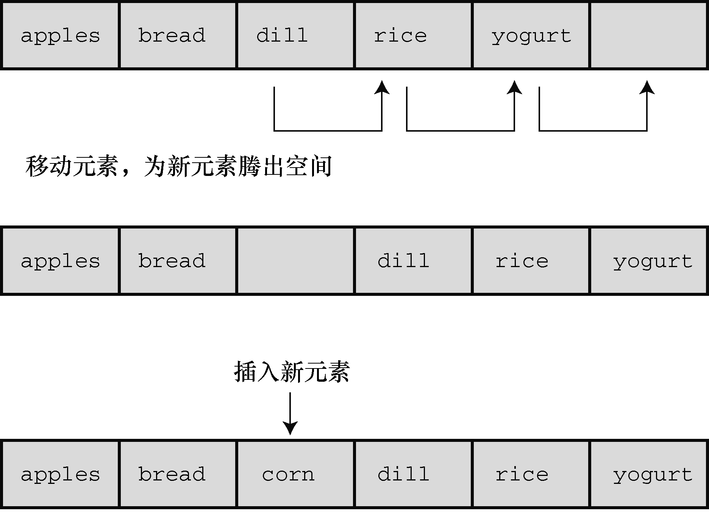
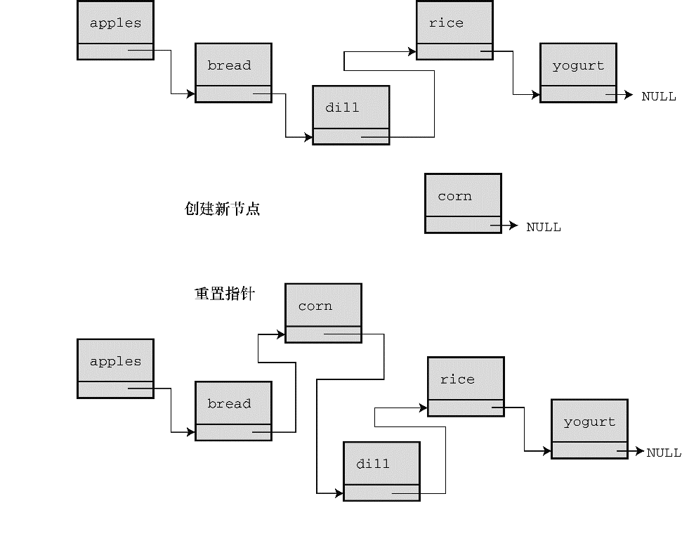
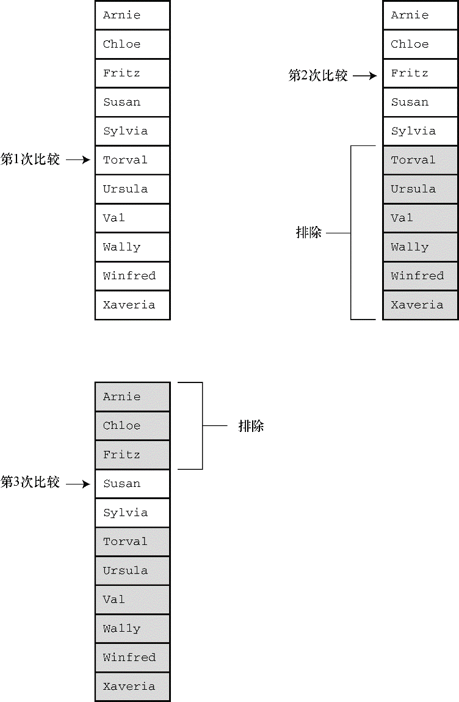

### 17.6　链表和数组

许多编程问题，如创建一个简单链表或队列，都可以用链表（指的是动态分配结构的序列链）或数组来处理。每种形式都有其优缺点，所以要根据具体问题的要求来决定选择哪一种形式。表17.1总结了链表和数组的性质。

<b class="my_markdown">表17.1　比较数组和链表</b>

| 数据形式 | 优点 | 缺点 |
| :-----  | :-----  | :-----  | :-----  | :-----  |
| 数组 | C直接支持 | 提供随机访问 | 在编译时确定大小 | 插入和删除元素很费时 |
| 链表 | 运行时确定大小 | 快速插入和删除元素 | 不能随机访问 | 用户必须提供编程支持 |

接下来，详细分析插入和删除元素的过程。在数组中插入元素，必须移动其他元素腾出空位插入新元素，如图17.9所示。新插入的元素离数组开头越近，要被移动的元素越多。然而，在链表中插入节点，只需给两个指针赋值，如图17.10所示。类似地，从数组中删除一个元素，也要移动许多相关的元素。但是从链表中删除节点，只需重新设置一个指针并释放被删除节点占用的内存即可。

<b class="my_markdown">图17.9　在数组中插入一个元素</b>

<b class="my_markdown">图17.10　在链表中插入一个元素</b>

接下来，考虑如何访问元素。对数组而言，可以使用数组下标直接访问该数组中的任意元素，这叫作随机访问（random access）。对链表而言，必须从链表首节点开始，逐个节点移动到要访问的节点，这叫作顺序访问（sequential access）。当然，也可以顺序访问数组。只需按顺序递增数组下标即可。在某些情况下，顺序访问足够了。例如，显示链表中的每一项，顺序访问就不错。其他情况用随机访问更合适。

假设要查找链表中的特定项。一种算法是从列表的开头开始按顺序查找，这叫作顺序查找（sequential search）。如果项并未按某种顺序排列，则只能顺序查找。如果待查找的项不在链表里，必须查找完所有的项才知道该项不在链表中（在这种情况下可以使用并发编程，同时查找列表中的不同部分）。

我们可以先排序列表，以改进顺序查找。这样，就不必查找排在待查找项后面的项。例如，假设在一个按字母排序的列表中查找 `Susan` 。从开头开始查找每一项，直到 `Sylvia` 都没有查找到 `Susan` 。这时就可以退出查找，因为如果 `Susan` 在列表中，应该排在 `Sylvia` 前面。平均下来，这种方法查找不在列表中的项的时间减半。

对于一个排序的列表，用二分查找（binary search）比顺序查找好得多。下面分析二分查找的原理。首先，把待查找的项称为目标项，而且假设列表中的各项按字母排序。然后，比较列表的中间项和目标项。如果两者相等，查找结束；假设目标项在列表中，如果中间项排在目标项前面，则目标项一定在后半部分项中；如果中间项在目标项后面，则目标项一定在前半部分项中。无论哪种情况，两项比较的结果都确定了下次查找的范围只有列表的一半。接着，继续使用这种方法，把需要查找的剩下一半的中间项与目标项比较。同样，这种方法会确定下一次查找的范围是当前查找范围的一半。以此类推，直到找到目标项或最终发现列表中没有目标项（见图17.11）。这种方法非常有效率。假如有127个项，顺序查找平均要进行64次比较才能找到目标项或发现不在其中。但是二分查找最多只用进行7次比较。第1次比较剩下63项进行比较，第2次比较剩下31项进行比较，以此类推，第6次剩下最后1项进行比较，第7次比较确定剩下的这个项是否是目标项。一般而言，n次比较能处理有2n-1个元素的数组。所以项数越多，越能体现二分查找的优势。

<b class="my_markdown">图17.11　用二分查找法查找 `Susan`</b>

用数组实现二分查找很简单，因为可以使用数组下标确定数组中任意部分的中点。只要把数组的首元素和尾元素的索引相加，得到的和再除以2即可。例如，内含100个元素的数组，首元素下标是 `0` ，尾元素下标是 `99` ，那么用于首次比较的中间项的下标应为 `(0+99)/2` ，得 `49` （整数除法）。如果比较的结果是下标为 `49` 的元素在目标项的后面，那么目标项的下标应在0～48的范围内。所以，第2次比较的中间项的下标应为 `(0+48)/2` ，得 `24` 。如果中间项与目标项的比较结果是，中间项在目标项前面，那么第3次比较的中间项下标应为 `(25+48)/2` ，得 `36` 。这体现了随机访问的特性，可以从一个位置跳至另一个位置，不用一次访问两位置之间的项。但是，链表只支持顺序访问，不提供跳至中间节点的方法。所以在链表中不能使用二分查找。

如前所述，选择何种数据类型取决于具体的问题。如果因频繁地插入和删除项导致经常调整大小，而且不需要经常查找，选择链表会更好。如果只是偶尔插入或删除项，但是经常进行查找，使用数组会更好。

如果需要一种既支持频繁插入和删除项又支持频繁查找的数据形式，数组和链表都无法胜任，怎么办？这种情况下应该选择二叉查找树。

