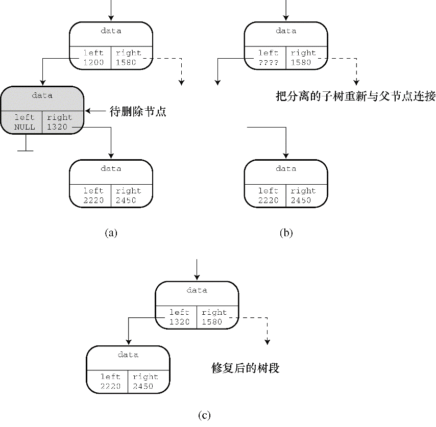

#### 17.7.3　二叉树的实现

接下来，我们要实现 `tree.h` 中的每个函数。 `InitializeTree()` 、 `EmptyTree()` 、 `FullTree()` 和 `TreeItems()` 函数都很简单，与链表ADT、队列ADT类似，所以下面着重讲解其他函数。

#### 1．添加项

在树中添加一个项，首先要检查该树是否有空间放得下一个项。由于我们定义二叉树时规定其中的项不能重复，所以接下来要检查树中是否有该项。通过这两步检查后，便可创建一个新节点，把待添加项拷贝到该节点中，并设置节点的左指针和右指针都为 `NULL` 。这表明该节点没有子节点。然后，更新 `Tree` 结构的 `size` 成员，统计新增了一项。接下来，必须找出应该把这个新节点放在树中的哪个位置。如果树为空，则应设置根节点指针指向该新节点。否则，遍历树找到合适的位置放置该节点。 `AddItem()` 函数就根据这个思路来实现，并把一些工作交给几个尚未定义的函数： `SeekItem()` 、 `MakeNode()` 和 `AddNode()` 。

```c
bool AddItem(const Item * pi, Tree * ptree)
{
     Trnode * new_node;
     if (TreeIsFull(ptree))
     {
          fprintf(stderr, "Tree is full\n");
          return false;            /* 提前返回    */
     }
     if (SeekItem(pi, ptree).child != NULL)
     {
          fprintf(stderr, "Attempted to add duplicate item\n");
          return false;            /* 提前返回    */
     }
     new_node = MakeNode(pi);    /* 指向新节点    */
     if (new_node == NULL)
     {
          fprintf(stderr, "Couldn't create node\n");
          return false;            /* 提前返回    */
     }
     /* 成功创建了一个新节点 */
     ptree->size++;
     if (ptree->root == NULL)            /* 情况1：树为空        */
          ptree->root = new_node;        /* 新节点是根节点       */
     else                                /* 情况2：树不为空      */
          AddNode(new_node, ptree->root);/* 在树中添加一个节点    */
     return true;    /* 成功返回 */
}
```

`SeekItem()` 、 `MakeNode()` 和 `AddNode()` 函数不是 `Tree` 类型公共接口的一部分。它们是隐藏在 `tree.c` 文件中的静态函数，处理实现的细节（如节点、指针和结构），不属于公共接口。

`MakeNode()` 函数相当简单，它处理动态内存分配和初始化节点。该函数的参数是指向新项的指针，其返回值是指向新节点的指针。如果 `malloc()` 无法分配所需的内存，则返回空指针。只有成功分配了内存， `MakeNode()` 函数才会初始化新节点。下面是 `MakeNode()` 的代码：

```c
static Trnode * MakeNode(const Item * pi)
{
     Trnode * new_node;
     new_node = (Trnode *) malloc(sizeof(Trnode));
     if (new_node != NULL)
     {
          new_node->item = *pi;
          new_node->left = NULL;
          new_node->right = NULL;
     }
     return new_node;
}
```

`AddNode()` 函数是二叉查找树包中第二麻烦的函数。它必须确定新节点的位置，然后添加新节点。具体来说，该函数要比较新项和根项，以确定应该把新项放在左子树还是右子树中。如果新项是一个数字，则使用 `<` 和 `>` 进行比较；如果新项是一个字符串，则使用 `strcmp()` 函数来比较。但是，该项是内含两个字符串的结构，所以，必须自定义用于比较的函数。如果新项应放在左子树中， `ToLeft()` 函数（稍后定义）返回 `true` ；如果新项应放在右子树中， `ToRight()` 函数（稍后定义）返回 `true` 。这两个函数分别相当于 `<` 和 `>` 。假设把新项放在左子树中。如果左子树为空， `AddNode()` 函数只需让左子节点指针指向新项即可。如果左子树不为空怎么办？此时， `AddNode()` 函数应该把新项和左子节点中的项做比较，以确定新项应该放在该子节点的左子树还是右子树。这个过程一直持续到函数发现一个空子树为止，并在此处添加新节点。递归是一种实现这种查找过程的方法，即把 `AddNode()` 函数应用于子节点，而不是根节点。当左子树或右子树为空时，即当 `root->left` 或 `root->right` 为 `NULL` 时，函数的递归调用序列结束。记住， `root` 是指向当前子树顶部的指针，所以每次递归调用它都指向一个新的下一级子树（递归详见第9章）。

```c
static void AddNode(Trnode * new_node, Trnode * root)
{
     if (ToLeft(&new_node->item, &root->item))
     {
          if (root->left == NULL)               /* 空子树 */
               root->left = new_node;           /* 所以，在此处添加节点 */
          else
               AddNode(new_node, root->left);   /* 否则，处理该子树*/
     }
     else if (ToRight(&new_node->item, &root->item))
     {
          if (root->right == NULL)
               root->right = new_node;
          else
               AddNode(new_node, root->right);
     }
     else                                    /* 不应含有重复的项 */
     {
          fprintf(stderr, "location error in AddNode()\n");
          exit(1);
     }
}
```

`ToLeft()` 和 `ToRight()` 函数依赖于 `Item` 类型的性质。Nerfville宠物俱乐部的成员名按字母排序。如果两个宠物名相同，按其种类排序。如果种类也相同，这两项属于重复项，根据该二叉树的定义，这是不允许的。回忆一下，如果标准C库函数 `strcmp()` 中的第 `1` 个参数表示的字符串在第 `2` 个参数表示的字符串前面，该函数则返回负数；如果两个字符串相同，该函数则返回 `0` ；如果第 `1` 个字符串在第 `2` 个字符串后面，该函数则返回正数。 `ToRight()` 函数的实现代码与该函数类似。通过这两个函数完成比较，而不是直接在 `AddNode()` 函数中直接比较，这样的代码更容易适应新的要求。当需要比较不同的数据形式时，就不必重写整个 `AddNode()` 函数，只需重写 `Toleft()` 和 `ToRight()` 即可。

```c
static bool ToLeft(const Item * i1, const Item * i2)
{
     int comp1;
     if ((comp1 = strcmp(i1->petname, i2->petname)) < 0)
          return true;
     else if (comp1 == 0 &&
          strcmp(i1->petkind, i2->petkind) < 0)
          return true;
     else
          return false;
}
```

#### 2．查找项

3个接口函数都要在树中查找特定项： `AddItem()` 、 `InTree()` 和 `DeleteItem()` 。这些函数的实现中使用 `SeekItem()` 函数进行查找。 `DeleteItem()` 函数有一个额外的要求：该函数要知道待删除项的父节点，以便在删除子节点后更新父节点指向子节点的指针。因此，我们设计 `SeekItem()` 函数返回的结构包含两个指针：一个指针指向包含项的节点（如果未找到指定项则为 `NULL` ）；一个指针指向父节点（如果该节点为根节点，即没有父节点，则为 `NULL` ）。这个结构类型的定义如下：

```c
typedef struct pair {
     Trnode * parent;
     Trnode * child;
} Pair;
```

`SeekItem()` 函数可以用递归的方式实现。但是，为了给读者介绍更多编程技巧，我们这次使用 `while` 循环处理树中从上到下的查找。和 `AddNode()` 一样， `SeekItem()` 也使用 `ToLeft()` 和 `ToRight()` 在树中导航。开始时， `SeekItem()` 设置 `look.child` 指针指向该树的根节点，然后沿着目标项应在的路径重置 `look.child` 指向后续的子树。同时，设置 `look.parent` 指向后续的父节点。如果没有找到匹配的项， `look.child` 则被设置为 `NULL` 。如果在根节点找到匹配的项，则设置 `look.parent` 为 `NULL` ，因为根节点没有父节点。下面是 `SeekItem()` 函数的实现代码：

```c
static Pair SeekItem(const Item * pi, const Tree * ptree)
{
     Pair look;
     look.parent = NULL;
     look.child = ptree->root;
     if (look.child == NULL)
          return look;    /* 提前退出 */
     while (look.child != NULL)
     {
          if (ToLeft(pi, &(look.child->item)))
          {
               look.parent = look.child;
               look.child = look.child->left;
          }
          else if (ToRight(pi, &(look.child->item)))
          {
               look.parent = look.child;
               look.child = look.child->right;
          }
          else            /* 如果前两种情况都不满足，则必定是相等的情况 */
               break;        /* look.child 目标项的节点 */
     }
     return look;        /* 成功返回 */
}
```

注意，如果 `SeekItem()` 函数返回一个结构，那么该函数可以与结构成员运算符一起使用。例如， `AddItem()` 函数中有如下的代码：

```c
if (SeekItem(pi, ptree).child != NULL)
```

有了 `SeekItem()` 函数后，编写 `InTree()` 公共接口函数就很简单了：

```c
bool InTree(const Item * pi, const Tree * ptree)
{
     return (SeekItem(pi, ptree).child == NULL) ? false : true;
}
```

#### 3．考虑删除项

删除项是最复杂的任务，因为必须重新连接剩余的子树形成有效的树。在准备编写这部分代码之前，必须明确需要做什么。

图17.13演示了最简单的情况。待删除的节点没有子节点，这样的节点被称为叶节点（leaf）。这种情况只需把父节点中的指针重置为 `NULL` ，并使用 `free()` 函数释放已删除节点所占用的内存。


<center class="my_markdown"><b class="my_markdown">图17.13　删除一个叶节点</b></center>

删除带有一个子节点的情况比较复杂。删除该节点会导致其子树与其他部分分离。为了修正这种情况，要把被删除节点父节点中存储该节点的地址更新为该节点子树的地址（见图17.14）。


<center class="my_markdown"><b class="my_markdown">图17.14　删除有一个子节点的节点</b></center>

最后一种情况是删除有两个子树的节点。其中一个子树（如左子树）可连接在被删除节点之前连接的位置。但是，另一个子树怎么处理？牢记树的基本设计：左子树的所有项都在父节点项的前面，右子树的所有项都在父节点项的后面。也就是说，右子树的所有项都在左子树所有项的后面。而且，因为该右子树曾经是被删除节点的父节点的左子树的一部分，所以该右节点中的所有项在被删除节点的父节点项的前面。想像一下如何在树中从上到下查找该右子树的头所在的位置。它应该在被删除节点的父节点的前面，所以要沿着父节点的左子树向下找。但是，该右子树的所有项又在被删除节点左子树所有项的后面。因此要查看左子树的右支是否有新节点的空位。如果没有，就要沿着左子树的右支向下找，一直找到一个空位为止。图17.15演示了这种方法。


<center class="my_markdown"><b class="my_markdown">图17.15　删除一个有两个子节点的项</b></center>

①  **删除一个节点**

现在可以设计所需的函数了，可以分成两个任务：第一个任务是把特定项与待删除节点关联；第二个任务是删除节点。无论哪种情况都必须修改待删除项父节点的指针。因此，要注意以下两点。

+ 该程序必须标识待删除节点的父节点。
+ 为了修改指针，代码必须把该指针的地址传递给执行删除任务的函数。

第一点稍后讨论，下面先分析第二点。要修改的指针本身是 `Trnode`  *类型，即指向 `Trnode` 的指针。由于该函数的参数是该指针的地址，所以参数的类型是 `Trnode`  **，即指向指针（该指针指向 `Trnode` ）的指针。假设有合适的地址可用，可以这样编写执行删除任务的函数：

```c
static void DeleteNode(Trnode **ptr)
/* ptr 是指向目标节点的父节点指针成员的地址 */
{
     Trnode * temp;
     if ((*ptr)->left == NULL)
     {
          temp = *ptr;
          *ptr = (*ptr)->right;
          free(temp);
     }
     else if ((*ptr)->right == NULL)
     {
          temp = *ptr;
          *ptr = (*ptr)->left;
          free(temp);
     }
     else /* 被删除的节点有两个子节点 */
     {
          /* 找到重新连接右子树的位置 */
          for (temp = (*ptr)->left; temp->right != NULL;
               temp = temp->right)
               continue;
          temp->right = (*ptr)->right;
          temp = *ptr;
          *ptr = (*ptr)->left;
          free(temp);
     }
}
```

该函数显式处理了3种情况：没有左子节点的节点、没有右子节点的节点和有两个子节点的节点。无子节点的节点可作为无左子节点的节点的特例。如果该节点没有左子节点，程序就将右子节点的地址赋给其父节点的指针。如果该节点也没有右子节点，则该指针为 `NULL` 。这就是无子节点情况的值。

注意，代码中用临时指针记录被删除节点的地址。被删除节点的父节点指针（* `ptr` ）被重置后，程序会丢失被删除节点的地址，但是 `free()` 函数需要这个信息。所以，程序把* `ptr` 的原始值存储在 `temp` 中，然后用 `free()` 函数使用 `temp` 来释放被删除节点所占用的内存。

有两个子节点的情况，首先在 `for` 循环中通过 `temp` 指针从左子树的右半部分向下查找一个空位。找到空位后，把右子树连接于此。然后，再用 `temp` 保存被删除节点的位置。接下来，把左子树连接到被删除节点的父节点上，最后释放 `temp` 指向的节点。

注意，由于 `ptr` 的类型是 `Trnode`  **，所以* `ptr` 的类型是 `Trnode`  *，与 `temp` 的类型相同。

②  **删除一个项**

剩下的问题是把一个节点与特定项相关联。可以使用 `SeekItem()` 函数来完成。回忆一下，该函数返回一个结构（内含两个指针，一个指针指向父节点，一个指针指向包含特定项的节点）。然后就可以通过父节点的指针获得相应的地址传递给 `DeleteNode()` 函数。根据这个思路， `DeleteNode()` 函数的定义如下：

```c
bool DeleteItem(const Item * pi, Tree * ptree)
{
     Pair look;
     look = SeekItem(pi, ptree);
     if (look.child == NULL)
          return false;
     if (look.parent == NULL)    /* 删除根节点 */
          DeleteNode(&ptree->root);
     else if (look.parent->left == look.child)
          DeleteNode(&look.parent->left);
     else
          DeleteNode(&look.parent->right);
     ptree->size--;
     return true;
}
```

首先， `SeekItem()` 函数的返回值被赋给 `look` 类型的结构变量。如果 `look.child` 是 `NULL` ，表明未找到指定项， `DeleteItem()` 函数退出，并返回 `false` 。如果找到了指定的 `Item` ，该函数分3种情况来处理。第一种情况是， `look.parent` 的值为 `NULL` ，这意味着该项在根节点中。在这情况下，不用更新父节点，但是要更新 `Tree` 结构中根节点的指针。因此，函数该函数把该指针的地址传递给 `DeleteNode()` 函数。否则（即剩下两种情况），程序判断待删除节点是其父节点的左子节点还是右子节点，然后传递合适指针的地址。

注意，公共接口函数（ `DeleteItem()` ）处理的是最终用户所关心的问题（项和树），而隐藏的 `DeleteNode()` 函数处理的是与指针相关的实质性任务。

#### 4．遍历树

遍历树比遍历链表更复杂，因为每个节点都有两个分支。这种分支特性很适合使用分而治之的递归（详见第9章）来处理。对于每一个节点，执行遍历任务的函数都要做如下的工作：

+ 处理节点中的项；
+ 处理左子树（递归调用）；
+ 处理右子树（递归调用）。

可以把遍历分成两个函数来完成： `Traverse()` 和 `InOrder()` 。注意， `InOrder()` 函数处理左子树，然后处理项，最后处理右子树。这种遍历树的顺序是按字母排序进行。如果你有时间，可以试试用不同的顺序，比如，项 `-` 左子树 `-` 右子树或者左子树 `-` 右子树 `-` 项，看看会发生什么。

```c
void Traverse(const Tree * ptree, void(*pfun)(Item item))
{
     if (ptree != NULL)
          InOrder(ptree->root, pfun);
}
static void InOrder(const Trnode * root, void(*pfun)(Item item))
{
     if (root != NULL)
     {
          InOrder(root->left, pfun);
          (*pfun)(root->item);
          InOrder(root->right, pfun);
     }
}
```

#### 5．清空树

清空树基本上和遍历树的过程相同，即清空树的代码也要访问每个节点，而且要用 `free()` 函数释放内存。除此之外，还要重置 `Tree` 类型结构的成员，表明该树为空。 `DeleteAll()` 函数负责处理 `Tree` 类型的结构，把释放内存的任务交给 `DeleteAllNode()` 函数。 `DeleteAllNode()` 与 `InOrder()` 函数的构造相同，它存储了指针的值 `root->right` ，使其在释放根节点后仍然可用。下面是这两个函数的代码：

```c
void DeleteAll(Tree * ptree)
{
     if (ptree != NULL)
          DeleteAllNodes(ptree->root);
     ptree->root = NULL;
     ptree->size = 0;
}
static void DeleteAllNodes(Trnode * root)
{
     Trnode * pright;
     if (root != NULL)
     {
          pright = root->right;
          DeleteAllNodes(root->left);
          free(root);
          DeleteAllNodes(pright);
     }
}
```

#### 6．完整的包

程序清单17.11演示了整个 `tree.c` 的代码。 `tree.h` 和 `tree.c` 共同组成了树的程序包。

程序清单17.11　 `tree.c` 程序

```c
/* tree.c -- 树的支持函数 */
#include <string.h>
#include <stdio.h>
#include <stdlib.h>
#include "tree.h"
/* 局部数据类型 */
typedef struct pair {
     Trnode * parent;
     Trnode * child;
} Pair;
/* 局部函数的原型 */
static Trnode * MakeNode(const Item * pi);
static bool ToLeft(const Item * i1, const Item * i2);
static bool ToRight(const Item * i1, const Item * i2);
static void AddNode(Trnode * new_node, Trnode * root);
static void InOrder(const Trnode * root, void(*pfun)(Item item));
static Pair SeekItem(const Item * pi, const Tree * ptree);
static void DeleteNode(Trnode **ptr);
static void DeleteAllNodes(Trnode * ptr);
/* 函数定义 */
void InitializeTree(Tree * ptree)
{
     ptree->root = NULL;
     ptree->size = 0;
}
bool TreeIsEmpty(const Tree * ptree)
{
     if (ptree->root == NULL)
          return true;
     else
          return false;
}
bool TreeIsFull(const Tree * ptree)
{
     if (ptree->size == MAXITEMS)
          return true;
     else
          return false;
}
int TreeItemCount(const Tree * ptree)
{
     return ptree->size;
}
bool AddItem(const Item * pi, Tree * ptree)
{
     Trnode * new_node;
     if (TreeIsFull(ptree))
     {
          fprintf(stderr, "Tree is full\n");
          return false;            /* 提前返回    */
     }
     if (SeekItem(pi, ptree).child != NULL)
     {
          fprintf(stderr, "Attempted to add duplicate item\n");
          return false;            /* 提前返回    */
     }
     new_node = MakeNode(pi);      /* 指向新节点  */
     if (new_node == NULL)
     {
          fprintf(stderr, "Couldn't create node\n");
          return false;            /* 提前返回    */
     }
     /* 成功创建了一个新节点 */
     ptree->size++;
     if (ptree->root == NULL)            /* 情况1：树为空        */
          ptree->root = new_node;        /* 新节点为树的根节点    */
     else                                /* 情况2：树不为空      */
          AddNode(new_node, ptree->root);/* 在树中添加新节点      */
     return true;                        /* 成功返回             */
}
bool InTree(const Item * pi, const Tree * ptree)
{
     return (SeekItem(pi, ptree).child == NULL) ? false : true;
}
bool DeleteItem(const Item * pi, Tree * ptree)
{
     Pair look;
     look = SeekItem(pi, ptree);
     if (look.child == NULL)
          return false;
     if (look.parent == NULL)            /* 删除根节点项            */
          DeleteNode(&ptree->root);
     else if (look.parent->left == look.child)
          DeleteNode(&look.parent->left);
     else
          DeleteNode(&look.parent->right);
     ptree->size--;
     return true;
}
void Traverse(const Tree * ptree, void(*pfun)(Item item))
{
     if (ptree != NULL)
          InOrder(ptree->root, pfun);
}
void DeleteAll(Tree * ptree)
{
     if (ptree != NULL)
          DeleteAllNodes(ptree->root);
     ptree->root = NULL;
     ptree->size = 0;
}
/* 局部函数 */
static void InOrder(const Trnode * root, void(*pfun)(Item item))
{
     if (root != NULL)
     {
          InOrder(root->left, pfun);
          (*pfun)(root->item);
          InOrder(root->right, pfun);
     }
}
static void DeleteAllNodes(Trnode * root)
{
     Trnode * pright;
     if (root != NULL)
     {
          pright = root->right;
          DeleteAllNodes(root->left);
          free(root);
          DeleteAllNodes(pright);
     }
}
static void AddNode(Trnode * new_node, Trnode * root)
{
     if (ToLeft(&new_node->item, &root->item))
     {
          if (root->left == NULL)              /* 空子树                */
               root->left = new_node;          /* 把节点添加到此处       */
          else
               AddNode(new_node, root->left);  /* 否则处理该子树        */
     }
     else if (ToRight(&new_node->item, &root->item))
     {
          if (root->right == NULL)
               root->right = new_node;
          else
               AddNode(new_node, root->right);
     }
     else                                    /* 不允许有重复项        */
     {
          fprintf(stderr, "location error in AddNode()\n");
          exit(1);
     }
}
static bool ToLeft(const Item * i1, const Item * i2)
{
     int comp1;
     if ((comp1 = strcmp(i1->petname, i2->petname)) < 0)
          return true;
     else if (comp1 == 0 &&strcmp(i1->petkind, i2->petkind) < 0)
          return true;
     else
          return false;
}
static bool ToRight(const Item * i1, const Item * i2)
{
     int comp1;
     if ((comp1 = strcmp(i1->petname, i2->petname)) > 0)
          return true;
     else if (comp1 == 0 &&
          strcmp(i1->petkind, i2->petkind) > 0)
          return true;
     else
          return false;
}
static Trnode * MakeNode(const Item * pi)
{
     Trnode * new_node;
     new_node = (Trnode *) malloc(sizeof(Trnode));
     if (new_node != NULL)
     {
          new_node->item = *pi;
          new_node->left = NULL;
          new_node->right = NULL;
     }
     return new_node;
}
static Pair SeekItem(const Item * pi, const Tree * ptree)
{
     Pair look;
     look.parent = NULL;
     look.child = ptree->root;
     if (look.child == NULL)
          return look;                        /* 提前返回    */
     while (look.child != NULL)
     {
          if (ToLeft(pi, &(look.child->item)))
          {
               look.parent = look.child;
               look.child = look.child->left;
          }
          else if (ToRight(pi, &(look.child->item)))
          {
               look.parent = look.child;
               look.child = look.child->right;
          }
          else               /* 如果前两种情况都不满足，则必定是相等的情况    */
               break;        /* look.child 目标项的节点                    */
     }
     return look;                       /* 成功返回 */
}
static void DeleteNode(Trnode **ptr)
/* ptr 是指向目标节点的父节点指针成员的地址 */
{
     Trnode * temp;
     if ((*ptr)->left == NULL)
     {
          temp = *ptr;
          *ptr = (*ptr)->right;
          free(temp);
     }
     else if ((*ptr)->right == NULL)
     {
          temp = *ptr;
          *ptr = (*ptr)->left;
          free(temp);
     }
     else    /* 被删除的节点有两个子节点 */
     {
          /* 找到重新连接右子树的位置 */
          for (temp = (*ptr)->left; temp->right != NULL;temp = temp->right)
               continue;
          temp->right = (*ptr)->right;
          temp = *ptr;
          *ptr = (*ptr)->left;
          free(temp);
     }
}
```

