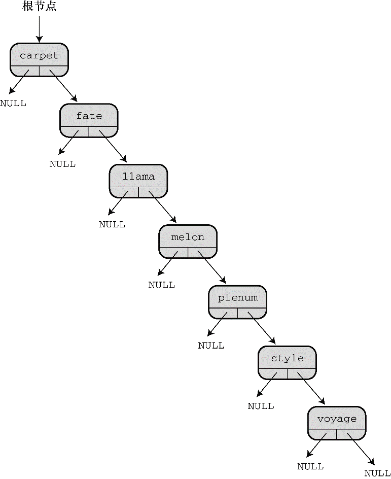

#### 17.7.5　树的思想

二叉查找树也有一些缺陷。例如，二叉查找树只有在满员（或平衡）时效率最高。假设要存储用户随机输入的单词。该树的外观应如图17.12所示。现在，假设用户按字母顺序输入数据，那么每个新节点应该被添加到右边，该树的外观应如图17.16所示。图17.12所示是平衡的树，图17.16所示是不平衡的树。查找这种树并不比查找链表要快。

<b class="my_markdown">图17.16　不平衡的二叉查找树</b>

避免串状树的方法之一是在创建树时多加注意。如果树或子树的一边或另一边太不平衡，就需要重新排列节点使之恢复平衡。与此类似，可能在进行删除操作后要重新排列树。俄国数学家Adel’son-Vel’skii和Landis发明了一种算法来解决这个问题。根据他们的算法创建的树称为AVL树。因为要重构，所以创建一个平衡的树所花费的时间更多，但是这样的树可以确保最大化搜索效率。

你可能需要一个能存储相同项的二叉查找树。例如，在分析一些文本时，统计某个单词在文本中出现的次数。一种方法是把 `Item` 定义成包含一个单词和一个数字的结构。第一次遇到一个单词时，将其添加到树中，并且该单词的数量加 `1` 。下一次遇到同样的单词时，程序找到包含该单词的节点，并递增表示该单词数量的值。把基本二叉查找树修改成具有这一特性，不费多少工夫。

考虑Nerfville宠物俱乐部的示例，有另一种情况。示例中的树根据宠物的名字和种类进行排列，所以，可以把名为Sam的猫存储在一个节点中，把名为Sam的狗存储在另一节点中，把名为Sam的山羊存储在第3个节点中。但是，不能存储两只名为Sam的猫。另一种方法是以名字来排序，但是这样做只能存储一个名为Sam的宠物。还需要把 `Item` 定义成多个结构，而不是一个结构。第一次出现Sally时，程序创建一个新的节点，并创建一个新的列表，然后把Sally及其种类添加到列表中。下一次出现Sally时，程序将定位到之前存储Sally的节点，并把新的数据添加到结构列表中。

> **提示　插件库**
> 读者可能意识到实现一个像链表或树这样的ADT比较困难，很容易犯错。插件库提供了一种可选的方法：让其他人来完成这些工作和测试。在学完本章这两个相对简单的例子后，读者应该能很好地理解和认识这样的库。

