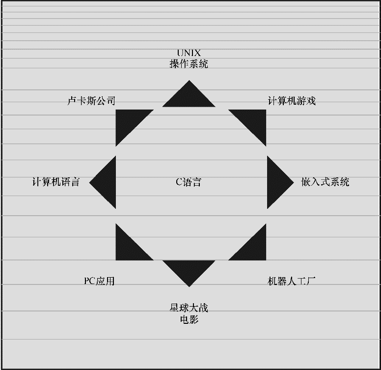

### 1.3　C语言的应用范围

早在20世纪80年代，C语言就已经成为小型计算机（UNIX系统）使用的主流语言。从那以后，C语言的应用范围扩展到微型机（个人计算机）和大型机（庞然大物）。如图1.2所示，许多软件公司都用C语言来开发文字处理程序、电子表格、编译器和其他产品，因为用C语言编写的程序紧凑而高效。更重要的是，C程序很方便修改，而且移植到新型号的计算机中也没什么问题。

<b class="my_markdown">图1.2　C语言的应用范围</b>

无论是软件公司、经验丰富的C程序员，还是其他用户，都能从C语言中受益。越来越多的计算机用户已转而求助C语言解决一些安全问题。不一定非得是计算机专家才能使用C语言。

20世纪90年代，许多软件公司开始改用C++来开发大型的编程项目。C++在C语言的基础上嫁接了面向对象编程工具（面向对象编程是一门哲学，它通过对语言建模来适应问题，而不是对问题建模以适应语言）。C++几乎是C的超集，这意味着任何C程序差不多就是一个C++程序。学习C语言，也相当于学习了许多C++的知识。

虽然这些年来C++和JAVA非常流行，但是C语言仍是软件业中的核心技能。在最想具备的技能中，C语言通常位居前十。特别是，C语言已成为嵌入式系统编程的流行语言。也就是说，越来越多的汽车、照相机、DVD播放机和其他现代化设备的微处理器都用C语言进行编程。除此之外，C语言还从长期被FORTRAN独占的科学编程领域分得一杯羹。最终，作为开发操作系统的卓越语言，C在Linux开发中扮演着极其重要的角色。因此，在进入21世纪的第2个10年中，C语言仍然保持着强劲的势头。

简而言之，C语言是最重要的编程语言之一，将来也是如此。如果你想拿下一份编程的工作，被问到是否会C语言时，最好回答“是”。

