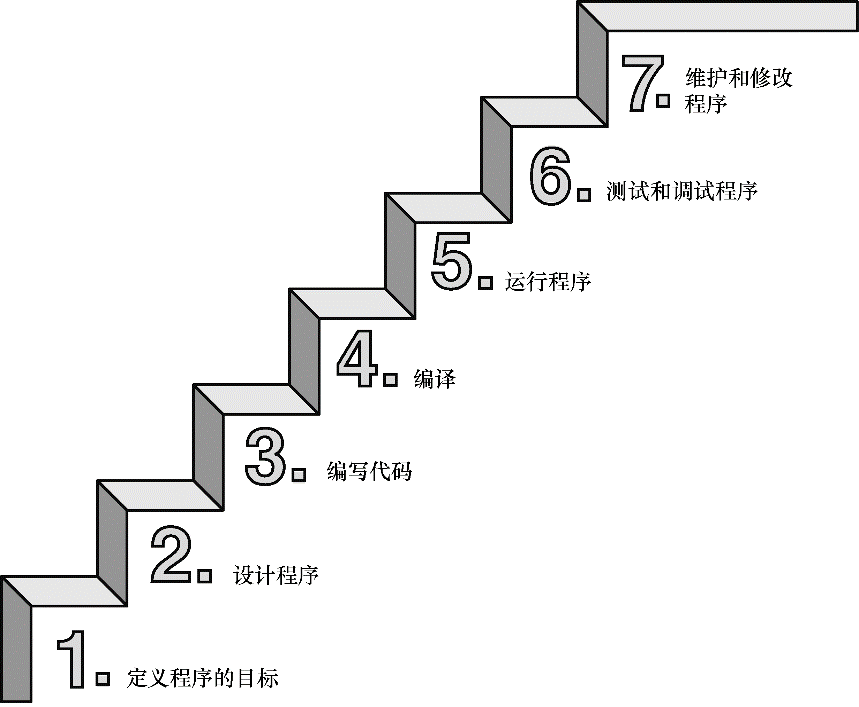

### 1.7　使用C语言的7个步骤

C是编译型语言。如果之前使用过编译型语言（如，Pascal或FORTRAN），就会很熟悉组建C程序的几个基本步骤。但是，如果以前使用的是解释型语言（如，BASIC）或面向图形界面语言（如，Visual Basic），或者甚至没接触过任何编程语言，就有必要学习如何编译。别担心，这并不复杂。首先，为了让读者对编程有大概的了解，我们把编写C程序的过程分解成7个步骤（见图1.3）。注意，这是理想状态。在实际的使用过程中，尤其是在较大型的项目中，可能要做一些重复的工作，根据下一个步骤的情况来调整或改进上一个步骤。

<b class="my_markdown">图1.3　编程的7个步骤</b>

