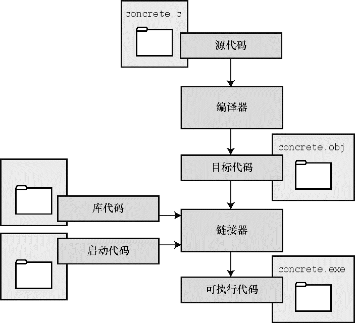

#### 1.8.1　目标代码文件、可执行文件和库

C编程的基本策略是，用程序把源代码文件转换为可执行文件（其中包含可直接运行的机器语言代码）。典型的C实现通过编译和链接两个步骤来完成这一过程。编译器把源代码转换成中间代码，链接器把中间代码和其他代码合并，生成可执行文件。C使用这种分而治之的方法方便对程序进行模块化，可以独立编译单独的模块，稍后再用链接器合并已编译的模块。通过这种方式，如果只更改某个模块，不必因此重新编译其他模块。另外，链接器还将你编写的程序和预编译的库代码合并。

中间文件有多种形式。我们在这里描述的是最普遍的一种形式，即把源代码转换为机器语言代码，并把结果放在目标代码文件（或简称目标文件）中（这里假设源代码只有一个文件）。虽然目标文件中包含机器语言代码，但是并不能直接运行该文件。因为目标文件中存储的是编译器翻译的源代码，这还不是一个完整的程序。

目标代码文件缺失启动代码（startup code）。启动代码充当着程序和操作系统之间的接口。例如，可以在MS Windows或Linux系统下运行IBM PC兼容机。这两种情况所使用的硬件相同，所以目标代码相同，但是Windows和Linux所需的启动代码不同，因为这些系统处理程序的方式不同。

目标代码还缺少库函数。几乎所有的C程序都要使用C标准库中的函数。例如， `concrete.c` 中就使用了 `printf()` 函数。目标代码文件并不包含该函数的代码，它只包含了使用 `printf()` 函数的指令。 `printf()` 函数真正的代码存储在另一个被称为库的文件中。库文件中有许多函数的目标代码。

链接器的作用是，把你编写的目标代码、系统的标准启动代码和库代码这3部分合并成一个文件，即可执行文件。对于库代码，链接器只会把程序中要用到的库函数代码提取出来（见图1.4）。

<b class="my_markdown">图1.4　编译器和链接器</b>

简而言之，目标文件和可执行文件都由机器语言指令组成的。然而，目标文件中只包含编译器为你编写的代码翻译的机器语言代码，可执行文件中还包含你编写的程序中使用的库函数和启动代码的机器代码。

在有些系统中，必须分别运行编译程序和链接程序，而在另一些系统中，编译器会自动启动链接器，用户只需给出编译命令即可。

接下来，了解一些具体的系统。

