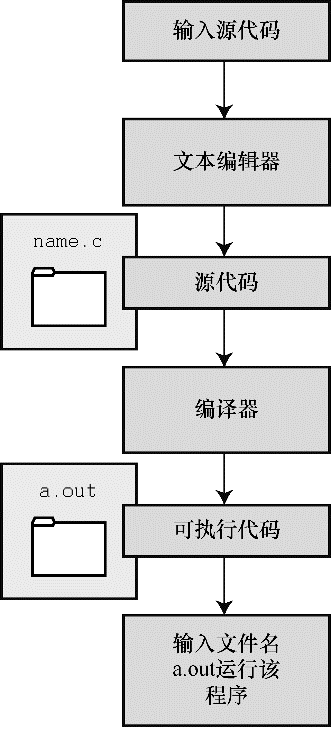

#### 1.8.2　UNIX系统

由于C语言因UNIX系统而生，也因此而流行，所以我们从UNIX系统开始（注意：我们提到的UNIX还包含其他系统，如FreeBSD，它是UNIX的一个分支，但是由于法律原因不使用该名称）。

#### 1．在UNIX系统上编辑

UNIX C没有自己的编辑器，但是可以使用通用的UNIX编辑器，如emacs、jove、vi或X Window System文本编辑器。

作为程序员，要负责输入正确的程序和为存储该程序的文件起一个合适的文件名。如前所述，文件名应该以 `.c` 结尾。注意， `UNIX` 区分大小写。因此， `budget.c` 、 `BUDGET.c` 和 `Budget.c` 是 `3` 个不同但都有效的C源文件名。但是 `BUDGET.C` 是无效文件名，因为该名称的扩展名使用了大写 `C` 而不是小写 `c` 。

假设我们在 `vi` 编辑器中编写了下面的程序，并将其存储在 `inform.c` 文件中：

```c
#include <stdio.h>
int main(void)
{
     printf("A .c is used to end a C program filename.\n");
     return 0;
}
```

以上文本就是源代码， `inform.c` 是源文件。注意，源文件是整个编译过程的开始，不是结束。

#### 2．在UNIX系统上编译

虽然在我们看来，程序完美无缺，但是对计算机而言，这是一堆乱码。计算机不明白 `#include` 和 `printf` 是什么（也许你现在也不明白，但是学到后面就会明白，而计算机却不会）。如前所述，我们需要编译器将我们编写的代码（源代码）翻译成计算机能看懂的代码（机器代码）。最后生成的可执行文件中包含计算机要完成任务所需的所有机器代码。

以前， `UNIX`  C编译器要调用语言定义的 `cc` 命令。但是，它没有跟上标准发展的脚步，已经退出了历史舞台。但是， `UNIX` 系统提供的C编译器通常来自一些其他源，然后以 `cc` 命令作为编译器的别名。因此，虽然在不同的系统中会调用不同的编译器，但用户仍可以继续使用相同的命令。

编译 `inform.c` ，要输入以下命令：

```c
cc inform.c
```

几秒钟后，会返回 `UNIX` 的提示，告诉用户任务已完成。如果程序编写错误，你可能会看到警告或错误消息，但我们先假设编写的程序完全正确（如果编译器报告 `void` 的错误，说明你的系统未更新成 `ANSI`  C编译器，只需删除 `void` 即可）。如果使用 `ls` 命令列出文件，会发现有一个 `a.out` 文件（见图 `1.5` ）。该文件是包含已翻译（或已编译）程序的可执行文件。要运行该文件，只需输入：

```c
a.out
```


<center class="my_markdown"><b class="my_markdown">图1.5　用UNIX准备C程序</b></center>

输出内容如下：

```c
A .c is used to end a C program filename.
```

如果要存储可执行文件（ `a.out` ），应该把它重命名。否则，该文件会被下一次编译程序时生成的新 `a.out` 文件替换。

如何处理目标代码？C编译器会创建一个与源代码基本名相同的目标代码文件，但是其扩展名是 `.o` 。在该例中，目标代码文件是 `inform.o` 。然而，却找不到这个文件，因为一旦链接器生成了完整的可执行程序，就会将其删除。如果原始程序有多个源代码文件，则保留目标代码文件。学到后面多文件程序时，你会明白到这样做的好处。

