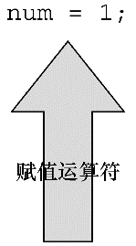
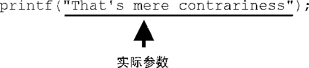

#### 2.2.2　第2遍：程序细节

浏览完程序清单2.1后，我们来仔细分析这个程序。再次强调，本节将逐行分析程序中的代码，以每行代码为出发点，深入分析代码背后的细节，为更全面地学习C语言编程的特性夯实基础。

#### 1． `#include` 指令和头文件

```c
#include<stdio.h>
```

这是程序的第 `1` 行。 `#include <stdio.h>` 的作用相当于把 `stdio.h` 文件中的所有内容都输入该行所在的位置。实际上，这是一种“拷贝-粘贴”的操作。 `include` 文件提供了一种方便的途径共享许多程序共有的信息。

`#include` 这行代码是一条C预处理器指令（ `preprocessor directive` ）。通常，C编译器在编译前会对源代码做一些准备工作，即预处理（`preprocessing`）。

所有的C编译器软件包都提供 `stdio.h` 文件。该文件中包含了供编译器使用的输入和输出函数（如， `printf()` ）信息。该文件名的含义是标准输入/输出头文件。通常，在C程序顶部的信息集合被称为头文件（`header`）。

在大多数情况下，头文件包含了编译器创建最终可执行程序要用到的信息。例如，头文件中可以定义一些常量，或者指明函数名以及如何使用它们。但是，函数的实际代码在一个预编译代码的库文件中。简而言之，头文件帮助编译器把你的程序正确地组合在一起。

`ANSI/ISO C` 规定了C编译器必须提供哪些头文件。有些程序要包含 `stdio.h` ，而有些不用。特定C实现的文档中应该包含对C库函数的说明。这些说明确定了使用哪些函数需要包含哪些头文件。例如，要使用 `printf()` 函数，必须包含 `stdio.h` 头文件。省略必要的头文件可能不会影响某一特定程序，但是最好不要这样做。本书每次用到库函数，都会用 `#include` 指令包含 `ANSI/ISO` 标准指定的头文件。

> **注意　为何不内置输入和输出**
> 读者一定很好奇，为何不把输入和输出这些基本功能内置在语言中。原因之一是，并非所有的程序都会用到I/O（输入/输出）包。轻装上阵表现了C语言的哲学。正是这种经济使用资源的原则，使得C语言成为流行的嵌入式编程语言（例如，编写控制汽车自动燃油系统或蓝光播放机芯片的代码）。#include中的#符号表明，C预处理器在编译器接手之前处理这条指令。本书后面章节中会介绍更多预处理器指令的示例，第16章将更详细地讨论相关内容。

#### 2． `main()` 函数

```c
int main(void)
```

程序清单 `2.1` 中的第 `2` 行表明该函数名为 `main` 。的确， `main` 是一个极其普通的名称，但是这是唯一的选择。C程序一定从 `main()` 函数开始执行（目前不必考虑例外的情况）。除了 `main()` 函数，你可以任意命名其他函数，而且 `main()` 函数必须是开始的函数。圆括号有什么功能？用于识别 `main()` 是一个函数。很快你将学到更多的函数。就目前而言，只需记住函数是C程序的基本模块。

`int` 是 `main()` 函数的返回类型。这表明 `main()` 函数返回的值是整数。返回到哪里？返回给操作系统。我们将在第 `6` 章中再来探讨这个问题。

通常，函数名后面的圆括号中包含一些传入函数的信息。该例中没有传递任何信息。因此，圆括号内是单词 `void` （第 `11` 章将介绍把信息从 `main()` 函数传回操作系统的另一种形式）。

如果浏览旧式的C代码，会发现程序以如下形式开始：

```c
main()
```

C90标准勉强接受这种形式，但是C99和C11标准不允许这样写。因此，即使你使用的编译器允许，也不要这样写。

你还会看到下面这种形式：

```c
void main()
```

一些编译器允许这样写，但是所有的标准都未认可这种写法。因此，编译器不必接受这种形式，而且许多编译器都不能这样写。需要强调的是，只要坚持使用标准形式，把程序从一个编译器移至另一个编译器时就不会出什么问题。

#### 3．注释

```c
/*一个简单的程序*/
```

在程序中，被 `/` * * `/` 两个符号括起来的部分是程序的注释。写注释能让他人（包括自己）更容易明白你所写的程序。C语言注释的好处之一是，可将注释放在任意的地方，甚至是与要解释的内容在同一行。较长的注释可单独放一行或多行。在 `/` *和* `/` 之间的内容都会被编译器忽略。下面列出了一些有效和无效的注释形式：

```c
/* 这是一条C注释。 */
/* 这也是一条注释，
   被分成两行。*/
/*
   也可以这样写注释。
*/
/* 这条注释无效，因为缺少了结束标记。
```

C99新增了另一种风格的注释，普遍用于C++和Java。这种新风格使用//符号创建注释，仅限于单行。

```c
// 这种注释只能写成一行。
int rigue; // 这种注释也可置于此。
```

因为一行末尾就标志着注释的结束，所以这种风格的注释只需在注释开始处标明//符号即可。

这种新形式的注释是为了解决旧形式注释存在的潜在问题。假设有下面的代码：

```c
/*
    希望能运行。
*/
x = 100;
y = 200;
/* 其他内容已省略。 */
```

接下来，假设你决定删除第4行，但不小心删掉了第3行（*/）。代码如下所示：

```c
/*
    希望能运行。
y = 200;
/*其他内容已省略。 */
```

现在，编译器把第1行的 `/` *和第4行的* `/` 配对，导致4行代码全都成了注释（包括应作为代码的那一行）。而//形式的注释只对单行有效，不会导致这种“消失代码”的问题。

一些编译器可能不支持这一特性。还有一些编译器需要更改设置，才能支持C99或C11的特性。

考虑到只用一种注释风格过于死板乏味，本书在示例中采用两种风格的注释。

#### 4．花括号、函数体和块

```c
{
    ...
}
```

程序清单 `2.1` 中，花括号把 `main()` 函数括起来。一般而言，所有的C函数都使用花括号标记函数体的开始和结束。这是规定，不能省略。只有花括号（ `{}` ）能起这种作用，圆括号（ `()` ）和方括号（ `[]` ）都不行。

花括号还可用于把函数中的多条语句合并为一个单元或块。如果读者熟悉Pascal、ADA、Modula-2或者Algol，就会明白花括号在C语言中的作用类似于这些语言中的 `begin` 和 `end` 。

#### 5．声明

```c
int num;
```

程序清单 `2.1` 中，这行代码叫作声明（`declaration`）。声明是C语言最重要的特性之一。在该例中，声明完成了两件事。其一，在函数中有一个名为 `num` 的变量（`variable`）。其二， `int` 表明 `num` 是一个整数（即，没有小数点或小数部分的数）。 `int` 是一种数据类型。编译器使用这些信息为 `num` 变量在内存中分配存储空间。分号在C语言中是大部分语句和声明的一部分，不像在Pascal中只是语句间的分隔符。

`int` 是C语言的一个关键字（`keyword`），表示一种基本的C语言数据类型。关键字是语言定义的单词，不能做其他用途。例如，不能用 `int` 作为函数名和变量名。但是，这些关键字在该语言以外不起作用，所以把一只猫或一个可爱的小孩叫 `int` 是可以的（尽管某些地方的当地习俗或法律可能不允许）。

示例中的 `num` 是一个标识符（`identifier`），也就是一个变量、函数或其他实体的名称。因此，声明把特定标识符与计算机内存中的特定位置联系起来，同时也确定了存储在某位置的信息类型或数据类型。

在C语言中，所有变量都必须先声明才能使用。这意味着必须列出程序中用到的所有变量名及其类型。

以前的C语言，还要求把变量声明在块的顶部，其他语句不能在任何声明的前面。也就是说， `main()` 函数体如下所示：

```c
int main() //旧规则
{
     int doors;
     int dogs;
     doors = 5;
     dogs = 3;
     // 其他语句
}
```

C99和C11遵循C++的惯例，可以把声明放在块中的任何位置。尽管如此，首次使用变量之前一定要先声明它。因此，如果编译器支持这一新特性，可以这样编写上面的代码：

```c
int main()            // 目前的C规则
{
     // 一些语句
     int doors;
     doors = 5; // 第1次使用doors
     // 其他语句
     int dogs;
     dogs = 3; // 第1次使用dogs
     // 其他语句
}
```

为了与旧系统更好地兼容，本书沿用最初的规则（即，把变量声明都写在块的顶部）。

现在，读者可能有3个问题：什么是数据类型？如何命名？为何要声明变量？请往下看。

**数据类型**

C语言可以处理多种类型的数据，如整数、字符和浮点数。把变量声明为整型或字符类型，计算机才能正确地存储、读取和解释数据。下一章将详细介绍C语言中的各种数据类型。

**命名**

给变量命名时要使用有意义的变量名或标识符（如，程序中需要一个变量数羊，该变量名应该是 `sheep_count` 而不是 `x3` ）。如果变量名无法清楚地表达自身的用途，可在注释中进一步说明。这是一种良好的编程习惯和编程技巧。

C99和C11允许使用更长的标识符名，但是编译器只识别前63个字符。对于外部标识符（参阅第12章），只允许使用31个字符。〔以前C90只允许6个字符，这是一个很大的进步。旧式编译器通常最多只允许使用8个字符。〕实际上，你可以使用更长的字符，但是编译器会忽略超出的字符。也就是说，如果有两个标识符名都有63个字符，只有一个字符不同，那么编译器会识别这是两个不同的名称。如果两个标识符都是64个字符，只有最后一个字符不同，那么编译器可能将其视为同一个名称，也可能不会。标准并未定义在这种情况下会发生什么。

可以用小写字母、大写字母、数字和下划线（_）来命名。而且，名称的第1个字符必须是字母或下划线，不能是数字。表2.1给出了一些示例。

<center class="my_markdown"><b class="my_markdown">表2.1　有效和无效的名称</b></center>

| 有效的名称 | 无效的名称 |
| :-----  | :-----  | :-----  | :-----  |
| `wiggles` | `$Z]` ** |
| `cat2` | `2cat` |
| `Hot_Tub` | `Hot-Tub` |
| `taxRate` | `tax rate` |
| `_kcab` | `don’t` |

操作系统和C库经常使用以一个或两个下划线字符开始的标识符（如， `_kcab` ），因此最好避免在自己的程序中使用这种名称。标准标签都以一个或两个下划线字符开始，如库标识符。这样的标识符都是保留的。这意味着，虽然使用它们没有语法错误，但是会导致名称冲突。

C语言的名称区分大小写，即把一个字母的大写和小写视为两个不同的字符。因此， `stars` 和 `Stars` 、 `STARS` 都不同。

为了让C语言更加国际化，C99和C11根据通用字符名（即UCN）机制添加了扩展字符集。其中包含了除英文字母以外的部分字符。欲了解详细内容，请参阅附录B的“参考资料VII：扩展字符支持”。

#### 声明变量的4个理由

一些更老的语言（如，FORTRAN和BASIC的最初形式）都允许直接使用变量，不必先声明。为何C语言不采用这种简单易行的方法？原因如下。

+ 把所有的变量放在一处，方便读者查找和理解程序的用途。如果变量名都是有意义的（如， `taxrate` 而不是 `r` ），这样做效果很好。如果变量名无法表述清楚，在注释中解释变量的含义。这种方法让程序的可读性更高。
+ 声明变量会促使你在编写程序之前做一些计划。程序在开始时要获得哪些信息？希望程序如何输出？表示数据最好的方式是什么？
+ 声明变量有助于发现隐藏在程序中的小错误，如变量名拼写错误。例如，假设在某些不需要声明就可以直接使用变量的语言中，编写如下语句： `RADIUS1 = 20.4;` 在后面的程序中，误写成： `CIRCUM = 6.28 * RADIUSl;` 你不小心把数字1打成小写字母l。这些语言会创建一个新的变量RADIUSl，并使用该变量中的值（也许是0，也许是垃圾值），导致赋给CIRCUM的值是错误值。你可能要花很久时间才能查出原因。这样的错误在C语言中不会发生（除非你很不明智地声明了两个极其相似的变量），因为编译器在发现未声明的RADIUSl时会报错。
+ 如果事先未声明变量，C程序将无法通过编译。如果前几个理由还不足以说服你，这个理由总可以让你认真考虑一下了。

如果要声明变量，应该声明在何处？前面提到过，C99之前的标准要求把声明都置于块的顶部，这样规定的好处是：把声明放在一起更容易理解程序的用途。C99允许在需要时才声明变量，这样做的好处是：在给变量赋值之前声明变量，就不会忘记给变量赋值。但是实际上，许多编译器都还不支持C99。

#### 6．赋值

```c
num = 1;
```

程序清单中的这行代码是赋值表达式语句<sup class="my_markdown">[2]</sup>。赋值是C语言的基本操作之一。该行代码的意思是“把值 `1` 赋给变量 `num` ”。在执行 `int num;` 声明时，编译器在计算机内存中为变量 `num` 预留了空间，然后在执行这行赋值表达式语句时，把值存储在之前预留的位置。可以给 `num` 赋不同的值，这就是 `num` 之所以被称为变量（`variable`）的原因。注意，该赋值表达式语句从右侧把值赋到左侧。另外，该语句以分号结尾，如图 `2.2` 所示。


<center class="my_markdown"><b class="my_markdown">图2.2　赋值是C语言中的基本操作之一</b></center>

#### 7．printf()函数

```c
printf("I am a simple ");
printf("computer.\n");
printf("My favorite number is %d because it is first.\n", num);
```

这 `3` 行都使用了C语言的一个标准函数： `printf()` 。圆括号表明 `printf` 是一个函数名。圆括号中的内容是从 `main()` 函数传递给 `printf()` 函数的信息。例如，上面的第 `1` 行把 `I am a simple` 传递给 `printf()` 函数。该信息被称为参数，或者更确切地说，是函数的实际参数（`actual argument`），如图 `2.3` 所示。〔在C语言中，实际参数（简称实参）是传递给函数的特定值，形式参数（简称形参）是函数中用于存储值的变量。第 `5` 章中将详述相关内容。〕 `printf()` 函数用参数来做什么？该函数会查看双引号中的内容，并将其打印在屏幕上。


<center class="my_markdown"><b class="my_markdown">图2.3　带实参的printf()函数</b></center>

第 `1` 行 `printf()` 演示了在C语言中如何调用函数。只需输入函数名，把所需的参数填入圆括号即可。当程序运行到这一行时，控制权被转给已命名的函数（该例中是 `printf()` ）。函数执行结束后，控制权被返回至主调函数（`calling function`），该例中是 `main()` 。

第 `2` 行 `printf()` 函数的双引号中的 `\n` 字符并未输出。这是为什么？ `\n` 的意思是换行。 `\n` 组合（依次输入这两个字符）代表一个换行符（`newline character`）。对于 `printf()` 而言，它的意思是“在下一行的最左边开始新的一行”。也就是说，打印换行符的效果与在键盘按下Enter键相同。既然如此，为何不在键入 `printf()` 参数时直接使用Enter键？因为编辑器可能认为这是直接的命令，而不是存储在源代码中的指令。换句话说，如果直接按下Enter键，编辑器会退出当前行并开始新的一行。但是，换行符仅会影响程序输出的显示格式。

换行符是一个转义序列（`escape sequence`）。转义序列用于代表难以表示或无法输入的字符。如， `\t` 代表Tab键， `\b` 代表Backspace键（退格键）。每个转义序列都以反斜杠字符（ `\` ）开始。我们在第 `3` 章中再来探讨相关内容。

这样，就解释了为什么 `3` 行 `printf()` 语句只打印出两行：第 `1` 个 `printf()` 打印的内容中不含换行符，但是第 `2` 和第 `3` 个 `printf()` 中都有换行符。

第 `3` 个 `printf()` 还有一些不明之处：参数中的 `%d` 在打印时有什么作用？先来看该函数的输出：

```c
My favorite number is 1 because it is first.
```

对比发现，参数中的 `%d` 被数字 `1` 代替了，而 `1` 就是变量 `num` 的值。 `%d` 相当于是一个占位符，其作用是指明输出 `num` 值的位置。该行和下面的BASIC语句很像：

```c
PRINT "My favorite number is "; num; " because it is first."
```

实际上，C语言的 `printf()` 比BASIC的这条语句做的事情多一些。 `%` 提醒程序，要在该处打印一个变量， `d` 表明把变量作为十进制整数打印。 `printf()` 函数名中的 `f` 提醒用户，这是一种格式化打印函数。 `printf()` 函数有多种打印变量的格式，包括小数和十六进制整数。后面章节在介绍数据类型时，会详细介绍相关内容。

#### 8．return语句

```c
return 0;
```

`return` 语句<sup class="my_markdown">[3]</sup>是程序清单 `2.1` 的最后一条语句。 `int main(void)` 中的 `int` 表明 `main()` 函数应返回一个整数。C标准要求 `main()` 这样做。有返回值的C函数要有 `return` 语句。该语句以 `return` 关键字开始，后面是待返回的值，并以分号结尾。如果遗漏 `main()` 函数中的 `return` 语句，程序在运行至最外面的右花括号（ `}` ）时会返回 `0` 。因此，可以省略 `main()` 函数末尾的 `return` 语句。但是，不要在其他有返回值的函数中漏掉它。因此，强烈建议读者养成在 `main()` 函数中保留 `return` 语句的好习惯。在这种情况下，可将其看作是统一代码风格。但对于某些操作系统（包括 `Linux` 和 `UNIX` ）， `return` 语句有实际的用途。第 `11` 章再详述这个主题。

