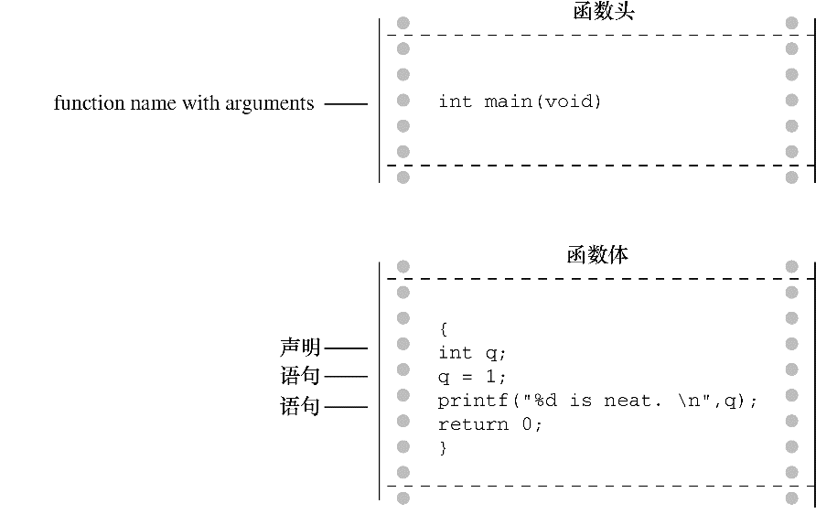

### 2.3　简单程序的结构

在看过一个具体的程序示例后，我们来了解一下C程序的基本结构。程序由一个或多个函数组成，必须有 `main()` 函数。函数由函数头和函数体组成。函数头包括函数名、传入该函数的信息类型和函数的返回类型。通过函数名后的圆括号可识别出函数，圆括号里可能为空，可能有参数。函数体被花括号括起来，由一系列语句、声明组成，如图 `2.4` 所示。本章的程序示例中有一条声明，声明了程序使用的变量名和类型。然后是一条赋值表达式语句，变量被赋予一个值。接下来是 `1` 条 `printf()` 语句<sup class="my_markdown">[4]</sup>，调用 `printf()` 函数 `1` 次。最后， `main()` 以 `return` 语句结束。


<center class="my_markdown"><b class="my_markdown">图2.4　函数包含函数头和函数体</b></center>

简而言之，一个简单的C程序的格式如下：

```c
#include <stdio.h>
int main(void)
{
     语句
     return 0;
}
```

（大部分语句都以分号结尾。）

