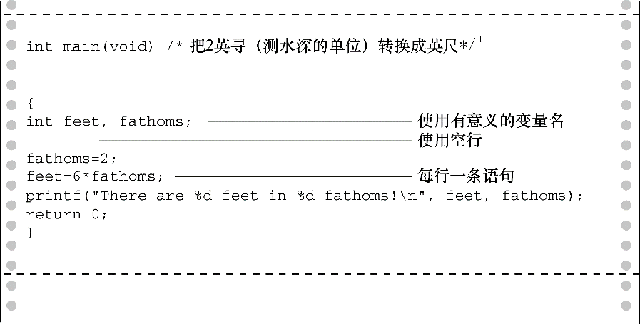

### 2.4　提高程序可读性的技巧

编写可读性高的程序是良好的编程习惯。可读性高的程序更容易理解，以后也更容易修改和更正。提高程序的可读性还有助于你理清编程思路。

前面介绍过两种提高程序可读性的技巧：选择有意义的函数名和写注释。注意，使用这两种技巧时应相得益彰，避免重复啰嗦。如果变量名是 `width` ，就不必写注释说明该变量表示宽度，但是如果变量名是 `video_routine_4` ，就要解释一下该变量名的含义。

提高程序可读性的第3个技巧是：在函数中用空行分隔概念上的多个部分。例如，程序清单2.1中用空行把声明部分和程序的其他部分区分开来。C语言并未规定一定要使用空行，但是多使用空行能提高程序的可读性。

提高程序可读性的第4个技巧是：每条语句各占一行。同样，这也不是C语言的要求。C语言的格式比较自由，可以把多条语句放在一行，也可以每条语句独占一行。下面的语句都没问题，但是不好看：

```c
int main( void ) { int four; four
=
4
;
printf(
        "%d\n",
four); return 0;}
```

分号告诉编译器一条语句在哪里结束、下一条语句在哪里开始。如果按照本章示例的约定来编写代码（见图2.5），程序的逻辑会更清晰。


<center class="my_markdown"><b class="my_markdown">图2.5　提高程序的可读性</b></center>

