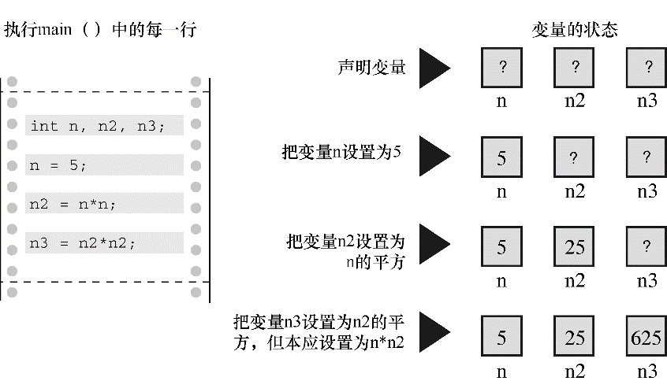

#### 2.7.2　语义错误

语义错误是指意思上的错误。例如，考虑这个句子：Scornful derivatives sing greenly（轻蔑的衍生物不熟练地唱歌）。句中的形容词、名词、动词和副词都在正确的位置上，所以语法正确。但是，却让人不知所云。在C语言中，如果遵循了C规则，但是结果不正确，那就是犯了语义错误。程序示例中有这样的错误：

```c
n3 = n2 * n2;
```

此处， `n3` 原意表示 `n` 的 `3` 次方，但是代码中的 `n3` 被设置成 `n` 的 `4` 次方（ `n2 = n * n` ）。

编译器无法检测语义错误，因为这类错误并未违反C语言的规则。编译器无法了解你的真正意图，所以你只能自己找出这些错误。例如，假设你修正了程序的语法错误，程序应该如程序清单2.5所示：

程序清单2.5　 `stillbad.c` 程序

```c
/* stillbad.c -- 修复了语法错误的程序 */
#include <stdio.h>
int main(void)
{
     int n, n2, n3;
     /* 该程序有一个语义错误 */
     n = 5;
     n2 = n * n;
     n3 = n2 * n2;
     printf("n = %d, n squared = %d, n cubed = %d\n", n, n2, n3);
     return 0;
}
```

该程序的输出如下：

```c
n = 5, n squared = 25, n cubed = 625
```

如果对简单的立方比较熟悉，就会注意到625不对。下一步是跟踪程序的执行步骤，找出程序如何得出这个答案。对于本例，通过查看代码就会发现其中的错误，但是，还应该学习更系统的方法。方法之一是，把自己想象成计算机，跟着程序的步骤一步一步地执行。下面，我们来试试这种方法。

`main()` 函数体一开始就声明了 `3` 个变量： `n` 、 `n2` 、 `n3` 。你可以画出 `3` 个盒子并把变量名写在盒子上来模拟这种情况（见图 `2.6` ）。接下来，程序把 `5` 赋给变量 `n` 。你可以在标签为 `n` 的盒子里写上 `5` 。接着，程序把 `n` 和 `n` 相乘，并把乘积赋给 `n2` 。因此，查看标签为 `n` 的盒子，其值是 `5` ， `5` 乘以 `5` 得 `25` ，于是把 `25` 放进标签为 `n2` 的盒子里。为了模拟下一条语句（ `n3 = n2 * n2` ），查看 `n2` 盒子，发现其值是 `25` 。 `25` 乘以 `25` 得 `625` ，把 `625` 放进标签为 `n3` 的盒子。原来如此！程序中计算的是 `n2` 的平方，不是用 `n2` 乘以 `n` 得到 `n` 的 `3` 次方。


<center class="my_markdown"><b class="my_markdown">图2.6　跟踪程序的执行步骤</b></center>

对于上面的程序示例，检查程序的过程可能过于繁琐。但是，用这种方法一步一步查看程序的执行情况，通常是发现程序问题所在的良方。

