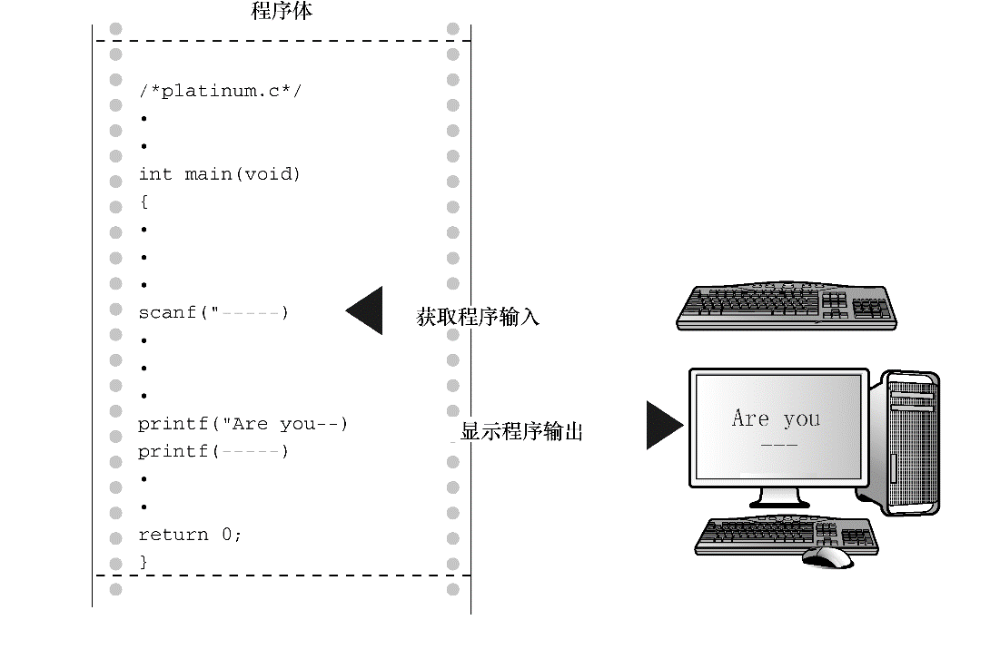

#### 3.1.1　程序中的新元素

程序清单3.1中包含C语言的一些新元素。

+ 注意，代码中使用了一种新的变量声明。前面的例子中只使用了整数类型的变量（ `int` ），但是本例使用了浮点数类型（ `float` ）的变量，以便处理更大范围的数据。 `float` 类型可以存储带小数的数字。
+ 程序中演示了常量的几种新写法。现在可以使用带小数点的数了。
+ 为了打印新类型的变量，在 `printf()` 中使用 `%f` 来处理浮点值。 `%.2f` 中的 `.2` 用于精确控制输出，指定输出的浮点数只显示小数点后面两位。
+ `scanf()` 函数用于读取键盘的输入。 `%f` 说明 `scanf()` 要读取用户从键盘输入的浮点数， `&weight` 告诉 `scanf()` 把输入的值赋给名为 `weight` 的变量。 `scanf()` 函数使用 `&` 符号表明找到 `weight` 变量的地点。下一章将详细讨论 `&` 。就目前而言，请按照这样写。
+ 也许本程序最突出的新特点是它的交互性。计算机向用户询问信息，然后用户输入数字。与非交互式程序相比，交互式程序用起来更有趣。更重要的是，交互式使得程序更加灵活。例如，示例程序可以使用任何合理的体重，而不只是 `156` 磅。不必重写程序，就可以根据不同体重进行计算。 `scanf()` 和 `printf()` 函数用于实现这种交互。 `scanf()` 函数读取用户从键盘输入的数据，并把数据传递给程序； `printf()` 函数读取程序中的数据，并把数据显示在屏幕上。把两个函数结合起来，就可以建立人机双向通信（见图 `3.1` ），这让使用计算机更加饶有趣味。

<b class="my_markdown">图3.1　程序中的 `scanf()` 和 `printf()` 函数</b>

本章着重解释上述新特性中的前两项：各种数据类型的变量和常量。第4章将介绍后3项。

