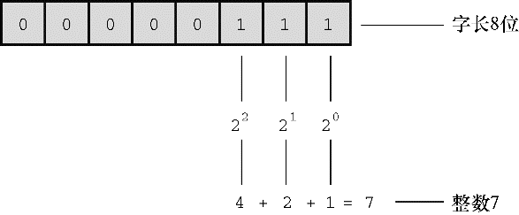

#### 3.3.2　整数

和数学的概念一样，在C语言中，整数是没有小数部分的数。例如，2、−23和2456都是整数。而3.14、0.22和2.000都不是整数。计算机以二进制数字存储整数，例如，整数7以二进制写是111。因此，要在8位字节中存储该数字，需要把前5位都设置成0，后3位设置成1（如图3.2所示）。

<b class="my_markdown">图3.2　使用二进制编码存储整数7</b>

