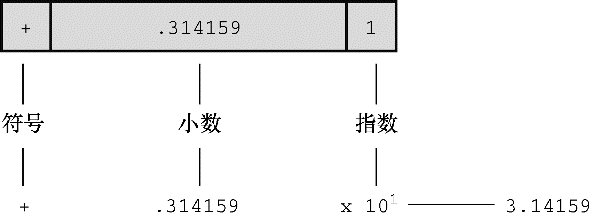

#### 3.3.3　浮点数

浮点数与数学中实数的概念差不多。2.75、3.16E7、7.00和2e-8都是浮点数。注意，在一个值后面加上一个小数点，该值就成为一个浮点值。所以，7是整数，7.00是浮点数。显然，书写浮点数有多种形式。稍后将详细介绍e记数法，这里先做简要介绍：3.16E7表示3.16×107（3.16乘以10的7次方）。其中，107=10000000，7被称为10的指数。

这里关键要理解浮点数和整数的存储方案不同。计算机把浮点数分成小数部分和指数部分来表示，而且分开存储这两部分。因此，虽然7.00和7在数值上相同，但是它们的存储方式不同。在十进制下，可以把7.0写成0.7E1。这里，0.7是小数部分，1是指数部分。图3.3演示了一个存储浮点数的例子。当然，计算机在内部使用二进制和2的幂进行存储，而不是10的幂。第15章将详述相关内容。现在，我们着重讲解这两种类型的实际区别。

+ 整数没有小数部分，浮点数有小数部分。
+ 浮点数可以表示的范围比整数大。参见本章末的表3.3。
+ 对于一些算术运算（如，两个很大的数相减），浮点数损失的精度更多。
+ 因为在任何区间内（如，1.0到2.0之间）都存在无穷多个实数，所以计算机的浮点数不能表示区间内所有的值。浮点数通常只是实际值的近似值。例如，7.0可能被存储为浮点值6.99999。稍后会讨论更多精度方面的内容。
+ 过去，浮点运算比整数运算慢。不过，现在许多CPU都包含浮点处理器，缩小了速度上的差距。

<b class="my_markdown">图3.3　以浮点格式（十进制）存储π的值</b>

