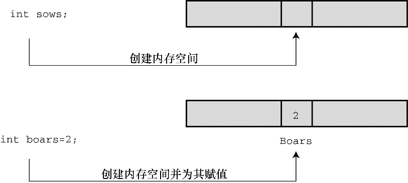

#### 3.4.1　 `int` 类型

C语言提供了许多整数类型，为什么一种类型不够用？因为C语言让程序员针对不同情况选择不同的类型。特别是，C语言中的整数类型可表示不同的取值范围和正负值。一般情况使用 `int` 类型即可，但是为满足特定任务和机器的要求，还可以选择其他类型。

`int` 类型是有符号整型，即 `int` 类型的值必须是整数，可以是正整数、负整数或零。其取值范围依计算机系统而异。一般而言，存储一个 `int` 要占用一个机器字长。因此，早期的 `16` 位 `IBM PC` 兼容机使用 `16` 位来存储一个 `int` 值，其取值范围（即 `int` 值的取值范围）是 `-32768` ～ `32767` 。目前的个人计算机一般是 `32` 位，因此用 `32` 位存储一个 `int` 值。现在，个人计算机产业正逐步向着 `64` 位处理器发展，自然能存储更大的整数。 `ISO C` 规定 `int` 的取值范围最小为 `-32768` ～ `32767` 。一般而言，系统用一个特殊位的值表示有符号整数的正负号。第 `15` 章将介绍常用的方法。

#### 1．声明 `int` 变量

第 `2` 章中已经用 `int` 声明过基本整型变量。先写上 `int` ，然后写变量名，最后加上一个分号。要声明多个变量，可以单独声明每个变量，也可在 `int` 后面列出多个变量名，变量名之间用逗号分隔。下面都是有效的声明：

```c
int erns;
int hogs, cows, goats;
```

可以分别在 `4` 条声明中声明各变量，也可以在一条声明中声明 `4` 个变量。两种方法的效果相同，都为 `4` 个 `int` 大小的变量赋予名称并分配内存空间。

以上声明创建了变量，但是并没有给它们提供值。变量如何获得值？前面介绍过在程序中获取值的两种途径。第1种途径是赋值：

```c
cows = 112;
```

第 `2` 种途径是，通过函数（如， `scanf()` ）获得值。接下来，我们着重介绍第 `3` 种途径。

#### 2．初始化变量

初始化（initialize）变量就是为变量赋一个初始值。在C语言中，初始化可以直接在声明中完成。只需在变量名后面加上赋值运算符（=）和待赋给变量的值即可。如下所示：

```c
int hogs = 21;
int cows = 32, goats = 14;
int dogs, cats = 94; /* 有效，但是这种格式很糟糕 */
```

以上示例的最后一行，只初始化了 `cats` ，并未初始化 `dogs` 。这种写法很容易让人误认为 `dogs` 也被初始化为 `94` ，所以最好不要把初始化的变量和未初始化的变量放在同一条声明中。

简而言之，声明为变量创建和标记存储空间，并为其指定初始值（如图3.4所示）。


<center class="my_markdown"><b class="my_markdown">图3.4　定义并初始化变量</b></center>

#### 3． `int` 类型常量

上面示例中出现的整数（ `21` 、 `32` 、 `14` 和 `94` ）都是整型常量或整型字面量。C语言把不含小数点和指数的数作为整数。因此， `22` 和 `-44` 都是整型常量，但是 `22.0` 和 `2.2E1` 则不是。C语言把大多数整型常量视为 `int` 类型，但是非常大的整数除外。详见后面“ `long` 常量和 `long long` 常量”小节对 `long int` 类型的讨论。

#### 4．打印 `int` 值

可以使用 `printf()` 函数打印 `int` 类型的值。第 `2` 章中介绍过， `%d` 指明了在一行中打印整数的位置。 `%d` 称为转换说明，它指定了 `printf()` 应使用什么格式来显示一个值。格式化字符串中的每个 `%d` 都与待打印变量列表中相应的 `int` 值匹配。这个值可以是 `int` 类型的变量、 `int` 类型的常量或其他任何值为 `int` 类型的表达式。作为程序员，要确保转换说明的数量与待打印值的数量相同，编译器不会捕获这类型的错误。程序清单 `3.2` 演示了一个简单的程序，程序中初始化了一个变量，并打印该变量的值、一个常量值和一个简单表达式的值。另外，程序还演示了如果粗心犯错会导致什么结果。

程序清单3.2　 `print1.c` 程序

```c
/* print1.c - 演示printf()的一些特性 */
#include <stdio.h>
int main(void)
{
     int ten = 10;
     int two = 2;
     printf("Doing it right: ");
     printf("%d minus %d is %d\n", ten, 2, ten - two);
     printf("Doing it wrong: ");
     printf("%d minus %d is %d\n", ten);  // 遗漏2个参数
     return 0;
}
```

编译并运行该程序，输出如下：

```c
Doing it right: 10 minus 2 is 8
Doing it wrong: 10 minus 16 is 1650287143
```

在第一行输出中，第 `1` 个 `%d` 对应 `int` 类型变量 `ten` ；第 `2` 个 `%d` 对应 `int` 类型常量 `2` ；第 `3` 个 `%d` 对应 `int` 类型表达式 `ten - two` 的值。在第二行输出中，第 `1` 个 `%d` 对应 `ten` 的值，但是由于没有给后两个 `%d` 提供任何值，所以打印出的值是内存中的任意值（读者在运行该程序时显示的这两个数值会与输出示例中的数值不同，因为内存中存储的数据不同，而且编译器管理内存的位置也不同）。

你可能会抱怨编译器为何不能捕获这种明显的错误，但实际上问题出在 `printf()` 不寻常的设计。大部分函数都需要指定数目的参数，编译器会检查参数的数目是否正确。但是， `printf()` 函数的参数数目不定，可以有 `1` 个、 `2` 个、 `3` 个或更多，编译器也爱莫能助。记住，使用 `printf()` 函数时，要确保转换说明的数量与待打印值的数量相等。

#### 5．八进制和十六进制

通常，C语言都假定整型常量是十进制数。然而，许多程序员很喜欢使用八进制和十六进制数。因为8和16都是2的幂，而10却不是。显然，八进制和十六进制记数系统在表达与计算机相关的值时很方便。例如，十进制数65536经常出现在16位机中，用十六进制表示正好是10000。另外，十六进制数的每一位的数恰好由4位二进制数表示。例如，十六进制数3的二进制数是0011，十六进制数5的二进制数是0101。因此，十六进制数35的位组合（bit pattern）是00110101，十六进制数53的位组合是01010011。这种对应关系使得十六进制和二进制的转换非常方便。但是，计算机如何知道10000是十进制、十六进制还是二进制？在C语言中，用特定的前缀表示使用哪种进制。0x或0X前缀表示十六进制值，所以十进制数16表示成十六进制是0x10或0X10。与此类似，0前缀表示八进制。例如，十进制数16表示成八进制是020。第15章将更全面地介绍进制相关的内容。

要清楚，使用不同的进制数是为了方便，不会影响数被存储的方式。也就是说，无论把数字写成16、020或0x10，存储该数的方式都相同，因为计算机内部都以二进制进行编码。

#### 6．显示八进制和十六进制

在C程序中，既可以使用也可以显示不同进制的数。不同的进制要使用不同的转换说明。以十进制显示数字，使用 `%d` ；以八进制显示数字，使用 `%o` ；以十六进制显示数字，使用 `%x` 。另外，要显示各进制数的前缀 `0` 、 `0x` 和 `0X` ，必须分别使用 `%#o` 、 `%#x` 、 `%#X` 。程序清单 `3.3` 演示了一个小程序（回忆一下，在某些集成开发环境（ `IDE` ）下编写的代码中插入 `getchar();` 语句，程序在执行完毕后不会立即关闭执行窗口）。

程序清单3.3　 `bases.c` 程序

```c
/* bases.c--以十进制、八进制、十六进制打印十进制数100 */
#include <stdio.h>
int main(void)
{
     int x = 100;
     printf("dec = %d; octal = %o; hex = %x\n", x, x, x);
     printf("dec = %d; octal = %#o; hex = %#x\n", x, x, x);
     return 0;
}
```

编译并运行该程序，输出如下：

```c
dec = 100; octal = 144; hex = 64
dec = 100; octal = 0144; hex = 0x64
```

该程序以 `3` 种不同记数系统显示同一个值。 `printf()` 函数做了相应的转换。注意，如果要在八进制和十六进制值前显示 `0` 和 `0x` 前缀，要分别在转换说明中加入 `#` 。

