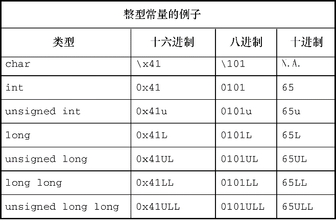
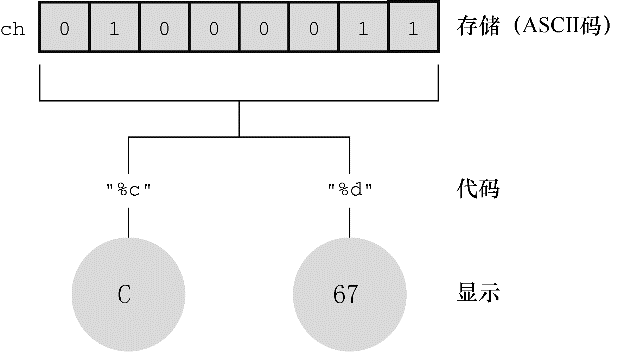

#### 3.4.3　使用字符： `char` 类型

`char` 类型用于存储字符（如，字母或标点符号），但是从技术层面看， `char` 是整数类型。因为 `char` 类型实际上存储的是整数而不是字符。计算机使用数字编码来处理字符，即用特定的整数表示特定的字符。美国最常用的编码是 `ASCII` 编码，本书也使用此编码。例如，在 `ASCII` 码中，整数 `65` 代表大写字母 `A` 。因此，存储字母 `A` 实际上存储的是整数 `65` （许多 `IBM` 的大型主机使用另一种编码—— `EBCDIC` ，其原理相同。另外，其他国家的计算机系统可能使用完全不同的编码）。

标准 `ASCII` 码的范围是 `0` ～ `127` ，只需 `7` 位二进制数即可表示。通常， `char` 类型被定义为 `8` 位的存储单元，因此容纳标准 `ASCII` 码绰绰有余。许多其他系统（如 `IMB PC` 和苹果 `Macs` ）还提供扩展 `ASCII` 码，也在 `8` 位的表示范围之内。一般而言，C语言会保证 `char` 类型足够大，以存储系统（实现C语言的系统）的基本字符集。

许多字符集都超过了127，甚至多于255。例如，日本汉字（kanji）字符集。商用的统一码（Unicode）创建了一个能表示世界范围内多种字符集的系统，目前包含的字符已超过110000个。国际标准化组织（ISO）和国际电工技术委员会（IEC）为字符集开发了ISO/IEC 10646标准。统一码标准也与ISO/IEC 10646标准兼容。

C语言把 `1` 字节定义为 `char` 类型占用的位（`bit`）数，因此无论是 `16` 位还是 `32` 位系统，都可以使用 `char` 类型。

#### 1．声明 `char` 类型变量

`char` 类型变量的声明方式与其他类型变量的声明方式相同。下面是一些例子：

```c
char response;
char itable, latan;
```

以上声明创建了 `3` 个 `char` 类型的变量： `response` 、 `itable` 和 `latan` 。

#### 2．字符常量和初始化

如果要把一个字符常量初始化为字母 `A` ，不必背下 `ASCII` 码，用计算机语言很容易做到。通过以下初始化把字母 `A` 赋给 `grade` 即可：

```c
char grade = 'A';
```

在C语言中，用单引号括起来的单个字符被称为字符常量（`character constant`）。编译器一发现 `'A'` ，就会将其转换成相应的代码值。单引号必不可少。下面还有一些其他的例子：

```c
char broiled;       /* 声明一个char类型的变量 */
broiled = 'T';      /* 为其赋值，正确 */
broiled = T;        /* 错误！此时T是一个变量 */
broiled = "T";      /* 错误！此时"T"是一个字符串 */
```

如上所示，如果省略单引号，编译器认为 `T` 是一个变量名；如果把 `T` 用双引号括起来，编译器则认为 `"T"` 是一个字符串。字符串的内容将在第 `4` 章中介绍。

实际上，字符是以数值形式存储的，所以也可使用数字代码值来赋值：

```c
char grade = 65; /* 对于ASCII，这样做没问题，但这是一种不好的编程风格 */
```

在本例中，虽然 `65` 是 `int` 类型，但是它在 `char` 类型能表示的范围内，所以将其赋值给 `grade` 没问题。由于 `65` 是字母 `A` 对应的 `ASCII` 码，因此本例是把 `A` 赋给 `grade` 。注意，能这样做的前提是系统使用 `ASCII` 码。其实，用 `'A'` 代替 `65` 才是较为妥当的做法，这样在任何系统中都不会出问题。因此，最好使用字符常量，而不是数字代码值。

奇怪的是，C语言将字符常量视为 `int` 类型而非 `char` 类型。例如，在 `int` 为 `32` 位、 `char` 为 `8` 位的 `ASCII` 系统中，有下面的代码：

```c
char grade = 'B';
```

本来 `'B'` 对应的数值 `66` 存储在 `32` 位的存储单元中，现在却可以存储在 `8` 位的存储单元中（ `grade` ）。利用字符常量的这种特性，可以定义一个字符常量 `'FATE'` ，即把 `4` 个独立的 `8` 位 `ASCII` 码存储在一个 `32` 位存储单元中。如果把这样的字符常量赋给 `char` 类型变量 `grade` ，只有最后 `8` 位有效。因此， `grade` 的值是 `'E'` 。

#### 3．非打印字符

单引号只适用于字符、数字和标点符号，浏览ASCII表会发现，有些ASCII字符打印不出来。例如，一些代表行为的字符（如，退格、换行、终端响铃或蜂鸣）。C语言提供了3种方法表示这些字符。

第1种方法前面介绍过——使用ASCII码。例如，蜂鸣字符的ASCII值是7，因此可以这样写：

```c
char beep = 7;
```

第2种方法是，使用特殊的符号序列表示一些特殊的字符。这些符号序列叫作转义序列（escape sequence）。表3.2列出了转义序列及其含义。

把转义序列赋给字符变量时，必须用单引号把转义序列括起来。例如，假设有下面一行代码：

```c
char nerf = '\n';
```

稍后打印变量 `nerf` 的效果是，在打印机或屏幕上另起一行。

<center class="my_markdown"><b class="my_markdown">表3.2　转义序列</b></center>

| 转义序列 | 含义 |
| :-----  | :-----  | :-----  | :-----  |
| `\a` | 警报（ANSI C） |
| `\b` | 退格 |
| `\f` | 换页 |
| `\n` | 换行 |
| `\r` | 回车 |
| `\t` | 水平制表符 |
| `\v` | 垂直制表符 |
| `\\` | 反斜杠（\） |
| `\'` | 单引号 |
| `\"` | 双引号 |
| `\?` | 问号 |
| `\0oo` | 八进制值（ `oo` 必须是有效的八进制数，即每个 `o` 可表示 `0` ～ `7` 中的一个数） |
| `\xhh` | 十六进制值（ `hh` 必须是有效的十六进制数，即每个 `h` 可表示 `0` ～ `f` 中的一个数） |

现在，我们来仔细分析一下转义序列。使用C90新增的警报字符（\a）是否能产生听到或看到的警报，取决于计算机的硬件，蜂鸣是最常见的警报（在一些系统中，警报字符不起作用）。C标准规定警报字符不得改变活跃位置。标准中的活跃位置（active position）指的是显示设备（屏幕、电传打字机、打印机等）中下一个字符将出现的位置。简而言之，平时常说的屏幕光标位置就是活跃位置。在程序中把警报字符输出在屏幕上的效果是，发出一声蜂鸣，但不会移动屏幕光标。

接下来的转义字符 `\b` 、 `\f` 、 `\n` 、 `\r` 、 `\t` 和 `\v` 是常用的输出设备控制字符。了解它们最好的方式是查看它们对活跃位置的影响。换页符（ `\f` ）把活跃位置移至下一页的开始处；换行符（ `\n` ）把活跃位置移至下一行的开始处；回车符（ `\r` ）把活跃位置移动到当前行的开始处；水平制表符（ `\t` ）将活跃位置移至下一个水平制表点（通常是第 `1` 个、第 `9` 个、第 `17` 个、第 `25` 个等字符位置）；垂直制表符（ `\v` ）把活跃位置移至下一个垂直制表点。

这些转义序列字符不一定在所有的显示设备上都起作用。例如，换页符和垂直制表符在PC屏幕上会生成奇怪的符号，光标并不会移动。只有将其输出到打印机上时才会产生前面描述的效果。

接下来的 `3` 个转义序列（ `\\` 、 `\'` 、 `\"` ）用于打印 `\` 、 `'` 、 `"` 字符（由于这些字符用于定义字符常量，是 `printf()` 函数的一部分，若直接使用它们会造成混乱）。如果打印下面一行内容：

```c
Gramps sez, "a \ is a backslash."
```

应这样编写代码：

```c
printf("Gramps sez, \"a \\ is a backslash.\"\n");
```

表 `3.2` 中的最后两个转义序列（ `\0oo` 和 `\xhh` ）是 `ASCII` 码的特殊表示。如果要用八进制 `ASCII` 码表示一个字符，可以在编码值前面加一个反斜杠（ `\` ）并用单引号括起来。例如，如果编译器不识别警报字符（ `\a` ），可以使用 `ASCII` 码来代替：

```c
beep = '\007';
```

可以省略前面的0，'\07'甚至'\7'都可以。即使没有前缀0，编译器在处理这种写法时，仍会解释为八进制。

从C90开始，不仅可以用十进制、八进制形式表示字符常量，C语言还提供了第3种选择——用十六进制形式表示字符常量，即反斜杠后面跟一个x或X，再加上1～3位十六进制数字。例如，Ctrl+P字符的ASCII十六进制码是10（相当于十进制的16），可表示为'\x10'或'\x010'。图3.5列出了一些整数类型的不同进制形式。


<center class="my_markdown"><b class="my_markdown">图3.5　 `int` 系列类型的常量写法示例</b></center>

使用ASCII码时，注意数字和数字字符的区别。例如，字符4对应的ASCII码是52。'4'表示字符4，而不是数值4。

关于转义序列，读者可能有下面3个问题。

+ 上面最后一个例子（ `printf("Gramps sez, \"a \\ is a backslash.\"\n"` ），为何没有用单引号把转义序列括起来？无论是普通字符还是转义序列，只要是双引号括起来的字符集合，就无需用单引号括起来。双引号中的字符集合叫作字符串（详见第 `4` 章）。注意，该例中的其他字符（ `G` 、 `r` 、 `a` 、 `m` 、 `p` 、 `s` 等）都没有用单引号括起来。与此类似， `printf("Hello!\007\n");` 将打印 `Hello!` 并发出一声蜂鸣，而 `printf("Hello!7\n");` 则打印 `Hello!7` 。不是转义序列中的数字将作为普通字符被打印出来。
+ 何时使用ASCII码？何时使用转义序列？如果要在转义序列（假设使用'\f'）和ASCII码（'\014'）之间选择，请选择前者（即'\f'）。这样的写法不仅更好记，而且可移植性更高。'\f'在不使用ASCII码的系统中，仍然有效。
+ 如果要使用ASCII码，为何要写成'\032'而不是032？首先，'\032'能更清晰地表达程序员使用字符编码的意图。其次，类似\032这样的转义序列可以嵌入C的字符串中，如printf("Hello!\007\n");中就嵌入了\007。

#### 4．打印字符

`printf()` 函数用 `%c` 指明待打印的字符。前面介绍过，一个字符变量实际上被存储为 `1` 字节的整数值。因此，如果用 `%d` 转换说明打印 `char` 类型变量的值，打印的是一个整数。而 `%c` 转换说明告诉 `printf()` 打印该整数值对应的字符。程序清单 `3.5` 演示了打印 `char` 类型变量的两种方式。

程序清单3.5　charcode.c程序

```c
/* charcode.c-显示字符的代码编号 */
#include <stdio.h>
int main(void)
{
     char ch;
     printf("Please enter a character.\n");
     scanf("%c", &ch);   /* 用户输入字符 */
     printf("The code for %c is %d.\n", ch, ch);
     return 0;
}
```

运行该程序后，输出示例如下：

```c
Please enter a character.
C
The code for C is 67.

```

运行该程序时，在输入字母后不要忘记按下Enter或Return键。随后， `scanf()` 函数会读取用户输入的字符， `&` 符号表示把输入的字符赋给变量 `ch` 。接着， `printf()` 函数打印 `ch` 的值两次，第 `1` 次打印一个字符（对应代码中的 `%c` ），第 `2` 次打印一个十进制整数值（对应代码中的 `%d` ）。注意， `printf()` 函数中的转换说明决定了数据的显示方式，而不是数据的存储方式（见图 `3.6` ）。


<center class="my_markdown"><b class="my_markdown">图3.6　数据显示和数据存储</b></center>

#### 5．有符号还是无符号

有些C编译器把 `char` 实现为有符号类型，这意味着 `char` 可表示的范围是 `-128` ～ `127` 。而有些C编译器把 `char` 实现为无符号类型，那么 `char` 可表示的范围是 `0` ～ `255` 。请查阅相应的编译器手册，确定正在使用的编译器如何实现 `char` 类型。或者，可以查阅 `limits.h` 头文件。下一章将详细介绍头文件的内容。

根据 `C90` 标准，C语言允许在关键字 `char` 前面使用 `signed` 或 `unsigned` 。这样，无论编译器默认 `char` 是什么类型， `signed char` 表示有符号类型，而 `unsigned char` 表示无符号类型。这在用 `char` 类型处理小整数时很有用。如果只用 `char` 处理字符，那么 `char` 前面无需使用任何修饰符。

