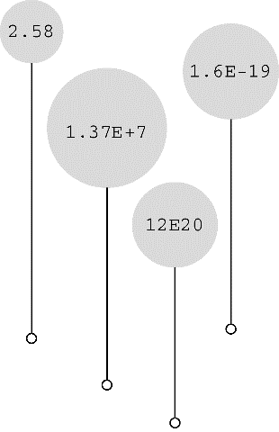

#### 3.4.6　 `float` 、 `double` 和 `long double` 

各种整数类型对大多数软件开发项目而言够用了。然而，面向金融和数学的程序经常使用浮点数。C语言中的浮点类型有 `float` 、 `double` 和 `long double` 类型。它们与FORTRAN和Pascal中的 `real` 类型一致。前面提到过，浮点类型能表示包括小数在内更大范围的数。浮点数的表示类似于科学记数法（即用小数乘以 `10` 的幂来表示数字）。该记数系统常用于表示非常大或非常小的数。表 `3.3` 列出了一些示例。

<center class="my_markdown"><b class="my_markdown">表3.3　记数法示例</b></center>

| 数字 | 科学记数法 | 指数记数法 |
| :-----  | :-----  | :-----  | :-----  | :-----  |
| `1000000000` | `1.0` × `10<sup class="my_markdown">9</sup>` | `1.0e9` |
| `123000` | `1.23` × `10<sup class="my_markdown">5</sup>` | `1.23e5` |
| `322.56` | `3.2256` × `10<sup class="my_markdown">2</sup>` | `3.2256e2` |
| `0.000056` | `5.6` × `10<sup class="my_markdown">-5</sup>` | `5.6e-5` |

第1列是一般记数法；第2列是科学记数法；第3列是指数记数法（或称为e记数法），这是科学记数法在计算机中的写法，e后面的数字代表10的指数。图3.7演示了更多的浮点数写法。


<center class="my_markdown"><b class="my_markdown">图3.7　更多浮点数写法示例</b></center>

C标准规定， `float` 类型必须至少能表示 `6` 位有效数字，且取值范围至少是 `10<sup class="my_markdown">-37</sup>` ～ `10<sup class="my_markdown">+37</sup>` 。前一项规定指 `float` 类型必须能够表示 `33.333333` 的前 `6` 位数字，而不是精确到小数点后 `6` 位数字。后一项规定用于方便地表示诸如太阳质量（ `2.0e30` 千克）、一个质子的电荷量（ `1.6e-19` 库仑）或国家债务之类的数字。通常，系统存储一个浮点数要占用 `32` 位。其中 `8` 位用于表示指数的值和符号，剩下 `24` 位用于表示非指数部分（也叫作尾数或有效数）及其符号。

C语言提供的另一种浮点类型是 `double` （意为双精度）。 `double` 类型和 `float` 类型的最小取值范围相同，但至少必须能表示 `10` 位有效数字。一般情况下， `double` 占用 `64` 位而不是 `32` 位。一些系统将多出的 `32` 位全部用来表示非指数部分，这不仅增加了有效数字的位数（即提高了精度），而且还减少了舍入误差。另一些系统把其中的一些位分配给指数部分，以容纳更大的指数，从而增加了可表示数的范围。无论哪种方法， `double` 类型的值至少有 `13` 位有效数字，超过了标准的最低位数规定。

C语言的第 `3` 种浮点类型是 `long double` ，以满足比 `double` 类型更高的精度要求。不过，C只保证 `long double` 类型至少与 `double` 类型的精度相同。

#### 1．声明浮点型变量

浮点型变量的声明和初始化方式与整型变量相同，下面是一些例子：

```c
float noah, jonah;
double trouble;
float planck = 6.63e-34;
long double gnp;
```

#### 2．浮点型常量

在代码中，可以用多种形式书写浮点型常量。浮点型常量的基本形式是：有符号的数字（包括小数点），后面紧跟e或E，最后是一个有符号数表示10的指数。下面是两个有效的浮点型常量：

```c
-1.56E+12
2.87e-3
```

正号可以省略。可以没有小数点（如，2E5）或指数部分（如，19.28），但是不能同时省略两者。可以省略小数部分（如，3.E16）或整数部分（如，.45E-6），但是不能同时省略两者。下面是更多的有效浮点型常量示例：

```c
3.14159
.2
4e16
.8E-5
100．
```

不要在浮点型常量中间加空格： `1.56 E+12` （错误！）

默认情况下，编译器假定浮点型常量是 `double` 类型的精度。例如，假设 `some` 是 `float` 类型的变量，编写下面的语句：

```c
some = 4.0 * 2.0;
```

通常， `4.0` 和 `2.0` 被存储为 `64` 位的 `double` 类型，使用双精度进行乘法运算，然后将乘积截断成 `float` 类型的宽度。这样做虽然计算精度更高，但是会减慢程序的运行速度。

在浮点数后面加上 `f` 或 `F` 后缀可覆盖默认设置，编译器会将浮点型常量看作 `float` 类型，如 `2.3f` 和 `9.11E9F` 。使用 `l` 或 `L` 后缀使得数字成为 `long double` 类型，如 `54.3l` 和 `4.32L` 。注意，建议使用 `L` 后缀，因为字母 `l` 和数字 `1` 很容易混淆。没有后缀的浮点型常量是 `double` 类型。

`C99` 标准添加了一种新的浮点型常量格式——用十六进制表示浮点型常量，即在十六进制数前加上十六进制前缀（ `0x` 或 `0X` ），用 `p` 和 `P` 分别代替 `e` 和 `E` ，用 `2` 的幂代替 `10` 的幂（即， `p` 计数法）。如下所示：

```c
0xa.1fp10
```

十六进制 `a` 等于十进制 `10` ， `.1f` 是 `1/16` 加上 `15/256` （十六进制 `f` 等于十进制 `15` ）， `p10` 是 `2<sup class="my_markdown">10</sup>` 或 `1024` 。 `0xa.1fp10` 表示的值是 `(10 + 1/16 + 15/256)` × `1024` （即，十进制 `10364.0` ）。

注意，并非所有的编译器都支持C99的这一特性。

#### 3．打印浮点值

`printf()` 函数使用 `%f` 转换说明打印十进制记数法的 `float` 和 `double` 类型浮点数，用 `%e` 打印指数记数法的浮点数。如果系统支持十六进制格式的浮点数，可用 `a` 和 `A` 分别代替 `e` 和 `E` 。打印 `long double` 类型要使用 `%Lf` 、 `%Le` 或 `%La` 转换说明。给那些未在函数原型中显式说明参数类型的函数（如， `printf()` ）传递参数时，C编译器会把 `float` 类型的值自动转换成 `double` 类型。程序清单 `3.7` 演示了这些特性。

程序清单3.7　 `showf_pt.c` 程序

```c
/* showf_pt.c -- 以两种方式显示float类型的值 */
#include <stdio.h>
int main(void)
{
     float aboat = 32000.0;
     double abet = 2.14e9;
     long double dip = 5.32e-5;
     printf("%f can be written %e\n", aboat, aboat);
     // 下一行要求编译器支持C99或其中的相关特性
     printf("And it's %a in hexadecimal, powers of 2 notation\n", aboat);
     printf("%f can be written %e\n", abet, abet);
     printf("%Lf can be written %Le\n", dip, dip);
     return 0;
}
```

该程序的输出如下，前提是编译器支持C99/C11：

```c
32000.000000 can be written 3.200000e+04
And it's 0x1.f4p+14 in hexadecimal, powers of 2 notation
2140000000.000000 can be written 2.140000e+09
0.000053 can be written 5.320000e-05
```

该程序示例演示了默认的输出效果。下一章将介绍如何通过设置字段宽度和小数位数来控制输出格式。

#### 4．浮点值的上溢和下溢

假设系统的最大 `float` 类型值是 `3.4E38` ，编写如下代码：

```c
float toobig = 3.4E38 * 100.0f;
printf("%e\n", toobig);
```

会发生什么？这是一个上溢（`overflow`）的示例。当计算导致数字过大，超过当前类型能表达的范围时，就会发生上溢。这种行为在过去是未定义的，不过现在C语言规定，在这种情况下会给 `toobig` 赋一个表示无穷大的特定值，而且 `printf()` 显示该值为 `inf` 或 `infinity` （或者具有无穷含义的其他内容）。

当对一个很小的数做除法时，情况更为复杂。回忆一下， `float` 类型的数以指数和尾数部分来存储。存在这样一个数，它的指数部分是最小值，即由全部可用位表示的最小尾数值。该数字是 `float` 类型能用全部精度表示的最小数字。现在把它除以 `2` 。通常，这个操作会减小指数部分，但是假设的情况中，指数已经是最小值了。所以计算机只好把尾数部分的位向右移，空出第 `1` 个二进制位，并丢弃最后一个二进制数。以十进制为例，把一个有 `4` 位有效数字的数（如， `0.1234E-10` ）除以 `10` ，得到的结果是 `0.0123E-10` 。虽然得到了结果，但是在计算过程中却损失了原末尾有效位上的数字。这种情况叫作下溢（`underflow`）。C语言把损失了类型全精度的浮点值称为低于正常的（`subnormal`）浮点值。因此，把最小的正浮点数除以 `2` 将得到一个低于正常的值。如果除以一个非常大的值，会导致所有的位都为 `0` 。现在，C库已提供了用于检查计算是否会产生低于正常值的函数。

还有另一个特殊的浮点值 `NaN` （ `not a number` 的缩写）。例如，给 `asin()` 函数传递一个值，该函数将返回一个角度，该角度的正弦就是传入函数的值。但是正弦值不能大于 `1` ，因此，如果传入的参数大于 `1` ，该函数的行为是未定义的。在这种情况下，该函数将返回 `NaN` 值， `printf()` 函数可将其显示为 `nan` 、 `NaN` 或其他类似的内容。


**浮点数舍入错误**

给定一个数，加上1，再减去原来给定的数，结果是多少？你一定认为是1。但是，下面的浮点运算给出了不同的答案：

```c
/* floaterr.c--演示舍入错误 */
#include <stdio.h>
int main(void)
{
     float a,b;
     b = 2.0e20 + 1.0;
     a = b - 2.0e20;
     printf("%f \n", a);
     return 0;
}
```

该程序的输出如下：

```c
0.000000        ←Linux系统下的老式gcc
-13584010575872.000000  ←Turbo C 1.5
4008175468544.000000    ←XCode 4.5、Visual Studio 2012、当前版本的gcc
```

得出这些奇怪答案的原因是，计算机缺少足够的小数位来完成正确的运算。 `2.0e20` 是 `2` 后面有 `20` 个 `0` 。如果把该数加 `1` ，那么发生变化的是第 `21` 位。要正确运算，程序至少要存储 `21` 位数字。而 `float` 类型的数字通常只能存储按指数比例缩小或放大的 `6` 或 `7` 位有效数字。在这种情况下，计算结果一定是错误的。另一方面，如果把 `2.0e20` 改成 `2.0e4` ，计算结果就没问题。因为 `2.0e4` 加 `1` 只需改变第 `5` 位上的数字， `float` 类型的精度足够进行这样的计算。


**浮点数表示法**

上一个方框中列出了由于计算机使用的系统不同，一个程序有不同的输出。原因是，根据前面介绍的知识，实现浮点数表示法的方法有多种。为了尽可能地统一实现，电子和电气工程师协会（ `IEEE` ）为浮点数计算和表示法开发了一套标准。现在，许多硬件浮点单元都采用该标准。 `2011` 年，该标准被 `ISO/IEC/IEEE 60559:2011` 标准收录。该标准作为 `C99` 和 `C11` 的可选项，符合硬件要求的平台可开启。 `floaterr.c` 程序的第 `3` 个输出示例即是支持该浮点标准的系统显示的结果。支持 `C` 标准的编译器还包含捕获异常问题的工具。详见附录 `B.5` ，参考资料 `V` 。


