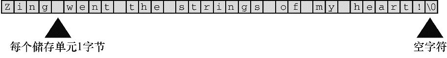

#### 4.2.1　char类型数组和null字符

C语言没有专门用于存储字符串的变量类型，字符串都被存储在 `char` 类型的数组中。数组由连续的存储单元组成，字符串中的字符被存储在相邻的存储单元中，每个单元存储一个字符（见图 `4.1` ）。


<center class="my_markdown"><b class="my_markdown">图4.1　数组中的字符串</b></center>

注意图4.1中数组末尾位置的字符 `\0` 。这是空字符（null character），C语言用它标记字符串的结束。空字符不是数字0，它是非打印字符，其ASCII码值是（或等价于）0。C中的字符串一定以空字符结束，这意味着数组的容量必须至少比待存储字符串中的字符数多1。因此，程序清单4.1中有40个存储单元的字符串，只能存储39个字符，剩下一个字节留给空字符。

那么，什么是数组？可以把数组看作是一行连续的多个存储单元。用更正式的说法是，数组是同类型数据元素的有序序列。程序清单 `4.1` 通过以下声明创建了一个包含 `40` 个存储单元（或元素）的数组，每个单元存储一个 `char` 类型的值：

```c
char name[40];
```

`name` 后面的方括号表明这是一个数组，方括号中的 `40` 表明该数组中的元素数量。 `char` 表明每个元素的类型（见图4.2）。


<center class="my_markdown"><b class="my_markdown">图4.2　声明一个变量和声明一个数组</b></center>

字符串看上去比较复杂！必须先创建一个数组，把字符串中的字符逐个放入数组，还要记得在末尾加上一个 `\0` 。还好，计算机可以自己处理这些细节。

