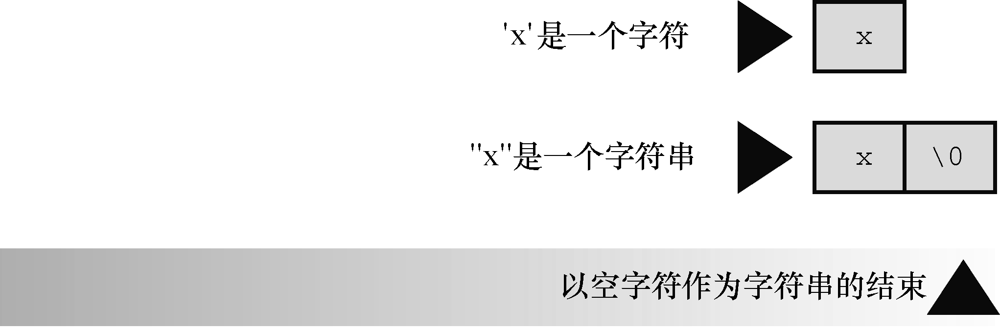

#### 4.2.2　使用字符串

试着运行程序清单4.2，使用字符串其实很简单。

程序清单4.2　 `praise1.c` 程序

```c
/* praise1.c -- 使用不同类型的字符串 */
#include <stdio.h>
#define PRAISE "You are an extraordinary being."
int main(void)
{
     char name[40];
     printf("What's your name? ");
     scanf("%s", name);
     printf("Hello, %s. %s\n", name, PRAISE);
     return 0;
}
```

`%s` 告诉 `printf()` 打印一个字符串。 `%s` 出现了两次，因为程序要打印两个字符串：一个存储在 `name` 数组中；一个由 `PRAISE` 来表示。运行 `praise1.c` ，其输出如下所示：

```c
What's your name? Angela Plains
Hello, Angela. You are an extraordinary being.

```

你不用亲自把空字符放入字符串末尾， `scanf()` 在读取输入时就已完成这项工作。也不用在字符串常量 `PRAISE` 末尾添加空字符。稍后我们会解释 `#define` 指令，现在先理解 `PRAISE` 后面用双引号括起来的文本是一个字符串。编译器会在末尾加上空字符。

注意（这很重要）， `scanf()` 只读取了 `Angela Plains` 中的 `Angela` ，它在遇到第 `1` 个空白（空格、制表符或换行符）时就不再读取输入。因此， `scanf()` 在读到 `Angela` 和 `Plains` 之间的空格时就停止了。一般而言，根据 `%s` 转换说明， `scanf()` 只会读取字符串中的一个单词，而不是一整句。C语言还有其他的输入函数（如， `fgets()` ），用于读取一般字符串。后面章节将详细介绍这些函数。

#### 字符串和字符

字符串常量 `"x"` 和字符常量 `'x'` 不同。区别之一在于 `'x'` 是基本类型（ `char` ），而 `"x"` 是派生类型（ `char` 数组）；区别之二是 `"x"` 实际上由两个字符组成： `'x'` 和空字符 `\0` （见图 `4.3` ）。


<center class="my_markdown"><b class="my_markdown">图4.3　字符 `'x'` 和字符串 `"x"`</b></center>

