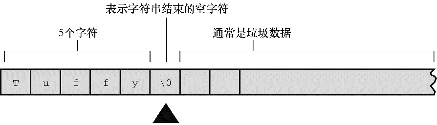

#### 4.2.3　 `strlen()` 函数

上一章提到了 `sizeof` 运算符，它以字节为单位给出对象的大小。 `strlen()` 函数给出字符串中的字符长度。因为 `1` 字节存储一个字符，读者可能认为把两种方法应用于字符串得到的结果相同，但事实并非如此。请根据程序清单 `4.3` ，在程序清单 `4.2` 中添加几行代码，看看为什么会这样。

程序清单4.3　 `praise2.c` 程序

```c
/* praise2.c */
// 如果编译器不识别%zd，尝试换成%u或%lu。
#include <stdio.h>
#include <string.h>      /* 提供strlen()函数的原型 */
#define PRAISE "You are an extraordinary being."
int main(void)
{
     char name[40];
     printf("What's your name? ");
     scanf("%s", name);
     printf("Hello, %s. %s\n", name, PRAISE);
     printf("Your name of %zd letters occupies %zd memory cells.\n",
               strlen(name), sizeof name);
     printf("The phrase of praise has %zd letters ",
               strlen(PRAISE));
     printf("and occupies %zd memory cells.\n", sizeof PRAISE);
     return 0;
}
```

如果使用ANSI C之前的编译器，必须移除这一行：

```c
#include <string.h>
```

`string.h` 头文件包含多个与字符串相关的函数原型，包括 `strlen()` 。第 `11` 章将详细介绍该头文件（顺带一提，一些 `ANSI` 之前的 `UNIX` 系统用 `strings.h` 代替 `string.h` ，其中也包含了一些字符串函数的声明）。

一般而言，C把函数库中相关的函数归为一类，并为每类函数提供一个头文件。例如， `printf()` 和 `scanf()` 都隶属标准输入和输出函数，使用 `stdio.h` 头文件。 `string.h` 头文件中包含了 `strlen()` 函数和其他一些与字符串相关的函数（如拷贝字符串的函数和字符串查找函数）。

注意，程序清单 `4.3` 使用了两种方法处理很长的 `printf()` 语句。第 `1` 种方法是将 `printf()` 语句分为两行（可以在参数之间断为两行，但是不要在双引号中的字符串中间断开）；第 `2` 种方法是使用两个 `printf()` 语句打印一行内容，只在第 `2` 条 `printf()` 语句中使用换行符（ `\n` ）。运行该程序，其交互输出如下：

```c
What's your name? Serendipity Chance
Hello, Serendipity. You are an extraordinary being.
Your name of 11 letters occupies 40 memory cells.
The phrase of praise has 31 letters and occupies 32 memory cells.

```

`sizeof` 运算符报告， `name` 数组有 `40` 个存储单元。但是，只有前 `11` 个单元用来存储 `Serendipity` ，所以 `strlen()` 得出的结果是 `11` 。 `name` 数组的第 `12` 个单元存储空字符， `strlen()` 并未将其计入。图 `4.4` 演示了这个概念。


<center class="my_markdown"><b class="my_markdown">图4.4　 `strlen()` 函数知道在何处停止</b></center>

对于 `PRAISE` ，用 `strlen()` 得出的也是字符串中的字符数（包括空格和标点符号）。然而， `sizeof` 运算符给出的数更大，因为它把字符串末尾不可见的空字符也计算在内。该程序并未明确告诉计算机要给字符串预留多少空间，所以它必须计算双引号内的字符数。

第 `3` 章提到过， `C99` 和 `C11` 标准专门为 `sizeof` 运算符的返回类型添加了 `%zd` 转换说明，这对于 `strlen()` 同样适用。对于早期的C，还要知道 `sizeof` 和 `strlen()` 返回的实际类型（通常是 `unsigned` 或 `unsigned long` ）。

另外，还要注意一点：上一章的 `sizeof` 使用了圆括号，但本例没有。何时使用圆括号取决于运算对象是类型还是特定量。运算对象是类型时，圆括号必不可少，但是对于特定量，圆括号可有可无。也就是说，对于类型，应写成 `sizeof(char)` 或 `sizeof(float)` ；对于特定量，可写成 `sizeof name` 或 `sizeof 6.28` 。尽管如此，还是建议所有情况下都使用圆括号，如 `sizeof(6.28)` 。

程序清单 `4.3` 中使用 `strlen()` 和 `sizeof` ，完全是为了满足读者的好奇心。在实际应用中， `strlen()` 和 `sizeof` 是非常重要的编程工具。例如，在各种要处理字符串的程序中， `strlen()` 很有用。详见第 `11` 章。

下面我们来学习 `#define` 指令。

