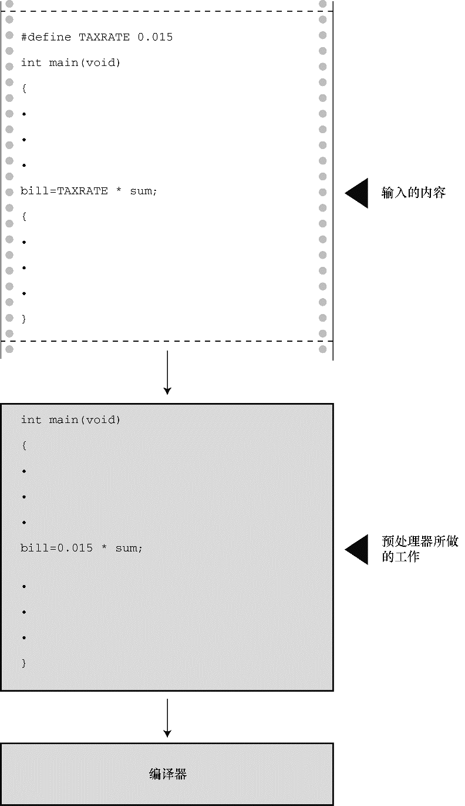

### 4.3　常量和C预处理器

有时，在程序中要使用常量。例如，可以这样计算圆的周长：

```c
circumference = 3.14159 * diameter;
```

这里，常量3.14159代表著名的常量pi（π）。在该例中，输入实际值便可使用这个常量。然而，这种情况使用符号常量（symbolic constant）会更好。也就是说，使用下面的语句，计算机稍后会用实际值完成替换：

```c
circumference = pi * diameter;
```

为什么使用符号常量更好？首先，常量名比数字表达的信息更多。请比较以下两条语句：

```c
owed = 0.015 * housevalue;
owed = taxrate * housevalue;
```

如果阅读一个很长的程序，第2条语句所表达的含义更清楚。

另外，假设程序中的多处使用一个常量，有时需要改变它的值。毕竟，税率通常是浮动的。如果程序使用符号常量，则只需更改符号常量的定义，不用在程序中查找使用常量的地方，然后逐一修改。

那么，如何创建符号常量？方法之一是声明一个变量，然后将该变量设置为所需的常量。可以这样写：

```c
float taxrate;
taxrate = 0.015;
```

这样做提供了一个符号名，但是 `taxrate` 是一个变量，程序可能会无意间改变它的值。C语言还提供了一个更好的方案——C预处理器。第 `2` 章中介绍了预处理器如何使用 `#include` 包含其他文件的信息。预处理器也可用来定义常量。只需在程序顶部添加下面一行：

```c
#define TAXRATE 0.015
```

编译程序时，程序中所有的 `TAXRATE` 都会被替换成 `0.015` 。这一过程被称为编译时替换（`compile-time substitution`）。在运行程序时，程序中所有的替换均已完成（见图 `4.5` ）。通常，这样定义的常量也称为明示常量（`manifest constant`）<sup class="my_markdown">[1]</sup>。

请注意格式，首先是 `#define` ，接着是符号常量名（ `TAXRATE` ），然后是符号常量的值（ `0.015` ）（注意，其中并没有 `=` 符号）。所以，其通用格式如下：

```c
#define NAME value
```

实际应用时，用选定的符号常量名和合适的值来替换`NAME`和`value`。注意，末尾不用加分号，因为这是一种由预处理器处理的替换机制。为什么 `TAXRATE` 要用大写？用大写表示符号常量是C语言一贯的传统。这样，在程序中看到全大写的名称就立刻明白这是一个符号常量，而非变量。大写常量只是为了提高程序的可读性，即使全用小写来表示符号常量，程序也能照常运行。尽管如此，初学者还是应该养成大写常量的好习惯。

另外，还有一个不常用的命名约定，即在名称前带 `c` 或 `k` 前缀来表示常量（如， `c_level` 或 `k_line` ）。

符号常量的命名规则与变量相同。可以使用大小写字母、数字和下划线字符，首字符不能为数字。程序清单4.4演示了一个简单的示例。


<center class="my_markdown"><b class="my_markdown">图4.5　输入的内容和编译后的内容</b></center>

程序清单4.4　 `pizza.c` 程序

```c
/* pizza.c -- 在比萨饼程序中使用已定义的常量 */
#include <stdio.h>
#define PI 3.14159
int main(void)
{
     float area, circum, radius;
     printf("What is the radius of your pizza?\n");
     scanf("%f", &radius);
     area = PI * radius * radius;
     circum = 2.0 * PI *radius;
     printf("Your basic pizza parameters are as follows:\n");
     printf("circumference = %1.2f, area = %1.2f\n", circum, area);
     return 0;
}
```

`printf()` 语句中的 `%1.2f` 表明，结果被四舍五入为两位小数输出。下面是一个输出示例：

```c
What is the radius of your pizza?
6.0
Your basic pizza parameters are as follows:
circumference = 37.70, area = 113.10

```

`#define` 指令还可定义字符和字符串常量。前者使用单引号，后者使用双引号。如下所示：

```c
#define BEEP '\a'
#define TEE 'T'
#define ESC '\033'
#define OOPS "Now you have done it!"
```

记住，符号常量名后面的内容被用来替换符号常量。不要犯这样的常见错误：

```c
/* 错误的格式 */
#define TOES = 20
```

如果这样做，替换 `TOES` 的是 `= 20` ，而不是 `20` 。这种情况下，下面的语句：

```c
digits = fingers + TOES;
```

将被转换成错误的语句：

```c
digits = fingers + = 20;
```

