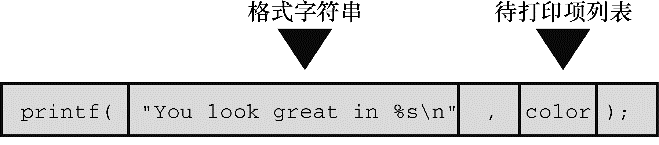
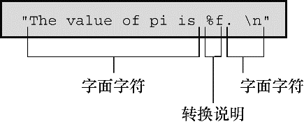

#### 4.4.2　使用 `printf()` 

程序清单4.6的程序中使用了一些转换说明。

程序清单4.6　 `printout.c` 程序

```c
/* printout.c -- 使用转换说明 */
#include <stdio.h>
#define PI 3.141593
int main(void)
{
     int number = 7;
     float pies = 12.75;
     int cost = 7800;
     printf("The %d contestants ate %f berry pies.\n", number,
               pies);
     printf("The value of pi is %f.\n", PI);
     printf("Farewell! thou art too dear for my possessing,\n");
     printf("%c%d\n", '$', 2 * cost);
     return 0;
}
```

该程序的输出如下：

```c
The 7 contestants ate 12.750000 berry pies.
The value of pi is 3.141593.
Farewell! thou art too dear for my possessing,
$15600
```

这是 `printf()` 函数的格式：

```c
printf( 格式字符串, 待打印项1, 待打印项2,...);
```

待打印项1、待打印项2等都是要打印的项。它们可以是变量、常量，甚至是在打印之前先要计算的表达式。第3章提到过，格式字符串应包含每个待打印项对应的转换说明。例如，考虑下面的语句：

```c
printf("The %d contestants ate %f berry pies.\n", number,pies);
```

格式字符串是双引号括起来的内容。上面语句的格式字符串包含了两个待打印项 `number` 和 `pies` 对应的两个转换说明。图 `4.6` 演示了 `printf()` 语句的另一个例子。


<center class="my_markdown"><b class="my_markdown">图4.6　 `printf()` 的参数</b></center>

下面是程序清单4.6中的另一行：

```c
printf("The value of pi is %f.\n", PI);
```

该语句中，待打印项列表只有一个项——符号常量 `PI` 。

如图4.7所示，格式字符串包含两种形式不同的信息：

+ 实际要打印的字符；
+ 转换说明。


<center class="my_markdown"><b class="my_markdown">图4.7　剖析格式字符串</b></center>

> **警告**
> 格式字符串中的转换说明一定要与后面的每个项相匹配，若忘记这个基本要求会导致严重的后果。千万别写成下面这样：

```c
printf("The score was Squids %d, Slugs %d.\n", score1);
```

> 这里，第 `2` 个 `%d` 没有对应任何项。系统不同，导致的结果也不同。不过，出现这种问题最好的状况是得到无意义的值。

如果只打印短语或句子，就不需要使用任何转换说明。如果只打印数据，也不用加入说明文字。程序清单 `4.6` 中的最后两个 `printf()` 语句都没问题：

```c
printf("Farewell! thou art too dear for my possessing,\n");
printf("%c%d\n", '$', 2 * cost);
```

注意第 `2` 条语句，待打印列表的第 `1` 个项是一个字符常量，不是变量；第 `2` 个项是一个乘法表达式。这说明 `printf()` 使用的是值，无论是变量、常量还是表达式的值。

由于 `printf()` 函数使用 `%` 符号来标识转换说明，因此打印 `%` 符号就成了个问题。如果单独使用一个 `%` 符号，编译器会认为漏掉了一个转换字符。解决方法很简单，使用两个 `%` 符号就行了：

```c
pc = 2*6;
printf("Only %d%% of Sally's gribbles were edible.\n", pc);
```

下面是输出结果：

```c
Only 12% of Sally's gribbles were edible.
```

