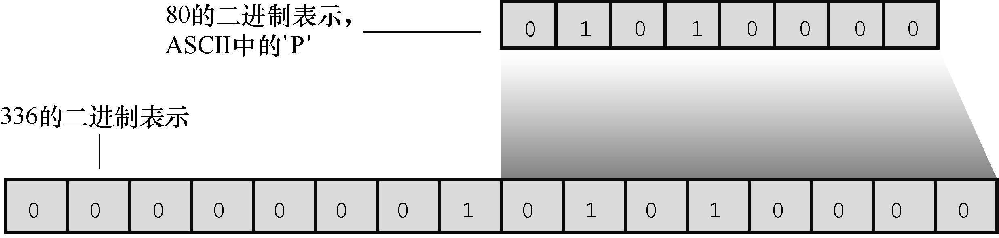
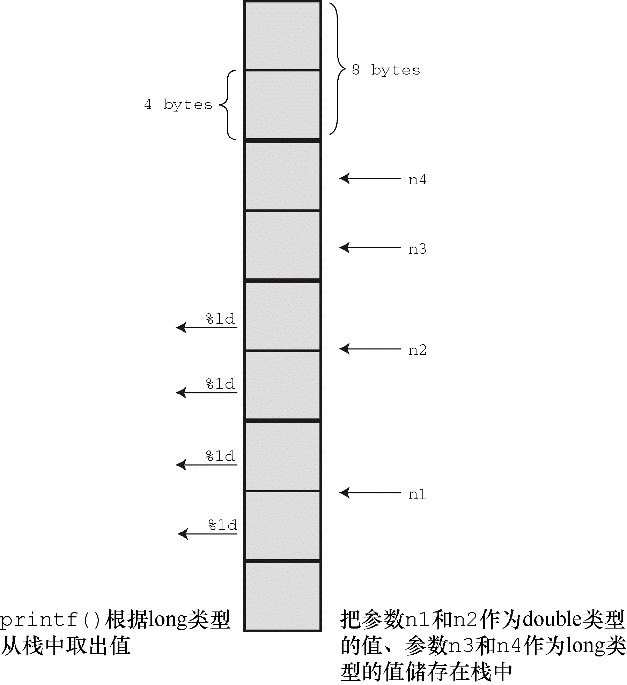

#### 4.4.4　转换说明的意义

下面深入探讨一下转换说明的意义。转换说明把以二进制格式存储在计算机中的值转换成一系列字符（字符串）以便于显示。例如，数字 `76` 在计算机内部的存储格式是二进制数 `01001100` 。 `%d` 转换说明将其转换成字符 `7` 和 `6` ，并显示为 `76` ； `%x` 转换说明把相同的值（ `01001100` ）转换成十六进制记数法 `4c` ； `%c` 转换说明把 `01001100` 转换成字符 `L` 。

转换（`conversion`）可能会误导读者认为原始值被替换成转换后的值。实际上，转换说明是翻译说明， `%d` 的意思是“把给定的值翻译成十进制整数文本并打印出来”。

#### 1．转换不匹配

前面强调过，转换说明应该与待打印值的类型相匹配。通常都有多种选择。例如，如果要打印一个 `int` 类型的值，可以使用 `%d` 、 `%x` 或 `%o` 。这些转换说明都可用于打印 `int` 类型的值，其区别在于它们分别表示一个值的形式不同。类似地，打印 `double` 类型的值时，可使用 `%f` 、 `%e` 或 `%g` 。

转换说明与待打印值的类型不匹配会怎样？上一章中介绍过不匹配导致的一些问题。匹配非常重要，一定要牢记于心。程序清单4.11演示了一些不匹配的整型转换示例。

程序清单4.11　 `intconv.c` 程序

```c
/* intconv.c -- 一些不匹配的整型转换 */
#include <stdio.h>
#define PAGES 336
#define WORDS 65618
int main(void)
{
     short num = PAGES;
     short mnum = -PAGES;
     printf("num as short and unsigned short:  %hd %hu\n", num,num);
     printf("-num as short and unsigned short: %hd %hu\n", mnum,mnum);
     printf("num as int and char: %d %c\n", num, num);
     printf("WORDS as int, short, and char: %d %hd %c\n",WORDS,WORDS, WORDS);
     return 0;
}
```

在我们的系统中，该程序的输出如下：

```c
num as short and unsigned short: 336 336
-num as short and unsigned short: -336 65200
num as int and char: 336 P
WORDS as int, short, and char: 65618 82 R
```

请看输出的第 `1` 行， `num` 变量对应的转换说明 `%hd` 和 `%hu` 输出的结果都是 `336` 。这没有任何问题。然而，第 `2` 行 `mnum` 变量对应的转换说明 `%u` （无符号）输出的结果却为 `65200` ，并非期望的 `336` 。这是由于有符号 `short int` 类型的值在我们的参考系统中的表示方式所致。首先， `short int` 的大小是 `2` 字节；其次，系统使用二进制补码来表示有符号整数。这种方法，数字 `0` ～ `32767` 代表它们本身，而数字 `32768` ～ `65535` 则表示负数。其中， `65535` 表示 `-1` ， `65534` 表示 `-2` ，以此类推。因此， `-336` 表示为 `65200` （即， `65536-336` ）。所以被解释成有符号 `int` 时， `65200` 代表 `-336` ；而被解释成无符号 `int` 时， `65200` 则代表 `65200` 。一定要谨慎！一个数字可以被解释成两个不同的值。尽管并非所有的系统都使用这种方法来表示负整数，但要注意一点：别期望用 `%u` 转换说明能把数字和符号分开。

第 `3` 行演示了如果把一个大于 `255` 的值转换成字符会发生什么情况。在我们的系统中， `short int` 是 `2` 字节， `char` 是 `1` 字节。当 `printf()` 使用 `%c` 打印 `336` 时，它只会查看存储 `336` 的 `2` 字节中的后 `1` 字节。这种截断（见图 `4.8` ）相当于用一个整数除以 `256` ，只保留其余数。在这种情况下，余数是 `80` ，对应的 `ASCII` 值是字符 `P` 。用专业术语来说，该数字被解释成“以 `256` 为模”（`modulo 256`），即该数字除以 `256` 后取其余数。


<center class="my_markdown"><b class="my_markdown">图4.8　把336转换成字符</b></center>

最后，我们在该系统中打印比 `short int` 类型最大整数（ `32767` ）更大的整数（ `65618` ）。这次，计算机也进行了求模运算。在本系统中，应把数字 `65618` 存储为 `4` 字节的 `int` 类型值。用 `%hd` 转换说明打印时， `printf()` 只使用最后 `2` 个字节。这相当于 `65618` 除以 `65536` 的余数。这里，余数是 `82` 。鉴于负数的存储方法，如果余数在 `32767` ～ `65536` 范围内会被打印成负数。对于整数大小不同的系统，相应的处理行为类似，但是产生的值可能不同。

混淆整型和浮点型，结果更奇怪。考虑程序清单4.12。

程序清单4.12　 `floatcnv.c` 程序

```c
/* floatcnv.c -- 不匹配的浮点型转换 */
#include <stdio.h>
int main(void)
{
     float n1 = 3.0;
     double n2 = 3.0;
     long n3 = 2000000000;
     long n4 = 1234567890;
     printf("%.1e %.1e %.1e %.1e\n", n1, n2, n3, n4);
     printf("%ld %ld\n", n3, n4);
     printf("%ld %ld %ld %ld\n", n1, n2, n3, n4);
     return 0;
}
```

在我们的系统中，该程序的输出如下：

```c
3.0e+00 3.0e+00 3.1e+46 1.7e+266
2000000000 1234567890
0 1074266112 0 1074266112
```

第 `1` 行输出显示， `%e` 转换说明没有把整数转换成浮点数。考虑一下，如果使用 `%e` 转换说明打印 `n3` （ `long` 类型）会发生什么情况。首先， `%e` 转换说明让 `printf()` 函数认为待打印的值是 `double` 类型（本系统中 `double` 为 `8` 字节）。当 `printf()` 查看 `n3` （本系统中是 `4` 字节的值）时，除了查看 `n3` 的 `4` 字节外，还会查看查看 `n3` 相邻的 `4` 字节，共 `8` 字节单元。接着，它将 `8` 字节单元中的位组合解释成浮点数（如，把一部分位组合解释成指数）。因此，即使 `n3` 的位数正确，根据 `%e` 转换说明和 `%ld` 转换说明解释出来的值也不同。最终得到的结果是无意义的值。

第 `1` 行也说明了前面提到的内容： `float` 类型的值作为 `printf()` 参数时会被转换成 `double` 类型。在本系统中， `float` 是 `4` 字节，但是为了 `printf()` 能正确地显示该值， `n1` 被扩成 `8` 字节。

第 `2` 行输出显示，只要使用正确的转换说明， `printf()` 就可以打印 `n3` 和 `n4` 。

第 `3` 行输出显示，如果 `printf()` 语句有其他不匹配的地方，即使用对了转换说明也会生成虚假的结果。用 `%ld` 转换说明打印浮点数会失败，但是在这里，用 `%ld` 打印 `long` 类型的数竟然也失败了！问题出在C如何把信息传递给函数。具体情况因编译器实现而异。“参数传递”框中针对一个有代表性的系统进行了讨论。


**参数传递**

参数传递机制因实现而异。下面以我们的系统为例，分析参数传递的原理。函数调用如下：

```c
printf("%ld %ld %ld %ld\n", n1, n2, n3, n4);
```

该调用告诉计算机把变量n1、n2、n3和n4的值传递给程序。这是一种常见的参数传递方式。程序把传入的值放入被称为栈（stack）的内存区域。计算机根据变量类型（不是根据转换说明）把这些值放入栈中。因此，n1被存储在栈中，占8字节（float类型被转换成double类型）。同样，n2也在栈中占8字节，而n3和n4在栈中分别占4字节。然后，控制转到printf()函数。该函数根据转换说明（不是根据变量类型）从栈中读取值。%ld转换说明表明printf()应该读取4字节，所以printf()读取栈中的前4字节作为第1个值。这是n1的前半部分，将被解释成一个long类型的整数。根据下一个%ld转换说明，printf()再读取4字节，这是n1的后半部分，将被解释成第2个long类型的整数（见图4.9）。类似地，根据第3个和第4个%ld，printf()读取n2的前半部分和后半部分，并解释成两个long类型的整数。因此，对于n3和n4，虽然用对了转换说明，但printf()还是读错了字节。

```c
float n1;    /* 作为double类型传递 */
double n2;
long n3, n4;
...
printf("%ld %ld %ld %ld\n", n1, n2, n3, n4);
```


<center class="my_markdown"><b class="my_markdown">图4.9　传递参数</b></center>


#### 2． `printf()` 的返回值

第 `2` 章提到过，大部分C函数都有一个返回值，这是函数计算并返回给主调程序（`calling program`）的值。例如，C库包含一个 `sqrt()` 函数，接受一个数作为参数，并返回该数的平方根。可以把返回值赋给变量，也可以用于计算，还可以作为参数传递。总之，可以把返回值像其他值一样使用。 `printf()` 函数也有一个返回值，它返回打印字符的个数。如果有输出错误， `printf()` 则返回一个负值（ `printf()` 的旧版本会返回不同的值）。

`printf()` 的返回值是其打印输出功能的附带用途，通常很少用到，但在检查输出错误时可能会用到（如，在写入文件时很常用）。如果一张已满的 `CD` 或 `DVD` 拒绝写入，程序应该采取相应的行动，例如终端蜂鸣 `30` 秒。不过，要实现这种情况必须先了解 `if` 语句。程序清单 `4.13` 演示了如何确定函数的返回值。

程序清单4.13　 `prntval.c` 程序

```c
/* prntval.c -- printf()的返回值 */
#include <stdio.h>
int main(void)
{
     int bph2o = 212;
     int rv;
     rv = printf("%d F is water's boiling point.\n", bph2o);
     printf("The printf() function printed %d characters.\n",
               rv);
     return 0;
}
```

该程序的输出如下：

```c
212 F is water's boiling point.
The printf() function printed 32 characters.
```

首先，程序用 `rv = printf(...);` 的形式把 `printf()` 的返回值赋给 `rv` 。因此，该语句执行了两项任务：打印信息和给变量赋值。其次，注意计算针对所有字符数，包括空格和不可见的换行符（ `\n` ）。

#### 3．打印较长的字符串

有时， `printf()` 语句太长，在屏幕上不方便阅读。如果空白（空格、制表符、换行符）仅用于分隔不同的部分，C编译器会忽略它们。因此，一条语句可以写成多行，只需在不同部分之间输入空白即可。例如，程序清单 `4.13` 中的一条 `printf()` 语句：

```c
printf("The printf() function printed %d characters.\n",
          rv);
```

该语句在逗号和 `rv` 之间断行。为了让读者知道该行未完，示例缩进了 `rv` 。C编译器会忽略多余的空白。

但是，不能在双引号括起来的字符串中间断行。如果这样写：

```c
printf("The printf() function printed %d
           characters.\n", rv);
```

C编译器会报错：字符串常量中有非法字符。在字符串中，可以使用 `\n` 来表示换行字符，但是不能通过按下Enter（或Return）键产生实际的换行符。

给字符串断行有3种方法，如程序清单4.14所示。

程序清单4.14　 `longstrg.c` 程序

```c
/* longstrg.c ––打印较长的字符串 */
#include <stdio.h>
int main(void)
{
     printf("Here's one way to print a ");
     printf("long string.\n");
     printf("Here's another way to print a \
long string.\n");
     printf("Here's the newest way to print a "
               "long string.\n");      /* ANSI C */
     return 0;
}
```

该程序的输出如下：

```c
Here's one way to print a long string.
Here's another way to print a long string.
Here's the newest way to print a long string.
```

方法 `1` ：使用多个 `printf()` 语句。因为第 `1` 个字符串没有以 `\n` 字符结束，所以第 `2` 个字符串紧跟第 `1` 个字符串末尾输出。

方法2：用反斜杠（\）和Enter（或Return）键组合来断行。这使得光标移至下一行，而且字符串中不会包含换行符。其效果是在下一行继续输出。但是，下一行代码必须和程序清单中的代码一样从最左边开始。如果缩进该行，比如缩进5个空格，那么这5个空格就会成为字符串的一部分。

方法3：ANSI C引入的字符串连接。在两个用双引号括起来的字符串之间用空白隔开，C编译器会把多个字符串看作是一个字符串。因此，以下3种形式是等效的：

```c
printf("Hello, young lovers, wherever you are.");
printf("Hello, young "        "lovers" ", wherever you are.");
printf("Hello, young lovers"
        ", wherever you are.");
```

上述方法中，要记得在字符串中包含所需的空格。如， `"young""lovers"` 会成为 `"younglovers"` ，而 `"young " "lovers"` 才是 `"younglovers"` 。

