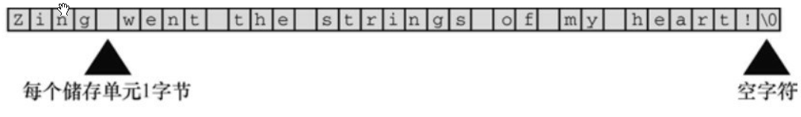

[toc]

字符串是一个或多个字符的序列，如下所示：

"Zing went the strings of my heart!"

### 1. char 类型数组和 null 字符

C 语言没有专门用于存储字符串的变量类型，字符串都被存储在 char 类型的数组中。数组由连续的存储单元组成，字符串中的字符被存储在相邻的存储单元中，每个单元存储一个字符。



<center>图4.1 数组中的字符串</center>

注意图 4.1 中数组末尾位置的字符 \0.这是空字符，C 语言用它标记字符串的结束。空字符不是数字 0，它是非打印字符，其 ASCII 码值是（或等价于）0。C 中的字符串一定以空字符结束，这意味着数组的容量必须至少比待存储字符串中的字符数多 1。

### 2. 使用字符串

程序清单**4.2 praise1.c**程序

```c
/* praise1.c -- 使用不同类型的字符串 */
#include <stdio.h>

#define PRAISE "You are an extraordinary being."

int main(void)
{
	char name[40];
	printf("What's your name?");
	scanf("%s", name);
	printf("Hello, %s. %s\n", name, PRAISE);
	return 0;
}
```

运行输出如下所示：

```console
What's your name?Angela Plains
Hello, Angela. You are an extraordinary being.
```

注意（这很重要），scanf() 只读取了 Angela Plains 中的 Angela，它在遇到第 1 个空白（空格、制表符或换行符）时就不在读取输入。因此，scanf() 在读到 Angela 和 Plains 之间的空格时就停止了。一般而言，根据 %s 转换说明，scanf() 之后读取字符串中的一个单词，而不是一整句。C 语言还有其他的输入函数（如，fgets()），用于读取一般字符串。

字符串常量 "x" 和字符常量 'x' 不同。区别之一在于 'x' 是基本类型（char）,而 "x" 是派生类型（char 数组）；区别之二是 "x" 实际上由两个字符组成：'x' 和空字符 \0。

### 3. strlen() 函数

上一章提到了 sizeof 运算符，它以字节为单位给出对象的大小。strlen() 函数给出字符串中的字符长度。

程序清单**4.3 praise2.c**程序

```c
/* praise2.c */
// 如果编译器不识别 %zd，尝试换成 %u 或 %lu。
#include <stdio.h>
#include <string.h>	/* 提供 strlen() 函数的原型 */

#define PRAISE "You are an extraordinary being."

int main(void)
{
	char name[40];
	printf("What's your name?");
	scanf("%s", name);
	printf("Hello, %s. %s\n", name, PRAISE);
	printf("Your name of %zd letters occupies %zd memory cells.\n", 
		strlen(name), sizeof name);
	printf("The phrase of praise has %zd letters ",
		strlen(PRAISE));
	printf("and occupies %zd memory cells.\n", sizeof PRAISE);
	return 0;
}
```

运行后输出如下所示：

```console
What's your name?Serendipity Chance
Hello, Serendipity. You are an extraordinary being.
Your name of 11 letters occupies 40 memory cells.
The phrase of praise has 31 letters and occupies 32 memory cells.
```

> 注意：上一章的 sizeof 使用了圆括号，但本例没有。圆括号的使用时机取决于运算对象是类型还是特定量？运算符对象是类型时，圆括号必不可少，但是对于特定量，可有可无。也就是说，对于类型，应写成 sizeof(char) 或 sizeof(float)；对于特定量，可写成 sizeof name 或 sizeof 6.28。尽管如此，还是建议所有情况下都使用圆括号，如 sizeof(6.28)。

