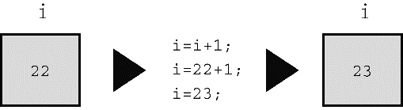

#### 5.2.1　赋值运算符： `=` 

在C语言中，=并不意味着“相等”，而是一个赋值运算符。下面的赋值表达式语句：

```c
bmw = 2002;
```

把值 `2002` 赋给变量 `bmw` 。也就是说，=号左侧是一个变量名，右侧是赋给该变量的值。符号=被称为赋值运算符。另外，上面的语句不读作“ `bmw` 等于 `2002` ”，而读作“把值 `2002` 赋给变量 `bmw` ”。赋值行为从右往左进行。

也许变量名和变量值的区别看上去微乎其微，但是，考虑下面这条常用的语句：

```c
i = i + 1;
```

对数学而言，这完全行不通。如果给一个有限的数加上 `1` ，它不可能“等于”原来的数。但是，在计算机赋值表达式语句中，这很合理。该语句的意思是：找出变量 `i` 的值，把该值加 `1` ，然后把新值赋值变量 `i` （见图5.1）。


<center class="my_markdown"><b class="my_markdown">图5.1　语句 `i = i + 1;`</b></center>

在C语言中，类似这样的语句没有意义（实际上是无效的）：

```c
2002 = bmw;
```

因为在这种情况下， `2002` 被称为右值（rvalue），只能是字面常量，不能给常量赋值，常量本身就是它的值。因此，在编写代码时要记住，=号左侧的项必须是一个变量名。实际上，赋值运算符左侧必须引用一个存储位置。最简单的方法就是使用变量名。不过，后面章节还会介绍“指针”，可用于指向一个存储位置。概括地说，C使用可修改的左值（modifiable lvalue）标记那些可赋值的实体。也许“可修改的左值”不太好懂，我们再来看一些定义。

#### 几个术语：数据对象、左值、右值和运算符

赋值表达式语句的目的是把值存储到内存位置上。用于存储值的数据存储区域统称为数据对象（data object）。C标准只有在提到这个概念时才会用到对象这个术语。使用变量名是标识对象的一种方法。除此之外，还有其他方法，但是要在后面的章节中才学到。例如，可以指定数组的元素、结构的成员，或者使用指针表达式（指针中存储的是它所指向对象的地址）。左值（lvalue）是C语言的术语，用于标识特定数据对象的名称或表达式。因此，对象指的是实际的数据存储，而左值是用于标识或定位存储位置的标签。

对于早期的C语言，提到左值意味着：

1．它指定一个对象，可以引用内存中的地址；

2．它可用在赋值运算符的左侧，左值（lvalue）中的l源自left。

但是后来，标准中新增了 `const` 限定符。用 `const` 创建的变量不可修改。因此， `const` 标识符满足上面的第1项，但是不满足第2项。一方面C继续把标识对象的表达式定义为左值，一方面某些左值却不能放在赋值运算符的左侧。

为此，C标准新增了一个术语：可修改的左值（modifiable lvalue），用于标识可修改的对象。所以，赋值运算符的左侧应该是可修改的左值。当前标准建议，使用术语对象定位值（object locator value）更好。

右值（rvalue）指的是能赋值给可修改左值的量，且本身不是左值。例如，考虑下面的语句：

```c
bmw = 2002;
```

这里， `bmw` 是可修改的左值， `2002` 是右值。读者也许猜到了，右值中的r源自right。右值可以是常量、变量或其他可求值的表达式（如，函数调用）。实际上，当前标准在描述这一概念时使用的是表达式的值（value of an expression），而不是右值。

我们看几个简单的示例：

```c
int ex;
int why;
int zee;
const int TWO = 2;
why = 42;
zee = why;
ex = TWO * (why + zee);
```

这里， `ex` 、 `why` 和 `zee` 都是可修改的左值（或对象定位值），它们可用于赋值运算符的左侧和右侧。 `TWO` 是不可改变的左值，它只能用于赋值运算符的右侧（在该例中， `TWO` 被初始化为 `2` ，这里的 `=` 运算符表示初始化而不是赋值，因此并未违反规则）。同时， `42` 是右值，它不能引用某指定内存位置。另外， `why` 和 `zee` 是可修改的左值，表达式 `(why + zee)` 是右值，该表达式不能表示特定内存位置，而且也不能给它赋值。它只是程序计算的一个临时值，在计算完毕后便会被丢弃。

在学习名称时，被称为“项”（如，赋值运算符左侧的项）的就是运算对象（operand）。运算对象是运算符操作的对象。例如，可以把“吃汉堡”描述为：“吃”（运算符）操作“汉堡”（运算对象）。类似地可以说，=运算符的左侧运算对象应该是可修改的左值。

C的基本赋值运算符有些与众不同，请看程序清单5.3。

程序清单5.3　 `golf.c` 程序

```c
/* golf.c -- 高尔夫锦标赛记分卡 */
#include <stdio.h>
int main(void)
{
     int jane, tarzan, cheeta;
     cheeta = tarzan = jane = 68;
     printf("                  cheeta   tarzan    jane\n");
     printf("First round score %4d %8d %8d\n", cheeta, tarzan, jane);
     return 0;
}
```

许多其他语言都会回避该程序中的三重赋值，但是C完全没问题。赋值的顺序是从右往左：首先把 `68` 赋给 `jane` ，然后再赋给 `tarzan` ，最后赋给 `cheeta` 。因此，程序的输出如下：

```c
                  cheeta    tarzan      jane
First round score   68         68         68
```

