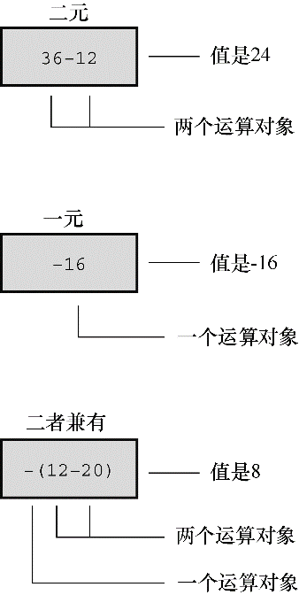

#### 5.2.4　符号运算符： `-` 和 `+` 

减号还可用于标明或改变一个值的代数符号。例如，执行下面的语句后， `smokey` 的值为12：

```c
rocky = –12;
smokey = –rocky;
```

以这种方式使用的负号被称为一元运算符（unary operator）。一元运算符只需要一个运算对象（见图5.2）。


<center class="my_markdown"><b class="my_markdown">图5.2　一元和二元运算符</b></center>

C90标准新增了一元+运算符，它不会改变运算对象的值或符号，只能这样使用：

```c
dozen = +12;
```

编译器不会报错。但是在以前，这样做是不允许的。

