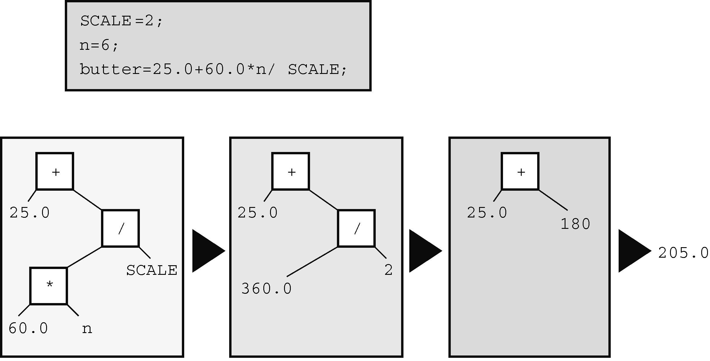

#### 5.2.7　运算符优先级

考虑下面的代码：

```c
butter = 25.0 + 60.0 * n / SCALE;
```

这条语句中有加法、乘法和除法运算。先算哪一个？是 `25.0` 加上 `60.0` ，然后把计算的和 `85.0` 乘以 `n` ，再把结果除以 `SCALE` ？还是 `60.0` 乘以 `n` ，然后把计算的结果加上 `25.0` ，最后再把结果除以 `SCALE` ？还是其他运算顺序？假设 `n` 是 `6.0` ， `SCALE` 是 `2.0` ，带入语句中计算会发现，第1种顺序得到的结果是 `255` ，第2种顺序得到的结果是 `192.5` 。C程序一定是采用了其他的运算顺序，因为程序运行该语句后， `butter` 的值是 `205.0` 。

显然，执行各种操作的顺序很重要。C语言对此有明确的规定，通过运算符优先级来解决操作顺序的问题。每个运算符都有自己的优先级。正如普通的算术运算那样，乘法和除法的优先级比加法和减法高，所以先执行乘法和除法。如果两个运算符的优先级相同怎么办？如果它们处理同一个运算对象，则根据它们在语句中出现的顺序来执行。对大多数运算符而言，这种情况都是按从左到右的顺序进行（=运算符除外）。因此，语句：

```c
butter = 25.0 + 60.0 * n / SCALE;
```

的运算顺序是：

```c
60.0 * n            首先计算表达式中的*或/（假设n的值是6，所以60.0*n得360.0）
360.0 / SCALE       然后计算表达式中第2个*或/
25.0 + 180          最后计算表达式里第1个+或-，结果为205.0（假设SCALE的值是2.0）
```

许多人喜欢用表达式树（expression tree）来表示求值的顺序，如图5.3所示。该图演示了如何从最初的表达式逐步简化为一个值。


<center class="my_markdown"><b class="my_markdown">图5.3　用表达式树演示运算符、运算对象和求值顺序</b></center>

如何让加法运算在除法运算之前执行？可以这样做：

```c
flour = (25.0 + 60.0 * n) / SCALE;
```

最先执行圆括号中的部分。圆括号内部按正常的规则执行。该例中，先执行乘法运算，再执行加法运算。执行完圆括号内的表达式后，用运算结果除以 `SCALE` 。

表5.1总结了到目前为止学过的运算符优先级。

<center class="my_markdown"><b class="my_markdown">表5.1　运算符优先级（从高至低）</b></center>

| 运算符 | 结合律 |
| :-----  | :-----  | :-----  | :-----  |
| `()` | 从左往右 |
| `+`   `-` （一元） | 从右往左 |
| *　 `/` | 从左往右 |
| `+` 　 `-` （二元） | 从左往右 |
| `=` | 从右往左 |

注意正号（加号）和负号（减号）的两种不同用法。结合律栏列出了运算符如何与运算对象结合。例如，一元负号与它右侧的量相结合，在除法中用除号左侧的运算对象除以右侧的运算对象。

