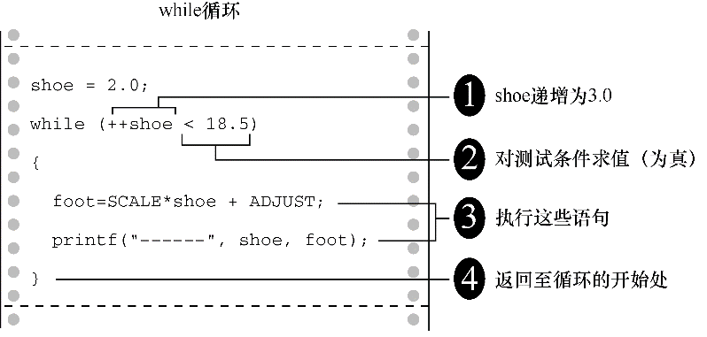
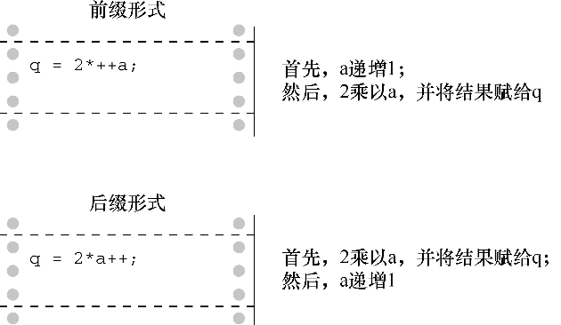

#### 5.3.3　递增运算符： `++` 

递增运算符（increment operator）执行简单的任务，将其运算对象递增1。该运算符以两种方式出现。第1种方式，++出现在其作用的变量前面，这是前缀模式；第2种方式，++出现在其作用的变量后面，这是后缀模式。两种模式的区别在于递增行为发生的时间不同。我们先解释它们的相似之处，再分析它们不同之处。程序清单5.10中的程序示例演示了递增运算符是如何工作的。

程序清单5.10　 `add_one.c` 程序

```c
/* add_one.c -- 递增：前缀和后缀 */
#include <stdio.h>
int main(void)
{
     int ultra = 0, super = 0;
     while (super < 5)
     {
          super++;
          ++ultra;
          printf("super = %d, ultra = %d \n", super, ultra);
     }
     return 0;
}
```

运行该程序后，其输出如下：

```c
super = 1, ultra = 1
super = 2, ultra = 2
super = 3, ultra = 3
super = 4, ultra = 4
super = 5, ultra = 5
```

该程序两次同时计数到5。用下面两条语句分别代替程序中的两条递增语句，程序的输出相同：

```c
super = super + 1;
ultra = ultra + 1;
```

这些都是很简单的语句，为何还要创建两个缩写形式？原因之一是，紧凑结构的代码让程序更为简洁，可读性更高。这些运算符让程序看起来很美观。例如，可重写程序清单5.2（ `shoes2.c` ）中的一部分代码：

```c
shoe = 3.0;
while (shoe < 18.5)
{
     foot = SCALE * size + ADJUST;
     printf("%10.1f %20.2f inches\n", shoe, foot);
     ++shoe;
}
```

但是，这样做也没有充分利用递增运算符的优势。还可以这样缩短这段程序：

```c
shoe = 2.0;
while (++shoe < 18.5)
{
     foot = SCALE*shoe + ADJUST;
     printf("%10.1f %20.2f inches\n", shoe, foot);
}
```

如上代码所示，把变量的递增过程放入 `while` 循环的条件中。这种结构在C语言中很普遍，我们来仔细分析一下。

首先，这样的 `while` 循环是如何工作的？很简单。 `shoe` 的值递增 `1` ，然后和 `18.5` 作比较。如果递增后的值小于 `18.5` ，则执行花括号内的语句一次。然后， `shoe` 的值再递增 `1` ，重复刚才的步骤，直到 `shoe` 的值不小于 `18.5` 为止。注意，我们把 `shoe` 的初始值从 `3.0` 改为 `2.0` ，因为在对 `foot` 第1次求值之前， `shoe` 已经递增了 `1` （见图5.4）。


<center class="my_markdown"><b class="my_markdown">图5.4　执行一次循环</b></center>

其次，这样做有什么好处？它使得程序更加简洁。更重要的是，它把控制循环的两个过程集中在一个地方。该循环的主要过程是判断是否继续循环（本例中，要检查鞋子的尺码是否小于 `18.5` ），次要过程是改变待测试的元素（本例中是递增鞋子的尺码）。

如果忘记改变鞋子的尺码， `shoe` 的值会一直小于18.5，循环不会停止。计算机将陷入无限循环（infinite loop）中，生成无数相同的行。最后，只能强行关闭这个程序。把循环测试和更新循环放在一处，就不会忘记更新循环。

但是，把两个操作合并在一个表达式中，降低了代码的可读性，让代码难以理解。而且，还容易产生计数错误。

递增运算符的另一个优点是，通常它生成的机器语言代码效率更高，因为它和实际的机器语言指令很相似。尽管如此，随着商家推出的C编译器越来越智能，这一优势可能会消失。一个智能的编译器可以把 `x = x + 1` 当作 `++x` 对待。

最后，递增运算符还有一个在某些场合特别有用的特性。我们通过程序清单5.11来说明。

程序清单5.11　 `post_pre.c` 程序

```c
/* post_pre.c -- 前缀和后缀 */
#include <stdio.h>
int main(void)
{
     int a = 1, b = 1;
     int a_post, pre_b;
     a_post = a++;  // 后缀递增
     pre_b = ++b;   // 前缀递增
     printf("a  a_post   b   pre_b \n");
     printf("%1d %5d %5d %5d\n", a, a_post, b, pre_b);
     return 0;
}
```

如果你的编译器没问题，那么程序的输出应该是：

```c
a     a_post     b     pre_b
2          1     2         2
```

`a` 和 `b` 都递增了 `1` ，但是， `a_post` 是 `a` 递增之前的值，而 `pre_b` 是 `b` 递增之后的值。这就是++的前缀形式和后缀形式的区别（见图5.5）。

```c
a_post = a++;       // 后缀：使用a的值之后，递增a
pre_b = ++b;        // 前缀：使用b的值之前，递增b
```


<center class="my_markdown"><b class="my_markdown">图5.5　前缀和后缀</b></center>

单独使用递增运算符时（如， `ego++;` ），使用哪种形式都没关系。但是，当运算符和运算对象是更复杂表达式的一部分时（如上面的示例），使用前缀或后缀的效果不同。例如，我们曾经建议用下面的代码：

```c
while (++shoe < 18.5)
```

该测试条件相当于提供了一个鞋子尺码到18的表。如果使用 `shoe++` 而不是 `++shoes` ，尺码表会增至19。因为 `shoe` 会在与18.5进行比较之后才递增，而不是先递增再比较。

当然，使用下面这种形式也没错：

```c
shoe = shoe + 1;
```

只不过，有人会怀疑你是否是真正的C程序员。

在学习本书的过程中，应多留意使用递增运算符的例子。自己思考是否能互换使用前缀和后缀形式，或者当前环境是否只能使用某种形式。

如果使用前缀形式和后缀形式会对代码产生不同的影响，那么最为明智的是不要那样使用它们。例如，不要使用下面的语句：

```c
b = ++i;    // 如果使用i++，会得到不同的结果
```

应该使用下列语句：

```c
++i;        // 第1行
b = i;      // 如果第1行使用的是i++，并不会影响b的值
```

尽管如此，有时小心翼翼地使用会更有意思。所以，本书会根据实际情况，采用不同的写法。

