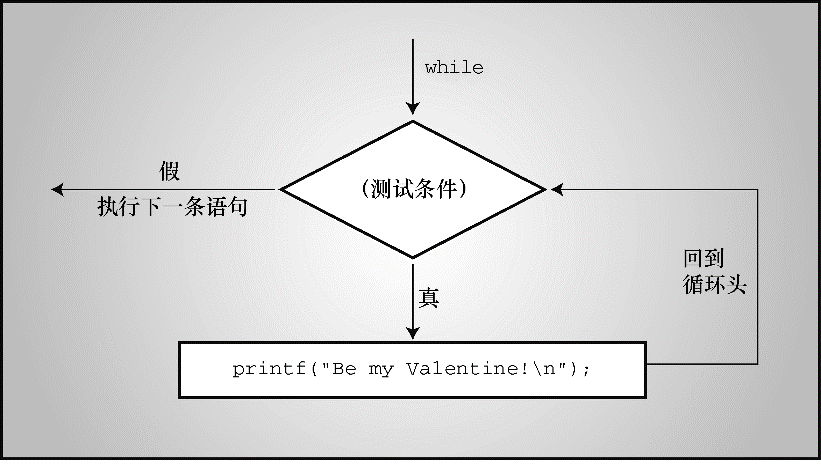

#### 5.4.2　语句

语句（statement）是C程序的基本构建块。一条语句相当于一条完整的计算机指令。在C中，大部分语句都以分号结尾。因此，

```c
legs = 4
```

只是一个表达式（它可能是一个较大表达式的一部分），而下面的代码则是一条语句：

```c
legs = 4;
```

最简单的语句是空语句：

```c
;    //空语句
```

C把末尾加上一个分号的表达式都看作是一条语句（即，表达式语句）。因此，像下面这样写也没问题：

```c
8;
3 + 4;
```

但是，这些语句在程序中什么也不做，不算是真正有用的语句。更确切地说，语句可以改变值或调用函数：

```c
x = 25;
++x;
y = sqrt(x);
```

虽然一条语句（或者至少是一条有用的语句）相当于一条完整的指令，但并不是所有的指令都是语句。考虑下面的语句：

```c
x = 6 + (y = 5);
```

该语句中的子表达式 `y = 5` 是一条完整的指令，但是它只是语句的一部分。因为一条完整的指令不一定是一条语句，所以分号用于识别在这种情况下的语句（即，简单语句）。

到目前为止，读者已经见过多种语句（不包括空语句）。程序清单5.13演示了一些常见的语句。

程序清单5.13　 `addemup.c` 程序

```c
/* addemup.c -- 几种常见的语句 */
#include <stdio.h>
int main(void)                   /* 计算前20个整数的和   */
{
     int count, sum;             /* 声明[1]             */
     count = 0;                  /* 表达式语句          */
     sum = 0;                    /* 表达式语句          */
     while (count++ < 20)        /* 迭代语句            */
          sum = sum + count;
     printf("sum = %d\n", sum);  /* 表达式语句[2]         */
     return 0;                /* 跳转语句                */
}

```

下面我们讨论程序清单5.13。到目前为止，相信读者已经很熟悉声明了。尽管如此，我们还是要提醒读者：声明创建了名称和类型，并为其分配内存位置。注意，声明不是表达式语句。也就是说，如果删除声明后面的分号，剩下的部分不是一个表达式，也没有值：

```c
int port /* 不是表达式，没有值 */
```

赋值表达式语句在程序中很常用：它为变量分配一个值。赋值表达式语句的结构是，一个变量名，后面是一个赋值运算符，再跟着一个表达式，最后以分号结尾。注意，在 `while` 循环中有一个赋值表达式语句。赋值表达式语句是表达式语句的一个示例。

函数表达式语句会引起函数调用。在该例中，调用 `printf()` 函数打印结果。 `while` 语句有3个不同的部分（见图5.6）。首先是关键字 `while` ；然后，圆括号中是待测试的条件；最后如果测试条件为真，则执行 `while` 循环体中的语句。该例的 `while` 循环中只有一条语句。可以是本例那样的一条语句，不需要用花括号括起来，也可以像其他例子中那样包含多条语句。多条语句需要用花括号括起来。这种语句是复合语句，稍后马上介绍。


<center class="my_markdown"><b class="my_markdown">图5.6　简单的 `while` 循环结构</b></center>

`while` 语句是一种迭代语句，有时也被称为结构化语句，因为它的结构比简单的赋值表达式语句复杂。在后面的章节里，我们会遇到许多这样的语句。

#### 副作用和序列点

我们再讨论一个C语言的术语副作用（side effect）。副作用是对数据对象或文件的修改。例如，语句：

```c
states = 50;
```

它的副作用是将变量的值设置为 `50` 。副作用？这似乎更像是主要目的！但是从C语言的角度看，主要目的是对表达式求值。给出表达式 `4 + 6` ，C会对其求值得 `10` ；给出表达式 `states = 50` ，C会对其求值得 `50` 。对该表达式求值的副作用是把变量 `states` 的值改为 `50` 。跟赋值运算符一样，递增和递减运算符也有副作用，使用它们的主要目的就是使用其副作用。

类似地，调用 `printf()` 函数时，它显示的信息其实是副作用（ `printf()` 的返回值是待显示字符的个数）。

序列点（sequence point）是程序执行的点，在该点上，所有的副作用都在进入下一步之前发生。在C语言中，语句中的分号标记了一个序列点。意思是，在一个语句中，赋值运算符、递增运算符和递减运算符对运算对象做的改变必须在程序执行下一条语句之前完成。后面我们要讨论的一些运算符也有序列点。另外，任何一个完整表达式的结束也是一个序列点。

什么是完整表达式？所谓完整表达式（full expression），就是指这个表达式不是另一个更大表达式的子表达式。例如，表达式语句中的表达式和 `while` 循环中的作为测试条件的表达式，都是完整表达式。

序列点有助于分析后缀递增何时发生。例如，考虑下面的代码：

```c
while (guests++ < 10)
     printf("%d \n", guests);
```

对于该例，C语言的初学者认为“先使用值，再递增它”的意思是，在 `printf()` 语句中先使用 `guests` ，再递增它。但是，表达式 `guests++ < 10` 是一个完整的表达式，因为它是 `while` 循环的测试条件，所以该表达式的结束就是一个序列点。因此，C保证了在程序转至执行 `printf()` 之前发生副作用（即，递增 `guests` ）。同时，使用后缀形式保证了 `guests` 在完成与 `10` 的比较后才进行递增。

现在，考虑下面这条语句：

```c
y = (4 + x++) + (6 + x++);
```

表达式 `4 + x++` 不是一个完整的表达式，所以C无法保证 `x` 在子表达式 `4 + x++` 求值后立即递增 `x` 。这里，完整表达式是整个赋值表达式语句，分号标记了序列点。所以，C保证程序在执行下一条语句之前递增 `x` 两次。C并未指明是在对子表达式求值以后递增 `x` ，还是对所有表达式求值后再递增 `x` 。因此，要尽量避免编写类似的语句。

