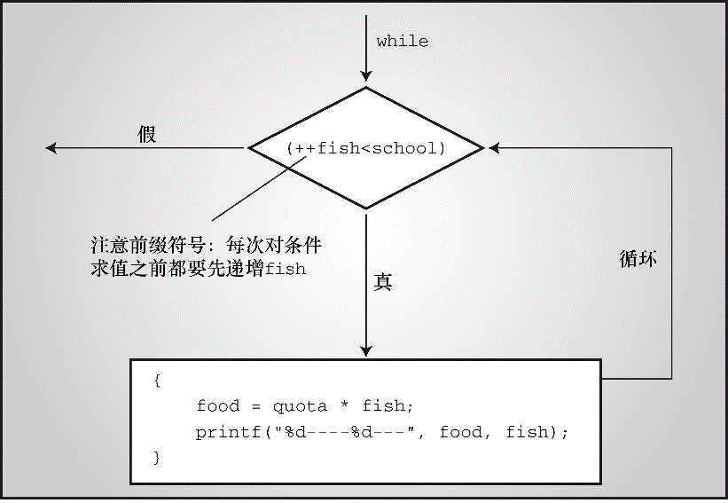

#### 5.4.3　复合语句（块）

复合语句（compound statement）是用花括号括起来的一条或多条语句，复合语句也称为块（block）。 `shoes2.c` 程序使用块让 `while` 语句包含多条语句。比较下面两个程序段：

```c
/* 程序段 1 */
index = 0;
while (index++ < 10)
     sam = 10 * index + 2;
printf("sam = %d\n", sam);
/* 程序段 2 */
index = 0;
while (index++ < 10)
{
     sam = 10 * index + 2;
     printf("sam = %d\n", sam);
}
```

程序段1， `while` 循环中只有一条赋值表达式语句。没有花括号， `while` 语句从 `while` 这行运行至下一个分号。循环结束后， `printf()` 函数只会被调用一次。

程序段2，花括号确保两条语句都是while循环的一部分，每执行一次循环就调用一次 `printf()` 函数。根据 `while` 语句的结构，整个复合语句被视为一条语句（见图5.7）。


<center class="my_markdown"><b class="my_markdown">图5.7　带复合语句的 `while` 循环</b></center>

> **提示　风格提示**
> 再看一下前面的两个 `while` 程序段，注意循环体中的缩进。缩进对编译器不起作用，编译器通过花括号和 `while` 循环的结构来识别和解释指令。这里，缩进是为了让读者一眼就可以看出程序是如何组织的。
> 程序段2中，块或复合语句放置花括号的位置是一种常见的风格。另一种常用的风格是：

```c
while (index++ < 10) {
     sam = 10*index + 2;
     printf("sam = %d \n", sam);
}
```

> 这种风格突出了块附属于 `while` 循环，而前一种风格则强调语句形成一个块。对编译器而言，这两种风格完全相同。
> 总而言之，使用缩进可以为读者指明程序的结构。


**总结　表达式和语句**

**表达式：**

表达式由运算符和运算对象组成。最简单的表达式是不带运算符的一个常量或变量（如， `22` 或 `beebop` ）。更复杂的例子是 `55 + 22` 和 `vap = 2`  *  `(vip + (vup = 4))` 。

**语句：**

到目前为止，读者接触到的语句可分为简单语句和复合语句。简单语句以一个分号结尾。如下所示：

```c
赋值表达式语句:     toes = 12;
函数表达式语句:     printf("%d\n", toes);
空语句:            ;    /* 什么也不做 */
```

复合语句（或块）由花括号括起来的一条或多条语句组成。如下面的 `while` 语句所示：

```c
while (years < 100)
{
     wisdom = wisdom * 1.05;
     printf("%d %d\n", years, wisdom);
     years = years + 1;
}
```


