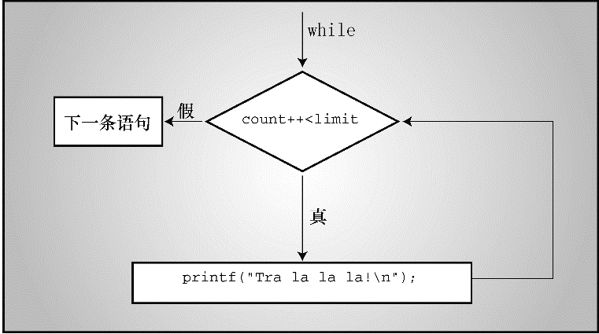

### 6.2　while语句

`while` 循环的通用形式如下：

```c
while ( expression )
    statement
```

`statement` 部分可以是以分号结尾的简单语句，也可以是用花括号括起来的复合语句。

到目前为止，程序示例中的 `expression` 部分都使用关系表达式。也就是说， `expression` 是值之间的比较，可以使用任何表达式。如果 `expression` 为真（或者更一般地说，非零），执行 `statement` 部分一次，然后再次判断 `expression` 。在 `expression` 为假（ `0` ）之前，循环的判断和执行一直重复进行。每次循环都被称为一次迭代（iteration），如图6.1所示。


<center class="my_markdown"><b class="my_markdown">图6.1　 `while` 循环的结构</b></center>

