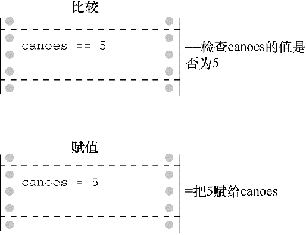

#### 6.3.3　真值的问题

C对真的概念约束太少会带来一些麻烦。例如，我们稍微修改一下程序清单6.1，修改后的程序如程序清单6.8所示。

程序清单6.8　 `trouble.c` 程序

```c
// trouble.c -- 误用=会导致无限循环
#include <stdio.h>
int main(void)
{
     long num;
     long sum = 0L;
     int status;
     printf("Please enter an integer to be summed ");
     printf("(q to quit): ");
     status = scanf("%ld", &num);
     while (status = 1)
     {
          sum = sum + num;
          printf("Please enter next integer (q to quit): ");
          status = scanf("%ld", &num);
     }
     printf("Those integers sum to %ld.\n", sum);
     return 0;
}
```

运行该程序，其输出如下：

```c
Please enter an integer to be summed (q to quit): 20
Please enter next integer (q to quit): 5
Please enter next integer (q to quit): 30
Please enter next integer (q to quit): q
Please enter next integer (q to quit):
Please enter next integer (q to quit):
Please enter next integer (q to quit):
Please enter next integer (q to quit):

```

（……屏幕上会一直显示最后的提示内容，除非强行关闭程序。也许你根本不想运行这个示例。）

这个麻烦的程序示例改动了 `while` 循环的测试条件，把 `status == 1` 替换成 `status = 1` 。后者是一个赋值表达式语句，所以 `status` 的值为 `1` 。而且，整个赋值表达式的值就是赋值运算符左侧的值，所以 `status = 1` 的值也是 `1` 。这里， `while (status = 1)` 实际上相当于 `while (1)` ，也就是说，循环不会退出。虽然用户输入 `q` ， `status` 被设置为 `0` ，但是循环的测试条件把 `status` 又重置为 `1` ，进入了下一次迭代。

读者可能不太理解，程序的循环一直运行着，用户在输入 `q` 后完全没机会继续输入。如果 `scanf()` 读取指定形式的输入失败，就把无法读取的输入留在输入队列中，供下次读取。当 `scanf()` 把 `q` 作为整数读取时失败了，它把 `q` 留下。在下次循环时， `scanf()` 从上次读取失败的地方（ `q` ）开始读取， `scanf()` 把 `q` 作为整数读取，又失败了。因此，这样修改后不仅创建了一个无限循环，还创建了一个无限失败的循环，真让人沮丧。好在计算机觉察不出来。对计算机而言，无限地执行这些愚蠢的指令比成功预测未来10年的股市行情没什么两样。

不要在本应使用==的地方使用=。一些计算机语言（如，BASIC）用相同的符号表示赋值运算符和关系相等运算符，但是这两个运算符完全不同（见图6.2）。赋值运算符把一个值赋给它左侧的变量；而关系相等运算符检查它左侧和右侧的值是否相等，不会改变左侧变量的值（如果左侧是一个变量）。


<center class="my_markdown"><b class="my_markdown">图6.2　关系运算符 `==` 和赋值运算符 `=`</b></center>

示例如下：

```c
canoes = 5          ←把5赋给canoes
canoes == 5         ←检查canoes的值是否为5
```

要注意使用正确的运算符。编译器不会检查出你使用了错误的形式，得出也不是预期的结果（误用=的人实在太多了，以至于现在大多数编译器都会给出警告，提醒用户是否要这样做）。如果待比较的一个值是常量，可以把该常量放在左侧有助于编译器捕获错误：

```c
5 = canoes          ←语法错误
5 == canoes         ←检查canoes的值是否为5
```

可以这样做是因为C语言不允许给常量赋值，编译器会把赋值运算符的这种用法作为语法错误标记出来。许多经验丰富的程序员在构建比较是否相等的表达式时，都习惯把常量放在左侧。

总之，关系运算符用于构成关系表达式。关系表达式为真时值为 `1` ，为假时值为 `0` 。通常用关系表达式作为测试条件的语句（如 `while` 和 `if` ）可以使用任何表达式作为测试条件，非零为真，零为假。

