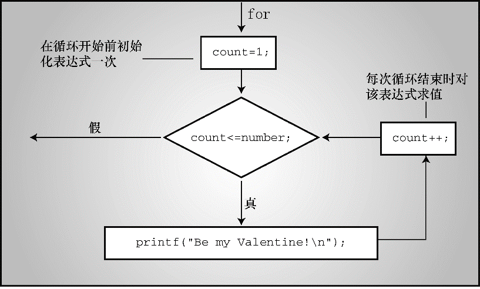

### 6.5　 `for` 循环

`for` 循环把上述3个行为（初始化、测试和更新）组合在一处。程序清单6.11使用 `for` 循环修改了程序清单6.10的程序。

程序清单6.11　 `sweetie2.c` 程序

```c
// sweetie2.c -- 使用for循环的计数循环
#include <stdio.h>
int main(void)
{
     const int NUMBER = 22;
     int count;
     for (count = 1; count <= NUMBER; count++)
          printf("Be my Valentine!\n");
     return 0;
}
```

关键字 `for` 后面的圆括号中有3个表达式，分别用两个分号隔开。第1个表达式是初始化，只会在 `for` 循环开始时执行一次。第2个表达式是测试条件，在执行循环之前对表达式求值。如果表达式为假（本例中， `count` 大于 `NUMBER` 时），循环结束。第3个表达式执行更新，在每次循环结束时求值。程序清单6.10用这个表达式递增 `count` 的值，更新计数。完整的 `for` 语句还包括后面的简单语句或复合语句。 `for` 圆括号中的表达式也叫作控制表达式，它们都是完整表达式，所以每个表达式的副作用（如，递增变量）都发生在对下一个表达式求值之前。图6.3演示了 `for` 循环的结构。


<center class="my_markdown"><b class="my_markdown">图6.3　 `for` 循环的结构</b></center>

程序清单6.12　 `for_cube.c` 程序

```c
/* for_cube.c -- 使用for循环创建一个立方表 */
#include <stdio.h>
int main(void)
{
     int num;
     printf("    n   n cubed\n");
     for (num = 1; num <= 6; num++)
          printf("%5d %5d\n", num, num*num*num);
     return 0;
}
```

程序清单6.12打印整数 `1` ～ `6` 及其对应的立方，该程序的输出如下：

```c
n   n cubed
1        1
2        8
3       27
4       64
5      125
6      216
```

`for` 循环的第1行包含了循环所需的所有信息： `num` 的初值， `num` 的终值<sup class="my_markdown">[1]</sup>和每次循环 `num` 的增量。

