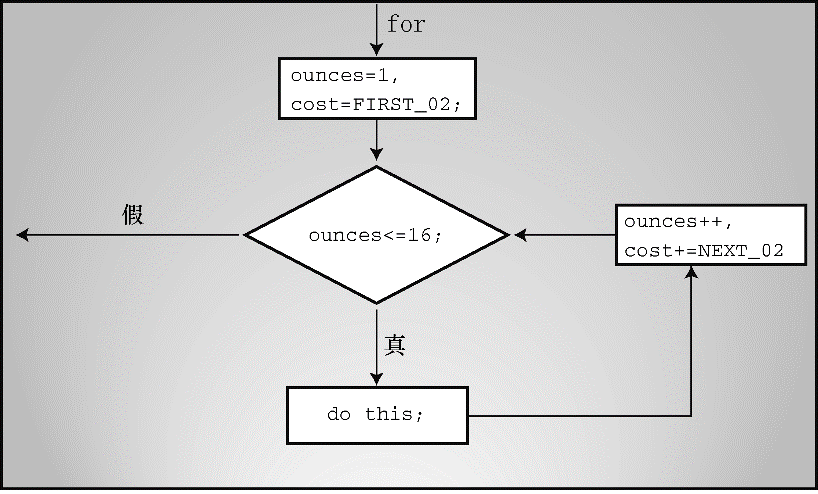

### 6.7　逗号运算符

逗号运算符扩展了 `for` 循环的灵活性，以便在循环头中包含更多的表达式。例如，程序清单6.13演示了一个打印一类邮件资费（first-class postage rate）的程序（在撰写本书时，邮资为首重46美分/盎司，续重20美分/盎司，可以在互联网上查看当前邮资）。

程序清单6.13　 `postage.c` 程序

```c
// postage.c -- 一类邮资
#include <stdio.h>
int main(void)
{
     const int FIRST_OZ = 46;   // 2013邮资
     const int NEXT_OZ = 20;    // 2013邮资
     int ounces, cost;
     printf(" ounces  cost\n");
     for (ounces = 1, cost = FIRST_OZ; ounces <= 16; ounces++,cost += NEXT_OZ)
          printf("%5d   $%4.2f\n", ounces, cost / 100.0);
     return 0;
}
```

该程序的前5行输出如下：

```c
ounces cost
1      $0.46
2      $0.66
3      $0.86
4      $1.06
```

该程序在初始化表达式和更新表达式中使用了逗号运算符。初始化表达式中的逗号使 `ounces` 和 `cost` 都进行了初始化，更新表达式中的逗号使每次迭代 `ounces` 递增 `1` 、 `cost` 递增 `20` （ `NEXT_OZ` 的值是 `20` ）。绝大多数计算都在 `for` 循环头中进行（见图6.4）。


<center class="my_markdown"><b class="my_markdown">图6.4　逗号运算符和 `for` 循环</b></center>

逗号运算符并不局限于在 `for` 循环中使用，但是这是它最常用的地方。逗号运算符有两个其他性质。首先，它保证了被它分隔的表达式从左往右求值（换言之，逗号是一个序列点，所以逗号左侧项的所有副作用都在程序执行逗号右侧项之前发生）。因此， `ounces` 在 `cost` 之前被初始化。在该例中，顺序并不重要，但是如果 `cost` 的表达式中包含了 `ounces` 时，顺序就很重要。例如，假设有下面的表达式：

```c
ounces++, cost = ounces * FIRST_OZ
```

在该表达式中，先递增 `ounce` ，然后在第2个子表达式中使用 `ounce` 的新值。作为序列点的逗号保证了左侧子表达式的副作用在对右侧子表达式求值之前发生。

其次，整个逗号表达式的值是右侧项的值。例如，下面语句

```c
x = (y = 3, (z = ++y +  2) + 5);
```

的效果是：先把 `3` 赋给 `y` ，递增 `y` 为 `4` ，然后把 `4` 加 `2` 之和（ `6` ）赋给 `z` ，接着加上 `5` ，最后把结果 `11` 赋给 `x` 。至于为什么有人编写这样的代码，在此不做评价。另一方面，假设在写数字时不小心输入了逗号：

```c
houseprice = 249,500;
```

这不是语法错误，C编译器会将其解释为一个逗号表达式，即 `houseprice = 249` 是逗号左侧的子表达式， `500` 是右侧的子表达式。因此，整个逗号表达式的值是逗号右侧表达式的值，而且左侧的赋值表达式把 `249` 赋给变量 `houseprice` 。因此，这与下面代码的效果相同：

```c
houseprice = 249;
500;
```

记住，任何表达式后面加上一个分号就成了表达式语句。所以， `500;` 也是一条语句，但是什么也不做。

另外，下面的语句

```c
houseprice = (249,500);
```

赋给 `houseprice` 的值是逗号右侧子表达式的值，即 `500` 。

逗号也可用作分隔符。在下面语句中的逗号都是分隔符，不是逗号运算符：

```c
char ch, date;
printf("%d %d\n", chimps, chumps);
```


**小结：新的运算符**

**赋值运算符：**

下面的运算符用右侧的值，根据指定的操作更新左侧的变量：

+=　把右侧的值加到左侧的变量上

-=　从左侧的变量中减去右侧的值

*=　把左侧的变量乘以右侧的值

/=　把左侧的变量除以右侧的值

%=　左侧变量除以右侧值得到的余数

**示例：**

```c
rabbits *= 1.6;与rabbits = rabbits * 1.6;相同
```

这些组合赋值运算符与普通赋值运算符的优先级相同，都比算术运算符的优先级低。因此，

```c
contents *= old_rate + 1.2;
```

最终的效果与下面的语句相同：

```c
contents = contents * (old_rate + 1.2);
```

**逗号运算符：**

逗号运算符把两个表达式连接成一个表达式，并保证最左边的表达式最先求值。逗号运算符通常在 `for` 循环头的表达式中用于包含更多的信息。整个逗号表达式的值是逗号右侧表达式的值。

**示例：**

```c
for (step = 2, fargo = 0; fargo < 1000; step *= 2)
     fargo += step;
```


