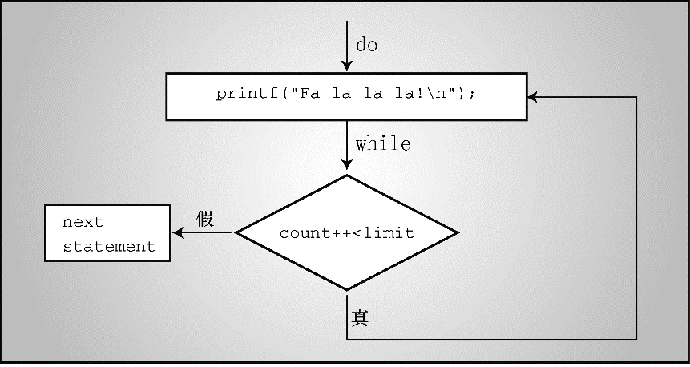

### 6.8　出口条件循环： `do` 　 `while` 

`while` 循环和 `for` 循环都是入口条件循环，即在循环的每次迭代之前检查测试条件，所以有可能根本不执行循环体中的内容。C语言还有出口条件循环（exit-condition loop），即在循环的每次迭代之后检查测试条件，这保证了至少执行循环体中的内容一次。这种循环被称为 `do` 　 `while` 循环。程序清单6.15演示了一个示例。

程序清单6.15　 `do_while.c` 程序

```c
/* do_while.c -- 出口条件循环 */
#include <stdio.h>
int main(void)
{
     const int secret_code = 13;
     int code_entered;
     do
     {
          printf("To enter the triskaidekaphobia therapy club,\n");
          printf("please enter the secret code number: ");
          scanf("%d", &code_entered);
     } while (code_entered != secret_code);
     printf("Congratulations! You are cured!\n");
     return 0;
}
```

程序清单6.15在用户输入13之前不断提示用户输入数字。下面是一个运行示例：

```c
To enter the triskaidekaphobia therapy club,
please enter the secret code number: 12
To enter the triskaidekaphobia therapy club,
please enter the secret code number: 14
To enter the triskaidekaphobia therapy club,
please enter the secret code number: 13
Congratulations! You are cured!

```

使用 `while` 循环也能写出等价的程序，但是长一些，如程序清单6.16所示。

程序清单6.16　 `entry.c` 程序

```c
/* entry.c -- 出口条件循环 */
#include <stdio.h>
int main(void)
{
     const int secret_code = 13;
     int code_entered;
     printf("To enter the triskaidekaphobia therapy club,\n");
     printf("please enter the secret code number: ");
     scanf("%d", &code_entered);
     while (code_entered != secret_code)
     {
          printf("To enter the triskaidekaphobia therapy club,\n");
          printf("please enter the secret code number: ");
          scanf("%d", &code_entered);
     }
     printf("Congratulations! You are cured!\n");
     return 0;
}
```

下面是 `do` 　 `while` 循环的通用形式：

```c
do
　　 statement
while ( expression );
```

`statement` 可以是一条简单语句或复合语句。注意， `do` 　 `while` 循环以分号结尾，其结构见图6.5。


<center class="my_markdown"><b class="my_markdown">图6.5　 `do` 　 `while` 循环的结构</b></center>

`do` 　 `while` 循环在执行完循环体后才执行测试条件，所以至少执行循环体一次；而 `for` 循环或 `while` 循环都是在执行循环体之前先执行测试条件。 `do` 　 `while` 循环适用于那些至少要迭代一次的循环。例如，下面是一个包含 `do` 　 `while` 循环的密码程序伪代码：

```c
do
{
     提示用户输入密码
     读取用户输入的密码
} while (用户输入的密码不等于密码);

```

避免使用这种形式的 `do` 　 `while` 结构：

```c
do
{
     询问用户是否继续
     其他行为
} while (回答是yes);
```

这样的结构导致用户在回答“ `no` ”之后，仍然执行“其他行为”部分，因为测试条件执行晚了。


**小结： `do` 　 `while` 语句**

**关键字：**
`do`
**　**
`while`

**一般注解：**

`do` 　 `while` 语句创建一个循环，在`expression`为假或 `0` 之前重复执行循环体中的内容。 `do` 　 `while` 语句是一种出口条件循环，即在执行完循环体后才根据测试条件决定是否再次执行循环。因此，该循环至少必须执行一次。`statement`部分可是一条简单语句或复合语句。

**形式：**

```c
do
     statement
while ( expression );

```

在`expression`为假或 `0` 之前，重复执行`statement`部分。

**示例：**

```c
do
     scanf("%d", &number);
while (number != 20);
```


