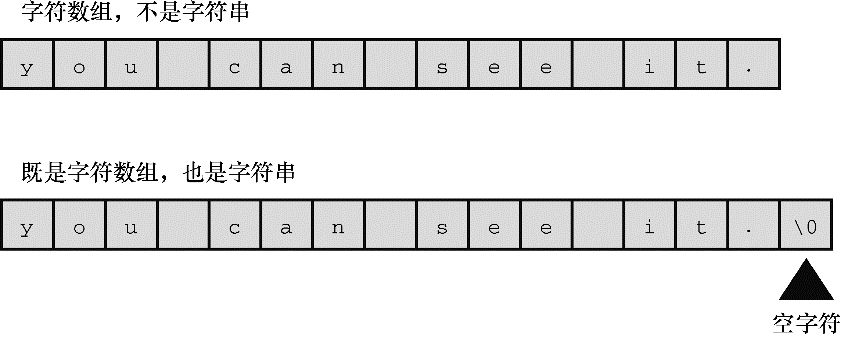
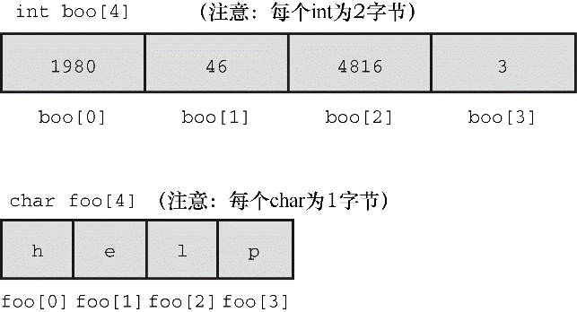

### 6.11　数组简介

在许多程序中，数组很重要。数组可以作为一种存储多个相关项的便利方式。我们在第10章中将详细介绍数组，但是由于循环经常用到数组，所以在这里先简要地介绍一下。

数组（array）是按顺序存储的一系列类型相同的值，如10个 `char` 类型的字符或15个 `int` 类型的值。整个数组有一个数组名，通过整数下标访问数组中单独的项或元素（element）。例如，以下声明：

```c
float debts[20];
```

声明 `debts` 是一个内含20个元素的数组，每个元素都可以存储 `float` 类型的值。数组的第1个元素是 `debts[0]` ，第2个元素是 `debts[1]` ，以此类推，直到 `debts[19]` 。注意，数组元素的编号从 `0` 开始，不是从 `1` 开始。可以给每个元素赋 `float` 类型的值。例如，可以这样写：

```c
debts[5] = 32.54;
debts[6] = 1.2e+21;
```

实际上，使用数组元素和使用同类型的变量一样。例如，可以这样把值读入指定的元素中：

```c
scanf("%f", &debts[4]); // 把一个值读入数组的第5个元素
```

这里要注意一个潜在的陷阱：考虑到影响执行的速度，C编译器不会检查数组的下标是否正确。下面的代码，都不正确：

```c
debts[20] = 88.32;     // 该数组元素不存在
debts[33] = 828.12;    // 该数组元素不存在
```

编译器不会查找这样的错误。当运行程序时，这会导致数据被放置在已被其他数据占用的地方，可能会破坏程序的结果甚至导致程序异常中断。

数组的类型可以是任意数据类型。

```c
int nannies[22];    /* 可存储22个int类型整数的数组 */
char actors[26];    /* 可存储26个字符的数组 */
long big[500];      /* 可存储500个long类型整数的数组 */
```

我们在第4章中讨论过字符串，可以把字符串存储在 `char` 类型的数组中（一般而言， `char` 类型数组的所有元素都存储 `char` 类型的值）。如果 `char` 类型的数组末尾包含一个表示字符串末尾的空字符 `\0` ，则该数组中的内容就构成了一个字符串（见图6.6）。


<center class="my_markdown"><b class="my_markdown">图6.6　字符数组和字符串</b></center>

用于识别数组元素的数字被称为下标（subscript）、索引（indice）或偏移量（offset）。下标必须是整数，而且要从 `0` 开始计数。数组的元素被依次存储在内存中相邻的位置，如图6.7所示。


<center class="my_markdown"><b class="my_markdown">图6.7　内存中的 `char` 和 `int` 类型的数组</b></center>

