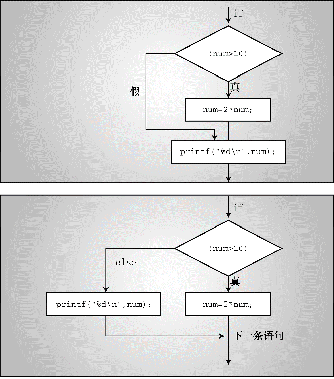

### 7.2　 `if else` 语句

简单形式的 `if` 语句可以让程序选择执行一条语句，或者跳过这条语句。C还提供了 `if` 　 `else` 形式，可以在两条语句之间作选择。我们用 `if else` 形式修正程序清单7.1中的程序段。

```c
if (all_days != 0)
     printf("%d days total: %.1f%% were below freezing.\n",
              all_days, 100.0 * (float) cold_days / all_days);
if (all_days == 0)
     printf("No data entered!\n");
```

如果程序发现 `all_days` 不等于 `0` ，那么它应该知道另一种情况一定是 `all_days` 等于 `0` 。用 `if` 　 `else` 形式只需测试一次。重写上面的程序段如下：

```c
if (all_days!= 0)
     printf("%d days total: %.1f%% were below freezing.\n",
              all_days, 100.0 * (float) cold_days / all_days);
else
     printf("No data entered!\n");
```

如果 `if` 语句的测试表达式为真，就打印温度数据；如果为假，就打印警告消息。

注意， `if` 　 `else` 语句的通用形式是：

`if ( expression )` &#13;
    `statement1`&#13;
 `else` &#13;
    `statement2`

如果 `expression` 为真（非 `0` ），则执行 `statement1` ；如果 `expression` 为假或 `0` ，则执行 `else` 后面的 `statement2` 。 `statement1` 和 `statement2` 可以是一条简单语句或复合语句。C并不要求一定要缩进，但这是标准风格。缩进让根据测试条件的求值结果来判断执行哪部分语句一目了然。

如果要在 `if` 和 `else` 之间执行多条语句，必须用花括号把这些语句括起来成为一个块。下面的代码结构违反了C语法，因为在 `if` 和 `else` 之间只允许有一条语句（简单语句或复合语句）：

```c
if (x > 0)
     printf("Incrementing x:\n");
     x++;
else        // 将产生一个错误
     printf("x <= 0 \n");
```

编译器把 `printf()` 语句视为 `if` 语句的一部分，而把 `x++;` 看作一条单独的语句，它不是 `if` 语句的一部分。然后，编译器发现 `else` 并没有所属的 `if` ，这是错误的。上面的代码应该这样写：

```c
if (x > 0)
{
     printf("Incrementing x:\n");
     x++;
}
else
     printf("x <= 0 \n");
```

`if` 语句用于选择是否执行一个行为，而 `if` 　 `else` 语句用于在两个行为之间选择。图7.1比较了这两种语句。


<center class="my_markdown"><b class="my_markdown">图7.1　 `if` 语句和 `if` 　 `else` 语句</b></center>

