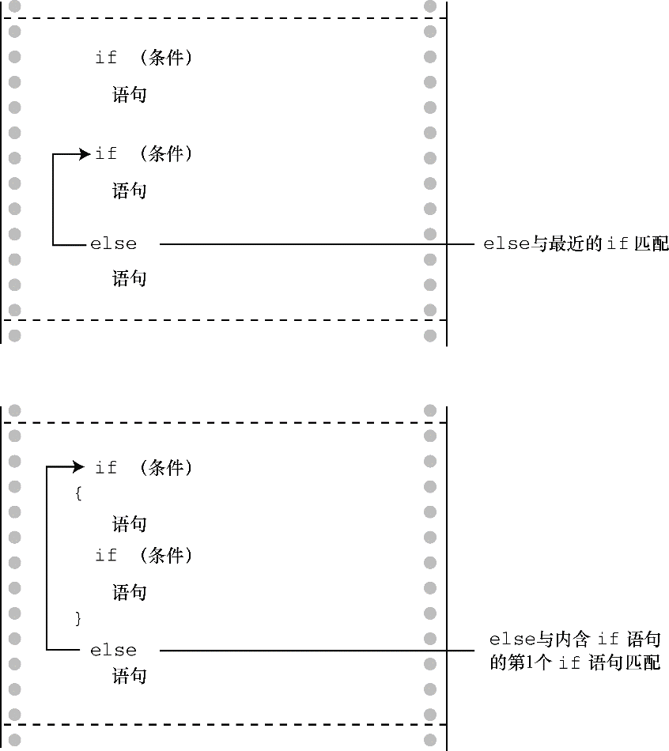

#### 7.2.4　 `else` 与 `if` 配对

如果程序中有许多 `if` 和 `else` ，编译器如何知道哪个 `if` 对应哪个 `else` ？例如，考虑下面的程序段：

```c
if (number > 6)
     if (number < 12)
          printf("You're close!\n");
else
     printf("Sorry, you lose a turn!\n");
```

何时打印 `Sorry, you lose a turn!` ？当 `number` 小于或等于 `6` 时，还是 `number` 大于 `12` 时？换言之， `else` 与第1个 `if` 还是第2个 `if` 匹配？答案是， `else` 与第 `2` 个 `if` 匹配。也就是说，输入的数字和匹配的响应如下：

```c
数字 响应
5         None
10        You’re close!
15        Sorry, you lose a turn!

```

规则是，如果没有花括号， `else` 与离它最近的 `if` 匹配，除非最近的 `if` 被花括号括起来（见图7.2）。


<center class="my_markdown"><b class="my_markdown">图7.2　 `if` 　 `else` 匹配的规则</b></center>

注意：要缩进“语句”，“语句”可以是一条简单语句或复合语句。

第1个例子的缩进使得 `else` 看上去与第1个 `if` 相匹配，但是记住，编译器是忽略缩进的。如果希望 `else` 与第1个 `if` 匹配，应该这样写：

```c
if (number > 6)
{
     if (number < 12)
          printf("You're close!\n");
}
else
     printf("Sorry, you lose a turn!\n");
```

这样改动后，响应如下：

```c
数字 响应
5         Sorry, you lose a turn!
10        You’re close!
15        None

```

